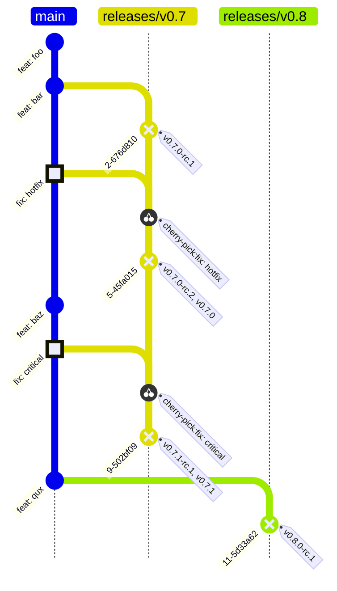
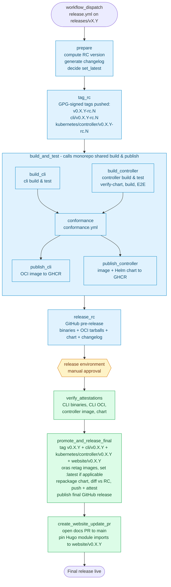

# Release Process

For OCM release managers. CLI and Kubernetes Controller ship together in lockstep from a single workflow.

## How it works

* Development happens on `main`. Releases are cut from `releases/vX.Y` branches.
* Minor and patch releases only (no majors).
* One workflow run produces four tags on the same commit:
  * `v0.X.Y` (canonical, the GitHub release)
  * `cli/v0.X.Y` (website install scripts)
  * `kubernetes/controller/v0.X.Y` (Go module side tag)
  * `website/v0.X.Y` (Hugo module imports for versioned docs; final-only, no RC)
* Cadence: one release per sprint (two weeks). RC at sprint start, promote previous RC at the next sprint start.

## Release Workflow Diagram

### Branching and tagging over time

How releases relate to branches in `main` over a typical cycle: an initial minor (`v0.7.0`), a patch (`v0.7.1`), and the next minor's branch cut (`releases/v0.8`).



Two things to notice. First, **promotion does not create a new commit.** The 
canonical final tag (`v0.7.0`) lands on the same commit as the most recent 
RC tag (`v0.7.0-rc.2`). The workflow just stamps additional tags on the RC 
commit. Second, **each tagged release commit carries multiple tags, not one.**
The same commit also receives `cli/v0.7.0-rc.2` + `cli/v0.7.0`, 
`kubernetes/controller/v0.7.0-rc.2` + `kubernetes/controller/v0.7.0` and `website/v0.7.0`. 
The side tags exist so the website install script, Go module consumers, and 
Hugo docs imports can address each component directly.

The `website/v0.X.Y` tag is asymmetric: only the final form is created, no `website/v0.X.Y-rc.N` counterpart. The website ships docs, not artifacts that need RC validation, so an RC tag would have no consumer. If you go looking and don't find a `website/v0.7.0-rc.2`, that's by design — it isn't missing.

### What the Release workflow does



Phase 1 (RC, blue) runs end-to-end without human intervention once you trigger the workflow with `dry_run=false`. The run then parks at the `release` environment gate. Approving it kicks off Phase 2 (final, green): attestation verification, tag promotion, chart repack with byte-equivalence check against the RC, and the final GitHub release. Anything failing in Phase 1 aborts before any user-facing tags or releases are visible; anything failing in Phase 2 leaves the RC intact so you can re-approve after fixing the underlying issue.

### Website

The website integrates into the same workflow run, after `promote_and_release_final` succeeds:

* The `website/v0.X.Y` tag is created at the same commit as the canonical tag — same `ADDITIONAL_TAGS` step that emits `cli/` and `kubernetes/controller/` tags.
* A separate `create_website_update_pr` job then opens a PR to `main` updating `website/config/_default/{hugo.yaml,module.yaml}` to pin the new minor's Hugo module imports to the just-created `website/v0.X.Y` tag. The PR uses the OCMBot app token, signed commits, and `add-paths: website/config/`.

* Binding versions (constructor, descriptor) referenced by the docs are resolved from the released `cli/v0.X.Y` go.mod, not from `main`. This guarantees the docs site for `v0.X.Y` matches what the released CLI was built against.
* On a **minor release** (`Z=0`) the script adds a new version entry under `versions` in `hugo.yaml` and a new set of import blocks in `module.yaml`.
* On a **patch release** (`Z>0`) the script updates the existing minor's import tags in `module.yaml` in place; `hugo.yaml` is unchanged.
* When more than 10 minors would be live, the oldest is retired (entry removed from `hugo.yaml`, imports removed from `module.yaml`). Retirement logic lives in `website/scripts/register-docs-version.js`.

There is no `website/v0.X.Y-rc.N` tag. The website has no RC artifacts to validate (it's a docs site, not a binary or image), so the RC variant would have no consumer.

## Release responsible

Rotates each sprint. Decides if a release is needed, runs the workflows, approves the gate, handles patches.

## Sprint checklist

```markdown
* [ ] Release branch created (e.g. `releases/v0.7`)
* [ ] RC released and verified (`v0.7.0-rc.1`)
* [ ] Previous RC promoted to final (`v0.6.0-rc.N` -> `v0.6.0`)
* [ ] Final release visible on GitHub Releases (`v0.6.0`)
```

## 1. Create the release branch

Run [Create OCM Release Branch](https://github.com/open-component-model/open-component-model/actions/workflows/release-branch.yml) with `target_branch=releases/vX.Y`.

> [!CAUTION]
> Once the branch exists, only bugfixes with docs should land on it. Needs release-responsible approval.
> Fix the issue on `main`, then once merged, `cherry-pick` the commit to the release branch.

## 2. Create a release candidate

Run [Release](https://github.com/open-component-model/open-component-model/actions/workflows/release.yml):

1. Set **"Use workflow from"** to the release branch.
2. `dry_run=true` first. Check the prepare summary: next RC version, next final version, set-latest decision.
3. `dry_run=false` to actually cut the RC.

The workflow builds CLI + controller, runs conformance, then publishes the RC as a GitHub pre-release with all assets attached.

> [!IMPORTANT]
> Always dry-run first. When patching an older minor (e.g. `v0.6.1` while `v0.7.0` exists), `set_latest=false` is required. That prevents `latest` from rolling backwards.

## 3. Promote RC to final

Same workflow, same run. After conformance passes, the run pauses on the `release` environment gate.

1. Wait for the RC
2. Open the workflow run, approve the environment gate. _Approval should only happen for RCs that were created and tested
   during the previous sprint._
3. The workflow verifies all attestations, re-packages the chart with final version strings, pushes everything, and publishes the GitHub release.

If attestation verification fails the run aborts. This shouldn't happen, but if it does, investigate why the attestation
failed and fix the root cause before creating a new release!

## 4. Patch release

Critical fix needs to land on an older minor:

```bash
git checkout releases/vX.Y
git cherry-pick <commit-from-main>
gh pr create --base releases/vX.Y \
  --title "chore(releases-041): <original PR>"
```

After merge, run the Release workflow on that branch. On hot-fixes we do not wait for the entire promotion process.

## Release notes

Generated by [git-cliff](https://git-cliff.org) from conventional commits. No manual editing for normal runs.

## Retract a release

1. Mark the GitHub release as pre-release.
2. Prepend a retraction notice to the body:
   ```markdown
   > **RETRACTED**: superseded by vX.Y.Z due to <reason>.
   ```
3. [Retract](https://go.dev/ref/mod#go-mod-file-retract) the release from the go.mod file as well.
4. Ship a patch release with the fix. File a security advisory if relevant.

OCI tags stay live in GHCR for users already pinned to the version.

## Verifying release tags

All release tags are GPG-signed.

```bash
curl -sSL https://raw.githubusercontent.com/open-component-model/open-component-model/main/website/static/gpg/OCM-RELEASES-PUBLIC-CURRENT.gpg | gpg --import
git tag -v v0.7.0
```

Key fingerprint: `36BDEEDF40C1A3077DE4A9D9F11241A047C49B13`.
