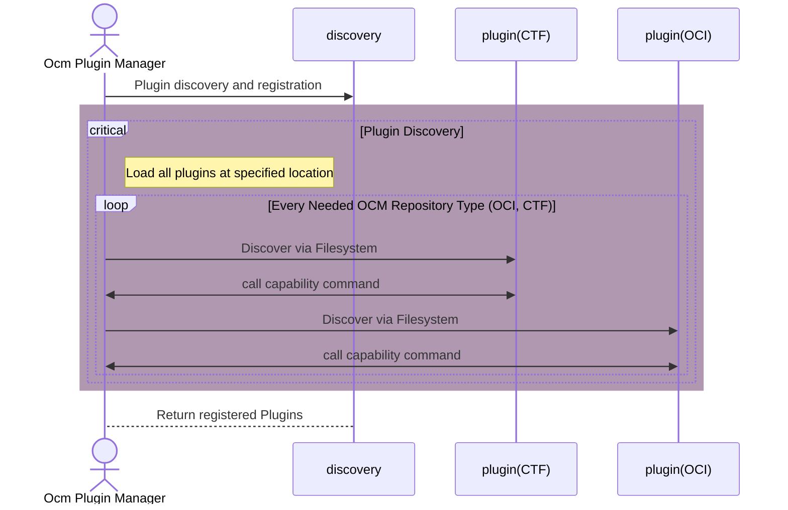
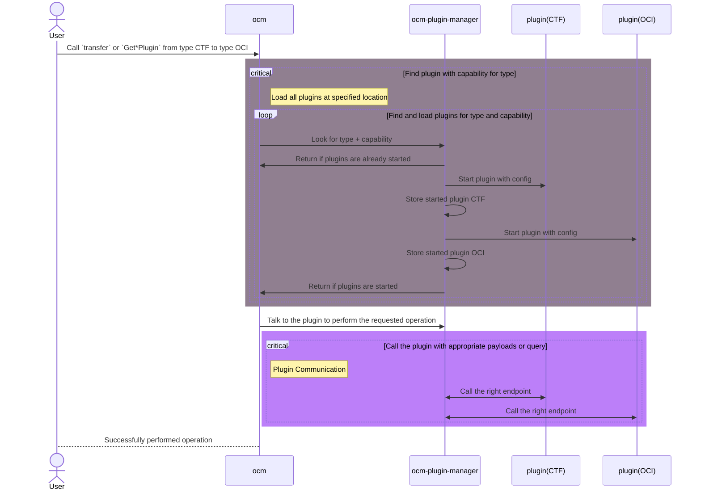

# Pluggable functionality dynamically loaded at runtime

* Status: proposed
* Deciders: Gergely Brautigam, Fabian Burth, Jakob Moeller
* Date: 2025.01.29

Technical Story: Design a pluggable system of various capabilities that the core can interact with to mitigate the amount
of imported code and cleanly separate the core of OCM from the technology specific implementations.

## Context and Problem Statement

In OCM, the schema specification of components is technology-agnostic when dealing with repositories and code coming from and going to a location.
Meaning technologies like, oci, git, maven, npm, plain tar are all irrelevant from the spec's perspective.

That said, the original OCM code (henceforth called ocm v1, or v1 for short) had a lot of implementation inside the library.
This made for a monolithic library that when imported, brought the whole world with it. Further, it made separating
core functionality from technology specific implementations that much harder.

## Decision Drivers

* the desire to encapsulate specific technologies
* the ability to lazy load implementations based on specific needs

## Considered Options

* [option 1](#option-1-separate-go-modules) separate go modules for importing them when needed
* [option 2](#option-2-separate-binaries) separate binaries that can perform certain actions for transportation and others
  * [option 2.1](#option-21-plugin-implementation-using-hashicorp-grpc-plugin) plugin implementation using hashicorp grpc plugin
  * [option 2.2](#options-22-go-based-plugin) go based plugin
  * [option 2.3](#options-23-plain-binary-communication-on-stdinstdout) plain binary communication on stdin/stdout
  * [option 2.4](#options-24-httpunix-domain-socket-server-based-communication) http/unix domain socket server based communication

## Decision Outcome

Chosen [Separate Binaries](#separate-binaries): "separate binaries".

Justification:

* Implementation is separated into their own project and repositories
* Anything that can listen on a socket or a tcp port can be a plugin, if certain contracts are followed
* With a robust plugin manager, plugins can be reused for the same type of communication needs
* Plugins are loaded at runtime via discovery; this means that potentially they could be loaded from a catalog
  containing verified plugins
* Ability to package _required_ and _essential_ plugins with the library so they can be used out of the box without
  external dependencies

  For example, ctf and the oci plugins. These can registered as `implemented plugins` directly through the library

### Separate Binaries

#### Description

Chosen because of the way it separates concerns and makes isolating technology specific coding to a single location.
That is the binary's implementation.

This is a language agnostic approach. Users can choose the language that best fits their needs, environments and
knowledge. As long as they follow the necessary contracts and formats, which are defined by schemes and documentation, their plugin will work.

#### High-level Architecture

There are two main flows in the plugin system.

First, discovery and registration of the plugins:



Once done, the second communication happens when a plugin is requested for action. This happens by
either calling a specific command on the CLI such as `transfer` or by calling the appropriate library function.



The library functions abstract communication between plugins, so the users doesn't have to concern themselves
dealing with REST calls, payloads, and communication details.

#### Contract

A plugin consists of a binary with two commands:

* [`capabilities`](#capabilities)
* [`server`](#server)

#### Server

The server will provide a way to be started with a configuration as a JSON encoded string.

```go
type Config struct {
    // ID defines what ID the plugin should take.
    ID string `json:"id"`
    // Type of the connection.
    Type Type `json:"type"`
    // Location defines either a socket path or an HTTP url with port.
    Location string `json:"location"`
    // IdleTimeout sets how long the plugin should sit around without work to do.
    IdleTimeout *time.Duration `json:"idleTimeout,omitempty"`
}
```

The plugin manager will decide on what location the plugin needs to listen on. This would be either a path to a unix
domain socket or a TCP URL in the format of `:65454` with a random, free port. The manager will make sure that these two
options are available.

#### Capabilities

The `capabilities` command returns the following structured response upon a call on stdout.

```go
type Capabilities struct {
    // Type is a map of types with capabilities.
    Type map[Type][]string `json:"type"`
}
```

Here is an example for the OCI plugin:

```go
        caps := &manager.Capabilities{
            Type: map[manager.Type][]string{
                "oci": {
                    manager.ReadComponentVersionRepositoryCapability,
                    manager.WriteComponentVersionRepositoryCapability,
                    manager.ReadResourceRepositoryCapability,
                    manager.WriteResourceRepositoryCapability,
                },
                ConsumerIdentityTypeV1: {
                    manager.CredentialRepositoryPluginCapability,
                },
            },
        }
```

This is converted to JSON and then sent back to the plugin manager. To add a new capability simply extend this list.

#### Direct registration of library plugins

If the environment doesn't allow running forked processes, or it's desired, the plugin manager can be used as a library
to register plugin implementations directly. Internally, we offer an implementation of the core plugin OCI that is
hidden behind a build tag. If said tag is provided an implementation for OCI based functionality is built into the ocm
binary.

Meaning, no plugin is needed to provide the functionality to talk to OCI registries and handle OCI based artifacts.

To achieve this, the plugin manager offers the following function:

```go
type ImplementedPlugin struct {
    Base         PluginBase
    Capabilities []string
    Type         string
    ID           string
}

var implementedRegisteredPlugins = map[string]map[string][]*ImplementedPlugin{}

// RegisterPluginImplementationForTypeAndCapabilities can be called by actual implementations in the source.
func RegisterPluginImplementationForTypeAndCapabilities(p *ImplementedPlugin) {
    for _, capability := range p.Capabilities {
        if _, ok := implementedRegisteredPlugins[p.Type]; !ok {
            implementedRegisteredPlugins[p.Type] = map[string][]*ImplementedPlugin{}
        }

        implementedRegisteredPlugins[p.Type][capability] = append(implementedRegisteredPlugins[p.Type][capability], p)
    }
}
```

Any implementation provided through this method is then used to look up a plugin during `fetchPlugin` cycle.

For example consider this partial OCI plugin implementation:

```go
// ID is used as a registration identity. Make sure this identity is unique.
const ID = "ocm.software/oci-plugin/v1"

...

var _ manager.ReadWriteRepositoryPluginContract = &OCIPlugin{}

func init() {
    // Ignore configuration for now
    plugin, _ := NewPlugin(nil)
    // construct the plugin...
    o := &OCIPlugin{p: plugin}
    manager.RegisterPluginImplementationForTypeAndCapabilities(&manager.ImplementedPlugin{
        Type: "oci",
        Capabilities: []string{
            manager.ReadComponentVersionRepositoryCapability,
            manager.WriteComponentVersionRepositoryCapability,
        },
        Base: o,
        ID:   ID,
    })
}
```

#### Discovery and Distribution

_Out of Scope_:

Outside registries hosting plugins are not described by this ADR.

_In Scope_:

Distribution via Component Versions. This means, that a plugin can be part of a component and be installed from a
component.

The component is hosted on an OCI repository. The ocm client will have the OCI capability built-in to avoid a
chicken-egg problem of fetching a plugin from a technology that the plugin adds in the first place.

There should be a command to help installation and discovery of plugins using `ocm plugin install`.

This command will download the referenced resource, unpack it, and put it into the requested plugin folder for later
loading at runtime. Extra identities, such as OS and Architecture, can be provided with the resource. Selection of the
right binary should be based on that.

Sample component version with a plugin created from local plugins:

```yaml
name: ocm.software/plugins/oci
provider:
  name: ocm.software
resources:
- extraIdentity:
    architecture: amd64
    os: linux
  input:
    path: out/ociplugin.linux-amd64
    type: file
  name: ociplugin
  type: ocmPlugin
  version: 0.0.1
- extraIdentity:
    architecture: arm64
    os: linux
  input:
    path: out/ociplugin.linux-arm64
    type: file
  name: ociplugin
  type: ocmPlugin
  version: 0.0.1
```

This can be used to fetch and access the right plugin for the right OS and ARCH.

## Pros and Cons of the Options

### [Option 1] Separate go modules

Pros:

* go modules can be imported separately and offer nice isolation between implementations

Cons:

* people will, in the end, import everything, since they won't know which access is required at any given point
* module versioning and co-dependent code will make imports and version handling a pain

### [Option 2] Separate binaries

Pros:

* implementation is completely separate
* loading has minimal overhead
* even if all the plugins are registered, only the ones that are really needed are started (lazy loading)
* the core library can be super tiny hence module imports are low if users want to use ocm as a library

Cons:

* need to manage the binary lifecycle
* multiple processes
* if the parent process isn't allowed to launch subprocesses, this will not work

#### [Option 2.1] plugin implementation using hashicorp grpc plugin

Pros:

* a mature environment where communication is already taken care off
* tcp communication and maturity; implementation of the connection is highly performant

Cons:

* the learning curve is pretty steep and might deter people from learning yet another framework

#### [Options 2.2] go based plugin

Pros:

* an existing ecosystem
* native to go

Cons:

* only go can be used
* windows support is none existent

#### [Options 2.3] plain binary communication on stdin/stdout

Pros:

* dead simple
* any language could support it

Cons:

* needs very well-defined contract that cannot be documented and standardized nicely
* communicating complex structures will become difficult
* bidirectional communication such as, request-response is cumbersome to take care of

#### [Options 2.4] http/unix domain socket server based communication

Pros:

* lazy load plugins without starting them
* anything can implement it
* communicating complex structures becomes a lot easier
* byte streams and bidirectional communication becomes trivial

Cons:

* life cycle management of the server communication
