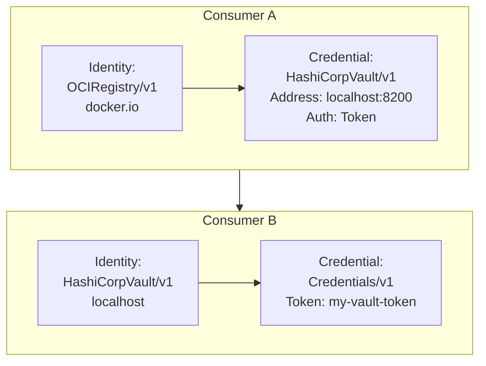

# A Credential System leveraging Graphs

* Status: proposed
* Deciders: Gergely Brautigam, Fabian Burth, Jakob Moeller
* Date: 2025.01.29

Technical Story: Design a modular, recursive credential resolution system that integrates with existing OCM v1 configurations while improving maintainability and clarity in credential resolution paths.

## Context and Problem Statement

OCM defines credentials based on the relationship between two sets of attributes:

* Consumer Identities – Define what is using the credentials.
* Credentials – Key-value attributes used by the system to resolve authentication.

### Example of a Simple Credential Configuration

```yaml
type: credentials.config.ocm.software
consumers:
- identity:
    type: OCIRegistry/v1
    hostname: docker.io
  credentials:
  - type: Credentials/v1
    properties:
      username: ocmuser
      password: ocmpass
```

This basic setup works well, but more complex cases introduce challenges, such as:

1. **Recursive Dependencies at Compile-Time**: If credentials require other credentials, resolution becomes nested.

   ```yaml
    type: credentials.config.ocm.software
    consumers:
    - identity:
        type: OCIRegistry/v1
        hostname: docker.io
      credentials:
        - type: HashiCorpVault/v1
          address: 'http://localhost:8200'
          authenticationType: Token
    - identity:
       type: HashiCorpVault/v1
       hostname: localhost
      credentials:
       - type: Credentials/v1
         properties:
           token: my-vault-token
    ```

2. **Dynamic Consumer Identity Matching**: Credentials may need to match patterns rather than strict values.

   ```yaml
   type: credentials.config.ocm.software
   consumers:
   - identity:
       type: OCIRegistry/v1
       hostname: quay.io/org/*
     credentials:
     - type: Credentials/v1
       properties:
         username: ocmuser
         password: ocmpass
   ```

3. **Repository-Based Credential Lookup**: Credentials might be stored in external configurations rather than directly provided.

   ```yaml
   type: credentials.config.ocm.software
   repositories:
   - repository:
     type: DockerConfig/v1
     # The path to the Docker configuration file, which acts like a dynamic lookup
     dockerConfigFile: "~/.docker/config.json"
   ```

These factors create a complex dependency chain that makes maintenance difficult.

## Decision Drivers

1. Reduce maintenance complexity.
2. Avoid excessive recursion while ensuring credential resolution remains functional.
3. Improve clarity in credential resolution paths.

## Considered Options

1. **[Option 1](#option-1-no-recursion): No Recursion** – Credentials must be explicitly defined.
2. **[Option 2](#option-2-limited-recursion-chosen): Limited Recursion (Chosen)** – Recursion is allowed for credentials but not across repositories
3. **[Option 3](#option-3-full-recursion): Full Recursion** – Allow recursion across both credentials and repositories.

## Decision Outcome

Chosen option: Limited recursion (Option 2).

### Justification

* Full repository recursion is not needed at this stage and is difficult to implement.
* Repository recursion complicates debugging and control.
* Limiting recursion to credentials still allows most use cases while avoiding excessive complexity.

### Resolution of Credentials

1. Load Configuration & Consumer Data
   * Reads system configuration (e.g., $HOME/.ocmconfig)
   * Load credential configuration (`credentials.config.ocm.software`).
2. Extract Direct Credentials
   * If direct credentials exist, store them.
   * If not, mark for plugin-based resolution.
3. Process Plugin-Based Credentials
   * Determine the correct plugin to use for a credential.
   * Derive new identities if necessary.
   * Store nodes (identity vertex) and dependencies (edges) in a Directed Acyclic Graph (DAG) of credentials.
4. Resolve Credential Requests
   * Traverse the graph for direct credentials. (Top-Down Recursion, call [`CredentialPlugin`](#credentialplugin) where needed)
   * If unavailable, attempt repository-based resolution. (Call [`RepositoryPlugin`](#repositoryplugin) where needed)

### Credential Graph Example / Recursive Traversal

Given this configuration

```yaml
 type: credentials.config.ocm.software
 consumers:
   - identity:
       type: OCIRegistry/v1
       hostname: docker.io
     credentials:
       - type: HashiCorpVault/v1
         address: 'http://localhost:8200'
         authenticationType: Token
   - identity:
       type: HashiCorpVault/v1
       hostname: localhost
     credentials:
       - type: Credentials/v1
         properties:
           token: my-vault-token
```

The resulting credential graph would look like:



For indirect resolutions via repositories, imagine a configuration such as

```yaml
type: credentials.config.ocm.software
repositories:
  - repository:
    type: DockerConfig/v1
    dockerConfigFile: "~/.docker/config.json"
    propagateConsumerIdentity: true
```

Now there is no graph that can be directly accessed, so the only option here is to dynamically ask the repository plugin
to resolve the credentials. The repository plugin then chooses the correct credentials based on the consumer identity.
The moment the repository is used, the credentials are no longer available in the graph directly.

## Contract

The base contract that will be supported by the graph implementation is the following entry-point

```go
type CredentialProvider interface {
    Resolve(identity credentialsv1.Identity, credentials credentialsv1.Attributes) (credentialsv1.Attributes, error)
}
```

The provider implementation is backed by a credential graph that is constructed by passing it a credential configuration.

The graph itself needs two input variables passed as options

```go
// GraphComputeOptions holds the plugin mappings used in graph construction.
type GraphComputeOptions struct {
    // CredentialPlugins maps each credential type to its corresponding plugin.
    // These plugins are responsible for performing the resolution from identities to credentials.
    CredentialPlugins           map[types.Type][]CredentialPlugin
    // CredentialRepositoryPlugins maps each credential type to repository plugins.
    // These plugins are used as a fallback mechanism when direct resolution fails.
    CredentialRepositoryPlugins map[types.Type][]RepositoryPlugin
}

// ToCredentialGraph builds a CredentialGraph instance from a configuration object.
// It performs the following steps:
//  1. Processes and caches all direct credentials provided by the consumers.
//  2. Processes plugin-based credential edges by linking consumer identities to the
//     identities computed by the plugins.
//
// Parameters:
//   - config: The credential configuration including consumers, repositories, etc.
//   - options: GraphComputeOptions containing the plugin mappings.
//
// Returns a pointer to the newly constructed CredentialGraph or an error.
func ToCredentialGraph(config *credentialsv1.Config, options GraphComputeOptions) (*CredentialGraph, error)
```

This is the mapping of the Types to the correct plugins for that specific type to call when doing credential
resolution. The mapping is considered a single source of truth and MUST be filled with supported combinations.

### `CredentialPlugin`

For most cases, `CredentialPlugin`'s are sufficient. These plugins get used whenever the graph contains a direct
reference to a credential.

This is a configuration that must rely on a `CredentialPlugin` that returns `SupportedCredentialTypes() => HashiCorpVault/v1`.

```yaml
 type: credentials.config.ocm.software
 consumers:
   - identity:
       type: AnyUserOfMyCredentials/v1
       hostname: localhost
     credentials:
       - type: HashiCorpVault/v1
         address: 'http://localhost:8200'
         authenticationType: Token
```

```go
// CredentialPlugin defines a plugin interface for dynamically resolving credentials.
// A CredentialPlugin can interact with individual requests for credentials and resolveDirect them.
//
// Typical examples are credential entries embedded in the graph like a HashiCorpVault reference
type CredentialPlugin interface {
    // SupportedCredentialTypes returns the list of credential types supported by the plugin.
    // The plugin is expected to be able to resolveDirect credentials for these types.
    SupportedCredentialTypes() []types.Type
    // ConsumerIdentityForCredential returns an identity for the given credential.
    // The credential MUST be of a supported type returned from SupportedCredentialTypes.
    ConsumerIdentityForCredential(credential types.Typed) (credentialsv1.Identity, error)
    // CredentialProvider defines that a CredentialPlugin can resolveDirect credentials for a given identity.
    // The identities passed SHOULD be derived from IdentityForCredential or they can be rejected.
    CredentialProvider
}
```

#### Passing Credentials to a `CredentialPlugin`

Because a `CredentialPlugin` might be a remote system that needs its own credential, it is possible to pass it its very own credentials.
By using `ConsumerIdentityForCredential` an identity can be generated that can be used to ask the graph for credentials.
The example below gives a simple example of such a recursion.

```yaml
 type: credentials.config.ocm.software
 consumers:
   - identity:
       type: AnyUserOfMyCredentials/v1
       hostname: localhost
     credentials:
       - type: HashiCorpVault/v1
         address: 'http://my.vault:8200'
         authenticationType: Token
   - identity:
        type: HashiCorpVault/v1
        hostname: my.vault
     credentials:
        - type: Credentials/v1
          properties:
            token: my-vault-token
```

### `RepositoryPlugin`

`RepositoryPlugin`'s are more complex than a `CredentialPlugin`, because they cannot be statically linked in the graph
by matching the consumer identity. Instead, they get a configuration entry that is passed to them while
resolving credentials.

```go
// RepositoryPlugin defines a plugin interface for dynamically resolving credentials based on an overarching
// forwarded repository configuration.
//
// Typical examples are dynamic credential files (think of .docker/config.json and helpers)
type RepositoryPlugin interface {
    // SupportedRepositoryConfigTypes declares which types of repository configuration the plugin supports
    SupportedRepositoryConfigTypes(ctx context.Context) ([]types.Type, error)
    // ConsumerIdentityForRepositoryConfig returns a unique identity under which credentials
    // can be resolved to forward for the Repository.
    ConsumerIdentityForRepositoryConfig(ctx context.Context, config types.Typed) (credentialsv1.Identity, error)
    // Resolve is able to return credentials for an identity backed by a repository indicated by config.
    // The type of the config SHOULD come from the SupportedRepositoryConfigTypes or it CAN be rejected.
    Resolve(ctx context.Context, config types.Typed, identity credentialsv1.Identity, credentials credentialsv1.Attributes) (credentialsv1.Attributes, error)
}
```

#### Passing Credentials to a `RepositoryPlugin`

Similar to a `CredentialPlugin`, the `RepostioryPlugin` can use its own set of credentials it can request from the graph.
In the example below, `SupportedRepositoryConfigTypes` would return `HashiCorpVault/v1`:

```yaml
type: credentials.config.ocm.software
repositories:
  - repository:
      type: HashiCorpVault/v1
      address: "http://localhost:8200"
      authenticationType: Token
consumers:
   - identity:
        type: HashiCorpVault/v1
        hostname: my.vault
     credentials:
        - type: Credentials/v1
          properties:
             token: my-vault-token
```

In this case any resolution that would be passed with the repository config entry

```yaml
repository:
   type: HashiCorpVault/v1
   address: "http://localhost:8200"
   authenticationType: Token
```

would then be able to resolve its credentials with the credential, by

* first generating the `ConsumerIdentityForRepositoryConfig`,
* and then matching against

```yaml
identity:
  type: HashiCorpVault/v1
  hostname: my.vault
credentials:
  - type: Credentials/v1
    properties:
       token: my-vault-token
```

### Resolving and interpreting of `credentialsv1.Attributes`

In the above contract, the `credentialsv1.Attributes` is a key-value map that is used to pass around the resolved credentials.
The keys themselves are not part of the contract but can be interpreted differently by any plugin.

For example, assuming that we have two consumer identity types

```yaml
type: credentials.config.ocm.software
consumers:
- identity:
    type: OCIRegistry/v1
    hostname: docker.io
  credentials:
  - type: Credentials/v1
    properties:
      username: ocmuser
      password: ocmpass
- identity:
    type: OCIRegistry/v1
    hostname: docker.io
  credentials:
    - type: Credentials/v1
      properties:
        token: my-access-token
```

A plugin that would support the identity type `OCIRegistry/v1` would receive a credential set from `Resolve(...)` that
looks like this:

```yaml
username: ocmuser
password: ocmpass
token: my-access-token
```

and it can choose an arbitrary logic (e.g. attempt to use the token before falling back to username and password) to deal
with the credentials.

The keys `username`, `password` and `token` here are arbitrarily chosen and can be any key-value pair that is required by the
consumer. The consumer does not inform the credentials plugin about the required keys, but the plugin is expected to use
keys in any order that makes sense to the plugin.

## Pros & Cons of Options

### **[Option 1]: No Recursion**

✅ Simple and easy to maintain.  
❌ Breaks dynamic credential resolution.  
❌ Limits plugin flexibility.

### **[Option 2]: Limited Recursion (Chosen)**

✅ Covers most use cases with manageable complexity.  
✅ Keeps plugins simple.  
❌ Requires graph-based recursion implementation.

### **[Option 3]: Full Recursion**

✅ Maximum flexibility.  
❌ Difficult to debug and maintain.  
❌ Repository recursion only detectable at runtime.

## Conclusion

The **limited recursion** approach balances complexity and flexibility,
allowing credential-based recursion while avoiding excessive recursive repository lookups.
This avoids maintaining a recursion stack while still preserving the vast majority of the feature set.
