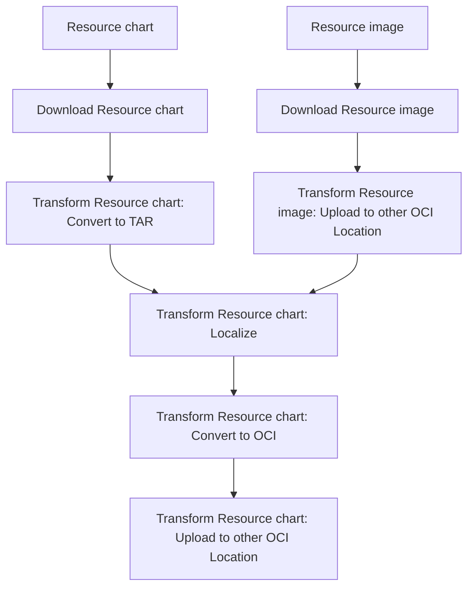
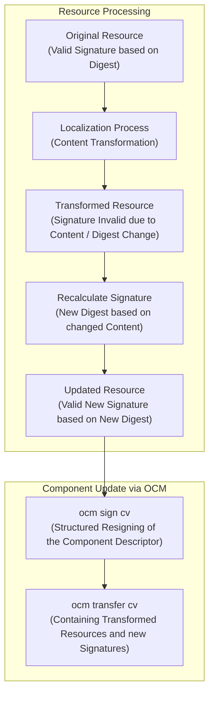

# A System for Localizing Content At Transfer Time

* Status: proposed
* Deciders: Gergely Brautigam, Fabian Burth, Jakob Moeller
* Date: 2025.01.29

Technical Story: Design an alternative, more transparent way to localize content
before it needs to be deployed.

## Table of Contents

* [Context and Problem Statement](#context-and-problem-statement)
  * [How to Localize at Transfer Time](#how-to-localize-at-transfer-time)
* [Contract](#contract)
  * [Deep Dive: YAML-based Localization as a Special Transformer](#deep-dive-yaml-based-localization-as-a-special-transformer)
  * [Combining Transformers for Complex Modifications and Format Compatibility](#combining-transformers-for-complex-modifications-and-format-compatibility)
  * [Resolving Relative Dependencies and References to other Resources for Localization with CEL](#resolving-relative-dependencies-and-references-to-other-resources-for-localization-with-cel)
  * [Maintaining Localization Instructions alongside Deployment Instructions (Localization with `Sibling Resources`)](#maintaining-localization-instructions-alongside-deployment-instructions-localization-with-sibling-resources)
* [Process Impacts and Changes in Workflows](#process-impacts-and-changes-in-workflows)
  * [Impacts on Signing and Verification of Component Versions](#impacts-on-signing-and-verification-of-component-versions)
  * [Impacts on Designing and Maintaining Localization Instructions](#impacts-on-designing-and-maintaining-localization-instructions)
    * [RACI Matrix](#raci-matrix)
* [Decision Drivers](#decision-drivers)
* [Considered Options](#considered-options)
* [Decision Outcome](#decision-outcome)
  * [Justification](#justification)
* [Pros & Cons of Options](#pros--cons-of-options)
* [Conclusion](#conclusion)

## Context and Problem Statement

In OCM, localization means adapting content for a new location.

For example, consider a typical Helm Chart with a values.yaml file:

```yaml
image:
    repository: ghcr.io/open-component-model/image
    tag: 1.0.0
```

When you run ocm transfer, the locations of such resources might change.

Before the transfer, the descriptor might reference both an image and a chart:

```yaml
name: github.com/acme.org/localize-me
provider: acme.org
version: 1.0.0
meta:
  schemaVersion: v2
resources:
- name: chart
  relation: local
  type: helmChart
  version: 1.0.0
  access:
    localReference: sha256:887ba6bdf74e24c1499b044fa395bad97a142e1d3e7ffc28278dcab112c50632
    mediaType: application/octet-stream
    type: localBlob
- name: image
  relation: external
  type: ociImage
  version: v1.0.0
  access:
    type: ociArtifact
    imageReference: ghcr.io/open-component-model/image
```

After using ocm transfer, the image location might change:

```yaml
name: github.com/acme.org/localize-me
provider: acme.org
version: 1.0.0
meta:
  schemaVersion: v2
resources:
- name: chart
  relation: local
  type: helmChart
  version: 1.0.0
  access:
    localReference: sha256:887ba6bdf74e24c1499b044fa395bad97a142e1d3e7ffc28278dcab112c50632
    mediaType: application/octet-stream
    type: localBlob
- name: image
  relation: external
  type: ociImage
  version: v1.0.0
  access:
    type: ociArtifact
    imageReference: ghcr.io/new-org/image
```

**The problem**: The image reference has changed, but the chart’s reference in its values.yaml has not been updated accordingly.

This ADR proposes a new solution compared to the old method of manually editing the values.yaml file. We call this Localization at Transfer Time.

### How to Localize at Transfer Time

Compared to the old tactic of localizing the content just before deployment (when the helm chart is about to be used), we can inject a localization behavior while executing our transfer process:

```yaml
metadata:
  version: v1alpha1
spec:
  mappings:
    - component:
        name: github.com/acme.org/localize-me
        version: 1.0.0
      source:
        type: CommonTransportFormat/v1
        filePath: ./test/localization-component/archive
      target:
        type: CommonTransportFormat/v1
        filePath: ./test/localization-component/archive-after-localization
      resources:
        - resource:
            name: chart
          target:
            type: localBlob
          transformations:
            - type: yaml.engine.localization/v1
              file: "*/values.yaml"
              mappings:
                - path: "image.repository"
                  value: ghcr.io/new-org/image
```

This configuration adds a new `transformations` step to the transfer process. The transformation uses a new plugin type, the **TransformerPlugin**, to modify the content of the `values.yaml` file and update the image reference.

For localizing a Helm chart, we use a specific transformation engine: `yaml.engine.localization/v1`. This process:

1. Loads the resource as a byte stream.
2. Parses the byte stream based on the resource type and its access type.
3. Applies the transformation (updates the values as specified).
4. Converts the modified content back into a byte stream.
5. Saves the updated stream to the target location.

> It is important to note that transformations, while stream-based, often still require **either access to a temporary filesystem or a memory buffer to modify the resource**.
>
> This means that access to a buffering location is important for efficient transformation.
> The proposal does not have an opinion on a system to choose which buffering method to use for any given transformer.

After these steps, a resource like this:

```yaml
- name: chart
  relation: local
  type: helmChart
  version: 1.0.0
  access:
    localReference: sha256:887ba6bdf74e24c1499b044fa395bad97a142e1d3e7ffc28278dcab112c50632
    mediaType: application/octet-stream
    type: localBlob
```

is updated to:

```yaml
- name: chart
  relation: local
  type: helmChart
  version: 1.0.0
  access:
    localReference: sha256:ccadd99b16cd3d200c22d6db45d8b6630ef3d936767127347ec8a76ab992c2ea # NOTE: the localReference sha changed!
    mediaType: application/octet-stream
    type: localBlob
```

Any further processing will use this updated, localized content.

**What's the difference?** The localization changes the actual content of a resource. Thus, the previous calculated digest/signature is not valid anymore and instead a new digest is calculated based on the new content. This means that the original resource is not modified, but rather a new resource is created with a new digest.

> Note: The `localReference` is a digest of the content in a localBlob based on the concept of a Content Addressable Storage (CAS), as it is used in OCI Image Layouts. This means that the original resource is not modified, rather there is now a new resource with a new digest.

## Contract

The transformer is a plugin contract that can be used like any other plugin:

```go

type TransformerPluginContract interface {
    PluginBase
    Transform(ctx context.Context, request TransformResourceRequest) (*TransformResourceResponse, error)
}

type TransformResourceRequest struct {
    // The resource specification that was used to download the resource
    *descriptor.Resource `json:"resource"`
    // The specification on how the resource should be transformed
    TransformationSpec *TransformationSpec `json:"transformSpec"`

    // The Location of the resource that should be localized (before it has been processed)
    ResourceLocation Location `json:"resourceLocation"`
    // The Location of the transformed resource (after it has been processed)
    TransformedResourceLocation Location `json:"transformedResourceLocation"`
    
    // Any additional inputs that the transformer may need
    Inputs map[string]any
}

type TransformationSpec struct {
    types.Typed `json:",inline"`
}

type TransformResourceResponse struct {
    // The resource specification after transformation
    *descriptor.Resource `json:"resource"`
    
    // Any additional outputs that the transformer may have produced
    Outputs map[string]any
}

type Location struct {
    LocationType `json:"type"`
    Value        string `json:"value"`
}

type LocationType string

const (
    // LocationTypeRemoteURL is a remote URL available to the plugin only.
    // It MUST be a valid URL. It MAY be accessible to the orchestrator, but MUST be accessible to the plugin.
    // The URL SHOULD be protected with Credentials.
    LocationTypeRemoteURL LocationType = "remoteURL"
    // LocationTypeUnixNamedPipe is a Unix named pipe available to the orchestrator and plugin.
    // It MUST be an absolute path. It SHOULD be opened with O_NONBLOCK whenever reading from it.
    LocationTypeUnixNamedPipe LocationType = "unixNamedPipe"
    // LocationTypeLocalFile is a local file present on the filesystem available to the orchestrator and plugin.
    // It MUST be an absolute path.
    LocationTypeLocalFile LocationType = "localFile"
)
```

### Deep Dive: YAML-based Localization as a Special Transformer

Let's take a look at the concrete implementation of a transformer. The localization used in this example can be implemented through a `Provider` contract like below. The Provider is called as such because it provides a localization service for a specific localization instruction.

```go
// Provider is any implementation that can localize a resource based on an instruction
type Provider interface {
    // Localize takes a resource and a data stream and returns a localized resource and a new data stream.
    // The localization itself is defined by the instruction.
    Localize(data io.Reader, instruction types.Typed, output io.Writer) (err error)
}
```

We do not need to pass it a resource, as YAML localization is purely value based.

In our example above, the `yaml.engine.localization/v1` would be called with

```text
data => byte stream of the resource (DownloadLocalResource in the ComponentVersionRepository)
instruction => the transformation instruction
    type: yaml.engine.localization/v1
    file: "*/values.yaml"
    mappings:
    - path: "image.repository"
      value: ghcr.io/new-org/image
output => byte stream of the localized resource
```

Note that the yaml engine used here only supports one input format: **A TAR archive or a Gzipped TAR archive.**
For more information on how to make localizations work with other formats, [a combination of transformers may be used](#combining-transformers-for-complex-modifications-and-format-compatibility).

This can then be wrapped in a transformer plugin simply by passing the instruction to the `Localize` function.

### Combining Transformers for Complex Modifications and Format Compatibility

An `access.type` defines how to access a resource. Since transformers only work on the content (and not on how to load it), the orchestrator calls them only after the resource is loaded. This means a transformer doesn’t need to know the implementation of the access.
However because usually transformers do touch up a resource, they CAN know the specification of the access.

To handle different formats, you can chain transformers together. For example, suppose the chart is stored as a HELM OCI Artifact rather than as a TAR archive:

```yaml
- name: chart
  relation: external
  type: ociImage
  version: v2.3.4
  access:
    type: ociArtifact
    imageReference: ghcr.io/open-component-model/chart
```

This will result in the byte stream being an OCI Image Layout, which will not be a valid TAR archive.

Thus we need to construct a transformer chain:

1. Convert the OCI Image Layout to a TAR Archive using oci.to.tar.transformer/v1.
2. Localize the TAR Archive with yaml.engine.localization/v1.
3. Convert the TAR Archive back to an OCI Image Layout with tar.to.oci.transformer/v1.

```yaml
resources:
- resource:
    name: chart
  target:
    type: ociArtifact
  transformations:
    - type: oci.to.tar.transformer/v1
    - type: yaml.engine.localization/v1
      file: "*/values.yaml"
      mappings:
        - path: "image.repository"
          value: ghcr.io/new-org/image
    - type: tar.to.oci.transformer/v1
```

> **Note**: Transformers can be lossy (some original details might be lost). To reduce this loss, the orchestrator uses named inputs and outputs. In the above example, the output from the first transformer (an OCI Descriptor for the Config Layer that would be otherwise "lost" while converting the Layout to a plain TAR) is used as an input for the final transformer to help rebuild the OCI Image Layout. This Input / Output mapping happens implicitly and is managed by the orchestrator.
> **Opinionation**: The orchestrator CLI can and will be opinionated about the order and type of transformers it understands. For example, it should be possible to still generate Specifications like the example above without the user having to know about the exact nature of the component versions. Nevertheless, this localization is clearly decoupled from the actual implementation of the transformers. This means that the orchestrator can be extended with new transformers without having to change the orchestrator itself.

### Resolving Relative Dependencies and References to other Resources for Localization with CEL

A common challenge in localization is that the data needed for transformation might come from sibling resources or other components providing context.

For example, consider these resources:

```yaml
name: github.com/acme.org/localize-me
provider: acme.org
version: 1.0.0
meta:
  schemaVersion: v2
resources:
- name: chart
  relation: local
  type: helmChart
  version: 1.0.0
  access: #...
- name: image
  relation: external
  type: ociImage
  version: v1.0.0
  access:
    type: ociArtifact
    imageReference: ghcr.io/open-component-model/image:v1.0.0
```

The chart’s localization depends on knowing the imageReference from its sibling resource. In our transfer spec, the value is hard-coded:

```yaml
type: yaml.engine.localization/v1
file: "*/values.yaml"
mappings:
- path: "image.repository"
  value: ghcr.io/new-org/image
```

Furthermore, the transformation might change the original image from `ghcr.io/open-component-model/image:v1.0.0` to `ghcr.io/new-org/image:v1.0.0`, so there is an implicit dependency on the original image during transfer.

To solve this problem, we have adopted the Common Expression Language (CEL) as a way to express these dependencies, heavily inspired and almost parallel implemented to [KRO](https://kro.run/docs/concepts/resource-group-definitions). The CEL expression is evaluated at runtime, allowing the orchestrator to resolve the correct value based on the current context in the transfer specification.

> We want to heavily shoutout the KRO team for their amazing work on this. The Apache 2.0 CEL Expression Parsing is based almost 1:1 on the KRO implementation and we are happy to share our learnings and improvements with the KRO team. We stand on the shoulders of giants, and without their work on the CEL parsing we would likely never have achieved this dynamic localization.

Let's take a look at a transfer specification that involves a CEL dependency expression:

```yaml
metadata:
  version: v1alpha1
spec:
  mappings:
    - component:
        name: github.com/acme.org/localize-me
        version: 1.0.0
      source:
        type: CommonTransportFormat/v1
        filePath: ./test/localization-component/archive
      target:
        type: CommonTransportFormat/v1
        filePath: ./test/localization-component/archive-after-localization
      resources:
        - resource:
            name: image
          transformations:
            - type: uploader.oci/v1alpha1
              imageReference:
                ghcr.io/new-org/image:v1.0.0
              id: myImage
        - resource:
            name: chart
          transformations:
            - type: oci.to.tar.transformer/v1alpha1
            - type: yaml.engine.localization/v1
              file: "*/values.yaml"
              mappings:
                - path: "image.repository"
                  value: "${myImage.access.imageReference.parseRef().registry}/${myImage.access.imageReference.parseRef().repository}"
            - type: tar.to.oci.transformer/v1alpha1
            - type: uploader.oci/v1alpha1
              imageReference:
                ghcr.io/jakobmoellerdev/charts/myimage:after-localize
```

In this example, the `imageReference` is dynamically resolved using the CEL expression `${myImage.access.imageReference.parseRef().registry}/${myImage.access.imageReference.parseRef().repository}`. This expression extracts the registry and repository from the `myImage` resource, allowing the localization to adapt to changes in the image reference.

The function definition for `parseRef()` is defined in the CEL library and can be used to extract the registry and repository from the image reference. This allows the localization to be more flexible and adaptable to changes in the image reference:

```go
parseReference := func(values ...ref.Val) ref.Val {
        val, err := dependency.GoNativeType(values[0])
        if err != nil {
            return types.NewErr("could not parse reference: %v", err)
        }
        valStr, ok := val.(string)
        if !ok {
            return types.NewErr("could not parse reference: %v", val)
        }
        r, err := registry.ParseReference(valStr)
        if err != nil {
            return types.NewErr("could not parse reference: %v", err)
        }
        return types.NewStringStringMap(types.DefaultTypeAdapter, map[string]string{
            "registry":   r.Registry,
            "repository": r.Repository,
            "reference":  r.Reference,
        })
}

// Declare the custom contains function and its implementation.
cel.Function("parseRef",
    cel.MemberOverload(
        "parse_registry_reference_member",
        []*cel.Type{cel.AnyType},
        cel.MapType(cel.StringType, cel.StringType),
        cel.FunctionBinding(parseReference),
    ),
    cel.Overload("parse_registry_reference",
        []*cel.Type{cel.AnyType},
        cel.MapType(cel.StringType, cel.StringType),
        cel.FunctionBinding(parseReference)),
))
```

The dependency resolution of the resource graph now allows us to access individual resource transformations as dependencies for
other transformations:



The Localization specification will then transform from

```yaml
type: yaml.engine.localization/v1
file: "*/values.yaml"
mappings:
  - path: "image.repository"
    value: "${myImage.access.imageReference.parseRef().registry}/${myImage.access.imageReference.parseRef().repository}"
```

to

```yaml
type: yaml.engine.localization/v1
file: "*/values.yaml"
mappings:
  - path: "image.repository"
    value: "ghcr.io/new-org/image"
```

### Maintaining Localization Instructions alongside Deployment Instructions (Localization with `Sibling Resources`)

Usually, DevOps and SRE teams do not want to maintain individual localization instructions for each component version directly in the transfer specification. Instead, the preference to have a single component version that contains all localization instructions next to the deployment instructions is a common practice. Imagine the following component version:

```yaml
name: github.com/acme.org/localize-me
provider: acme.org
version: 1.0.0
meta:
  schemaVersion: v2
resources:
- name: chart
  labels:
    - name: localization.ocm.software/from-reference
      version: v1alpha1
      value: "chart-localization"
  relation: local
  type: helmChart
  version: 1.0.0
  access: #...
- name: chart-localization
  relation: local
  type: localization
  version: 1.0.0
  access: #...
- name: image
  relation: external
  type: ociImage
  version: v1.0.0
  access:
    type: ociArtifact
    imageReference: ghcr.io/open-component-model/image:v1.0.0
```

The `chart-localization` resource is a  that contains the localization instructions for the chart. This allows the DevOps and SRE teams to maintain the localization instructions alongside the deployment instructions, without having to modify the transfer specification.
This is a common practice in many organizations, as it allows for a more streamlined and efficient workflow. We call the maintaining of localization instructions alongside deployment instructions **Sibling Resource Localization**.

The content of this chart-localization can be detected through a well known label: `localization.ocm.software/from-reference`. This label is used to identify the localization instructions for the chart. The orchestrator will then automatically detect this label and use the localization instructions from the `chart-localization` resource to localize the chart when generating the transfer specification.

The chart localization itself is a yaml document that looks similar to the original specification:

```yaml
instructions:
- type: relative.yaml.engine.localization/v1
  file: "*/values.yaml"
  mappings:
  - path: "image.repository"
    resource:
      name: image
    value: "${resource.access.imageReference.parseRef().registry}/${resource.access.imageReference.parseRef().repository}" # dynamic value
```

In comparison to the original specification, the `resource` field is (abstractly) used to reference the resource that should be used for the localization. This allows the localization instructions to be defined through the resource. However, this expression alone is not sufficient for the orchestrator to understand the localization. Thus, the orchestrator generates the following specification for the transfer:

```yaml
metadata:
  version: v1alpha1
spec:
  mappings:
    - component:
        name: github.com/acme.org/localize-me
        version: 1.0.0
      source:
        type: CommonTransportFormat/v1
        filePath: ./test/localization-component/archive
      target:
        type: CommonTransportFormat/v1
        filePath: ./test/localization-component/archive-after-localization
      resources:
        - resource:
            name: image
          transformations:
            - type: uploader.oci/v1alpha1
              imageReference:
                ghcr.io/new-org/image:v1.0.0
              id: image
        - resource:
            name: chart
          transformations:
            - type: oci.to.tar.transformer/v1alpha1
            - type: yaml.engine.localization/v1
              file: "*/values.yaml"
              mappings:
                - path: "image.repository"
                  value: "${image.access.imageReference.parseRef().registry}/${image.access.imageReference.parseRef().repository}"
            - type: tar.to.oci.transformer/v1alpha1
            - type: uploader.oci/v1alpha1
              imageReference:
                ghcr.io/jakobmoellerdev/charts/myimage:after-localize
```

This generation happens based on the following discovery:

1. The Orchestrator sees the resource in the Component Descriptor with the Localization Instruction based on `localization.ocm.software/from-reference`.
2. The Orchestrator downloads that localization reference, and parses it as `relative.yaml.engine.localization/v1`.
3. The Orchestrator interprets the original resource, and injects transformations such as `oci.to.tar.transformer/v1alpha1` and `tar.to.oci.transformer/v1alpha1` to ensure the resource is in the correct format for localization. This is only done if the resource needs to be transformed in order to apply localization. Only a few selected accessTypes such as OCI and TAR will be supported for this.
4. The Orchestrator then injects the `image` resource as a dependency for the localization instruction, and resolves the CEL expression to the correct value. This is done by using the `resource` field in the localization instruction to reference the resource that should be used for the localization.
5. The Transfer Specification is rendered and applied normally.

## Process Impacts and Changes in Workflows

### Impacts on Signing and Verification of Component Versions

Since the localization process changes a resource’s content, its original signature becomes invalid. To maintain trust, the signature must be recalculated after transformation.

This requires the OCM command to support a structured resigning process for component versions that include transformed resources.



This means that

1. Every transfer that modifies a resource must handle resigning.
2. The transfer process must have a valid signing authority.
3. The overall process builds a **Transfer Chain of Trust**, ensuring that the resource remains secure despite modifications.

> This is a significant change. Previously, trust was based solely on the component's original signature. Now, **trust is built on both the component signature and the new digests of transformed resources.**

**But is this still secure? Now my signature has changed!!**

Yes, it is still secure. The signature chain is verified by the landscape operator. The component developer signs the component version initially (with both the deployment and localization instructions).

Now, because both initial resources are trusted by the landscape operator, the operator can resign the component with a _landscape-specific_ signature to ensure that the localization is trusted within that landscape.

This is by design: the landscape operator is responsible for the trust within their landscape and any modifications to the component version to adjust it in that landscape.

> The landscape operator is the final authority on the trustworthiness of the component version within their landscape.
> They are usually a combination of SREs, DevOps, and Operators who manage the deployment and transfer of components.
> Because they are the teams that control which component versions are deployed, they are the ones who must trust the component versions they deploy.
> They verify the components by using them in their landscape (downloading the component versions)

### Impacts on Designing and Maintaining Localization Instructions

This new flow changes how localization is handled:

* **Creation**: Localization instructions are still contained within the component version, but can be referenced in the transfer specification.
* **Maintenance**: Since landscape operators usually manage the transfer specification, they are responsible for a successful component version transfer as well.
* **Resigning Responsibility**: Landscape operators are required to resign components after localization to continue the chain of trust.

The flow changes slightly to accommodate this new process:

```mermaid
flowchart TD
  subgraph "Localize during Deploy"
    A["Code"]
    B["Deployment Instruction (HELM, kustomize, etc...)"]
    C["Write Localization Instruction"]
    D[("Create Component Version")]
    E["Transfer Component Version"]
    F["Apply Deployment Instruction (+ Localization)"]
    A --> D
    A --> B
    B --> C 
    B --> D
    C --> D --> E --> F
  end


  subgraph "Localize during Transfer"
    G["Code"]
    H["Deployment Instruction (HELM, kustomize, etc...)"]
    I["Write Localization Instruction"]
    J[("Component Version")]
    K["Transfer Component Version"]
    L["Apply Deployment Instruction (pre-localized)"]
    M["Create Transfer Specification"]

    G-->J
    G-->H
    H-->J
    H-->I-->J
    
    M-->K
    J-->M
    K-->L
  end


```



---

Below is the updated RACI matrix reflecting that localization instructions remain embedded in the component version and are maintained by the **Engineer**. In this new flow, the **Engineer** is (still) responsible for creating and maintaining the localization instructions within the component version, while the **Operator/SRE/DevOps** continues to manage the transfer specification and deployment.

---

#### RACI Matrix

| **Task**                                                             | **Engineer** | **Localization Instruction Developer** | **Operator/SRE/DevOps** |
|----------------------------------------------------------------------|--------------|----------------------------------------|-------------------------|
| **1. Build Component**                                               | R, A         | I                                      | I                       |
| **2. Localize Component**                                            | I, C         | R, A                                   | I                       |
| **3. Reference Localization Instructions in Transfer Specification** | I            | I, C                                   | R, A                    |
| **3. Localize while Transferring**                                   | I, C         | I                                      | R, A                    |
| **4. Transfer Component & Monitor Deployment**                       | I            | I                                      | R, A                    |

> **Notes:**
>
> * **Engineer:** Still creates and maintains the localization instructions within the component version.
> * **Chart Developer:** Still responsible for creating and maintaining deployment and localization instructions.
> * **Operator/SRE/DevOps:** Manages the transfer specification and ensures the component version (with embedded localization) is correctly transferred and deployed. Now also manages the resigning process and executes localizations during transfer.

---

This matrix ensures that while the operator remains responsible for transfer and deployment, the engineer retains ownership of localization within the component version.

#### Maintaining templated Localization Instructions (as an Engineer)

The localization instructions are still maintained by the engineer owning the component version
Thus, they are able to reference resources that are co-located with their deployment instruction.
This is done through templating.

> We call these co-located resources **sibling resources** because they are closely related to each other and are usually developed and maintained together.

There should always be a pair of sibling resources containing:

* **The deployment instruction** (e.g. Helm Chart, Kustomize, etc.)
* **The localization instruction** (defined by OCM Localization syntax)

An example component descriptor containing both could look like this:

```yaml
name: github.com/acme.org/localize-me
provider: acme.org
version: 1.0.0
meta:
  schemaVersion: v2
resources:
  - name: chart
    relation: local
    type: helmChart
    version: 1.0.0
    access:
      localReference: sha256:887ba6bdf74e24c1499b044fa395bad97a142e1d3e7ffc28278dcab112c50632
      mediaType: application/octet-stream
      type: localBlob
  - name: chart-localization
    relation: local
    type: localization/v1alpha1
    version: v1.0.0
    access:
      localReference: sha256:ccadd99b16cd3d200c22d6db45d8b6630ef3d936767127347ec8a76ab992c2ea
      mediaType: application/x-yaml
      type: localBlob
```

Localization instruction contents are _NOT_ hard-coded value references, but relative references to other resources:

```yaml
localizations:
- engine: yaml.engine.localization/v1 # optional but defaulted
  templatingEngine: gotemplate/v1 # optional but defaulted
  file: values.yaml
  key: .image.name
  selector:
    name: chart
  value: {{ .access.imageReference }}
```

The localization needs 4 key pieces of information:

* **The resource to localize**: This is the resource that will be transformed.
* **The localization instruction**: This is the instruction that will be used to transform the resource.
* **Relative references**: These are references to other resources that are used in the transformation.
* **The target location**: This is the location where the transformed resource will be stored.

In the example above, the localization instruction is a YAML localization instruction that will update the `.image.name` field in the `values.yaml` file of the resource to the value of the `imageReference` of the `chart` resource.

Here we can see, that to localize the value correctly, the template needs to access the `imageReference` of the `chart` resource, which can only be done if the engineer is aware that his image is stored as an `ociArtifact`.

> In contrast to most general workflows in OCM, a localization is **specific to the resource and access type**.

Thus, any localization can only work correctly if

* The resource is accessible (downloaded)
* The localization instruction is available (embedded in the component version by the engineer)
* All relative references in the instruction are available (embedded in the component version by the engineer)
* The relative reference has not been modified to be of a different type (here, the `chart` resource is still an `ociArtifact`)

## Decision Drivers

1. Simplify the process of applying localization.
2. Make the localization process easier to debug by including it in the transfer specification.
3. Enhance security by explicitly resigning and creating a signature chain.
4. Allow more flexible and complex transformations during localization.
5. Ensure compatibility with external systems by producing deployable artifacts that require no further changes.
   > It is now possible to deploy deployment instructions (such as a Helm Chart) without further modification after localization.
   > Now, all toolings that were used before by DevOps (such as Argo or HELM) can be pointed to the artifacts without needing to localize them.

> Note: Compatibility with external systems is a key difference from the previous approach. Previously, users had to modify deployment instructions to include localization instructions. Now, localization is done during transfer time, and deployment instructions are pre-localized and ready to use.

## Considered Options

1. **Localize at Deploy Time** – System stays as is.
2. **Localize at Transfer Time** - Modify the system to apply localization during the transfer process.

## Decision Outcome

TBD

### Justification

TBD

## Pros & Cons of Options

### Localize at Deploy Time

**Pros**

* **Does not change Artifact Signatures**: The artifact signature remains the same, simplifying the trust chain.

**Cons**

* **Hard to Debug**: Localization is applied at a time when the artifact is already in use, making it hard to debug on failure
* **Requires Deployment Tool to understand OCM Localization**: The deployment tool must understand OCM Localization to apply the localization correctly

### Localize at Transfer Time

**Pros**

* **Easier to Debug**: Localization is applied during the transfer process, making it easier to debug on failure
* **No Changes to Deployment Tool**: The deployment tool does not need to understand OCM Localization to apply the localization correctly

**Cons**

* **Changes Artifact Signatures**: The artifact signature changes, requiring a resigning process to maintain trust

## Conclusion

TBD
