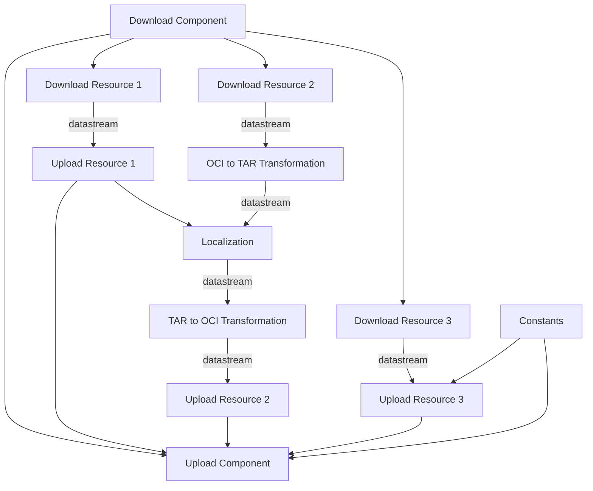
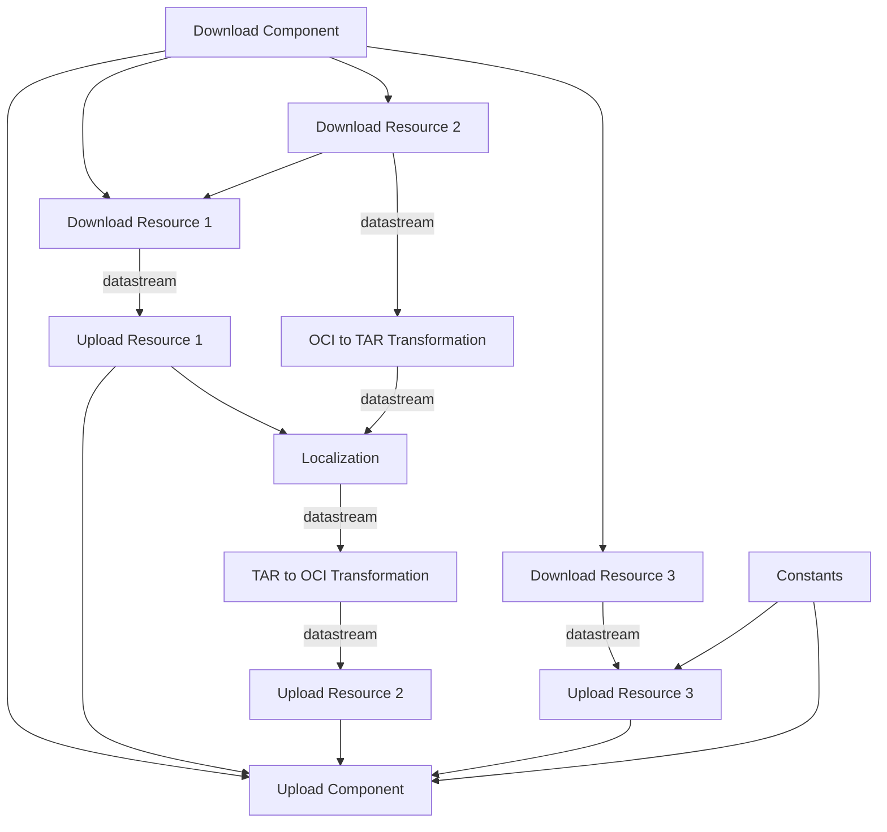

# A OCM Transformation Specification

* **Status**: proposed
* **Deciders**: Gergely Brautigam, Fabian Burth, Jakob Moeller
* **Date**: 2025-02-17

**Technical Story:** Design a specification that enables the transformation of ocm components and their resources.

> **NOTE:** This proposal essentially introduces **OCM as K8S + KRO for SBOMs**.  
> The _operation plugins_ are analogous to _k8s controllers_ (without reconciliation). Their _types and corresponding configuration schemas_ are analogous to the _k8s resource definitions_.  
> The analysis of CEL expressions to build up a directed acyclic graph (DAG) of operations is analogous to KROs _resource graph definition_.
>
> The ideas in this proposal are heavily inspired by [kro](https://kro.run/). The current proof-of-concept implementation even uses large parts of their code!

## Context and Problem Statement

The specification is primarily designed for the **transfer of components and their resources**.

### Requirements

- **Transfer components and their resources from one or multiple source repositories to one or multiple target repositories.**

  **Example:**
  - The root component `ocm.software/root-component:1.0.0` is stored at `ghcr.io/ocm-component-model/transfer-source/ocm.software/root-component:1.0.0`.
  - The root component references `ocm.software/leaf-component:1.0.0`.
  - The leaf component is stored at `quay.io/ocm-component-model/transfer-source/ocm.software/leaf-component:1.0.0`.

  Both components should be transferred to `ghcr.io/ocm-component-model/transfer-target` and `quay.io/ocm-component-model/transfer-target` in a single transfer process.

- **Transfer resources between different storage systems.**

  **Example:**
  - The resource `ocm-cli:1.0.0` is stored as an OCI artifact at `ghcr.io/ocm-component-model/transfer-source/ocm-cli:1.0.0`.

  As part of a component transfer, the resource `ocm-cli:1.0.0` should be transferred to the central Maven repository `https://repo1.maven.org/maven2` with the `GAV` `software.ocm/ocm-cli/1.0.0`. Consequently, the resource has to be transformed into a Maven artifact.

- **Localize resources that are deployment instructions during transfer.**

  **Example:**
  - The component `ocm.software/root-component:1.0.0` contains a resource `ghcr.io/ocm-component-model/transfer-source/ocm-controller-deployment-manifest:1.0.0` and a resource `ghcr.io/ocm-component-model/transfer-source/ocm-controller:1.0.0`.
  - The resource `ocm-controller-deployment-manifest:1.0.0` is a k8s deployment and specifies `image: ghcr.io/ocm-component-model/transfer-source/ocm-controller:1.0.0` in its pod template.
  - Both `ocm.software/root-component:1.0.0` and its resources are transferred to a registry in a private environment:  
    `private-registry.com/ocm-component-model/transfer-target/ocm-controller-deployment-manifest:1.0.0`  
    and  
    `private-registry.com/ocm-component-model/transfer-target/ocm-controller:1.0.0`.

  To enable consumption of the component in the private environment, the pod template in the deployment manifest must be adjusted from  
  `image: ghcr.io/ocm-component-model/transfer-source/ocm-controller:1.0.0`  
  to  
  `image: private-registry.com/ocm-component-model/transfer-target/ocm-controller:1.0.0`.

- **Hash and sign components (during transfer).**

  **Example:**
  - The component `ocm.software/root-component:1.0.0` references the component `ocm.software/leaf-component:1.0.0`.
  - Therefore, the _hash_ of component `ocm.software/root-component:1.0.0` incorporates the _hash_ of component `ocm.software/leaf-component:1.0.0`.

  Hence, the hash of `ocm.software/leaf-component:1.0.0` must be calculated before the hash of `ocm.software/root-component:1.0.0` can be computed. Since the hash of the resource content is part of the component hash, _cross storage system transfers_ and _localization_ require the hash to be recalculated during transfer.

- **Parallelization of transfer operations.**

  **Example:**
  - Resources `myimageA` and `myimageB` both need to be transferred as part of a component transfer.
  - Although the download and upload of each resource depend on one another, there are no dependencies between the two resources.
  - Therefore, the download and upload of `myimageA` and `myimageB` can be performed in parallel.

### Conclusion

**Extensibility**: The **cross storage system transfer** and the **localization** require that the transformation is extensible.

- The transformation logic for re-packaging during cross storage system transfers depends on the source and target storage systems (e.g., OCI, Maven, npm).
- The transformation logic for localization depends on the deployment description format (e.g., manifest, kustomization, helm).

**Ordering**: The **hash and sign** operations require that the operations be performed in a specific order (child components before parent components). Additionally, there are several other operations that either implicitly depend on each other (data flow between download and upload of a resource) or explicitly depend on each other (localization requires the location of the image after transfer).

**Parallelization**: Operations such as downloading and uploading of resources, as well as hashing and localization, can be performed in parallel to significantly speed up the transfer process.

Users might also want to incorporate their own operations:

- **Filtering** image layers or entire resources based on the target location of the transfer (e.g., for customer deliveries).

## Solution Proposal

An _ocm transformation specification_ is a formalized description of the operations that must be performed on components and their resources. It uses a **CEL expression syntax** to determine dependencies between operations. Based on these dependencies, a **directed acyclic graph (DAG)** is constructed to determine the order of operations.

In fact, the description format is currently so generic that it can be used to orchestrate arbitrary operations on arbitrary data—essentially establishing a **general purpose CEL-based pipeline language**.

This approach allows for the preparation or enrichment of operations on components and resources with additional information.

### Example: OCM Transformation Specification

Assume we have the following component stored in `ghcr.io/fabianburth/source-ocm-repository`:

```yaml
meta:
  schemaVersion: v2
component:
  name: ocm.software/root-component
  version: 1.0.0
  provider: ocm.software
  resources:
    - access:
        imageReference: ghcr.io/fabianburth/source-charts/podinfo:6.7.1
        type: ociArtifact
      name: mychart
      relation: external
      type: helmChart
      version: 6.7.1
    - access:
        imageReference: ghcr.io/fabianburth/source-image/podinfo:6.7.1
        type: ociArtifact
      name: myimage
      relation: external
      type: ociImage
      version: 6.7.1
    - access:
        localReference: sha256:<sha256>
        mediaType: application/yaml
        type: localBlob
      name: mylocalization
      relation: external
      type: localization-rule
      version: 6.7.1
```

We want to transfer the component to `ghcr.io/fabianburth/target-ocm-repository/*` and the resources to `ghcr.io/fabianburth/target-*`. In doing so, we want to localize the helm chart.

```yaml
type: transformations.ocm./v1alpha1
transformations:
  - type: attributes.transformation/v1alpha1
    id: constants
    attributes:
      targetImageReference: "ghcr.io/fabianburth/target-ocm-repository/ocm.software/root-component:1.0.0"

  # component 1
  - type: downloader.component.ctf/v1alpha1
    id: downloadcomponent1
    name: ocm.software/root-component
    version: 1.0.0
    filePath: ghcr.io/fabianburth/source-ocm-repository/ocm.software/root-component:1.0.0

  # resource 1
  - type: downloader.resource.oci/v1alpha1
    id: resourcedownload1
    componentDescriptor: ${downloadcomponent1.outputs.descriptor}
    resource:
      name: myimage
  - type: uploader.resource.oci/v1alpha1
    id: resourceupload1
    componentDescriptor: ${resourcedownload1.outputs.descriptor}
    imageReference: ghcr.io/fabianburth/target-image/myimage:6.7.1
    data: ${resourcedownload1.outputs.data}

  # resource 2
  - type: downloader.resource.oci/v1alpha1
    id: resourcedownload2
    componentDescriptor: ${downloadcomponent1.outputs.descriptor}
    resource:
      name: mychart
  - type: oci.to.tar.transformer/v1alpha1
    id: ocitotar1
    data: ${resourcedownload2.outputs.data}
  - type: yaml.engine.localization/v1
    id: localization1
    data: ${ocitotar1.outputs.data}
    file: "*/values.yaml"
    mappings:
      - path: "image.repository"
        value: "${resourceupload1.resource.access.imageReference.parseRef().registry}/${resourceupload1.resource.access.imageReference.parseRef().repository}"
  - type: tar.to.oci.transformer/v1alpha1
    id: tartooci1
    data: ${localization1.outputs.data}
    manifest: ${ocitotar1.outputs.manifest}
    ref: ${ocitotar1.outputs.ref}
    configLayer: ${ocitotar1.outputs.configLayer}
  - type: uploader.resource.oci/v1alpha1
    id: resourceupload2
    imageReference: ghcr.io/fabianburth/target-chart/mychart:6.7.1
    componentDescriptor: ${downloadcomponent1.outputs.descriptor}
    data: ${tartooci1.outputs.data}

  # resource 3
  - type: downloader.localblob.oci/v1alpha1
    id: downloadresource3
    componentDescriptor: ${downloadcomponent1.outputs.descriptor}
    resource:
      name: mylocalization
  - type: uploader.localblob.oci/v1alpha1
    id: resourceupload3
    componentDescriptor: ${downloadcomponent1.outputs.descriptor}
    imageReference: ${constants.spec.attributes.targetImageReference}
    data: ${downloadresource3.outputs.data}

  - type: merge.component/v1alpha1
    id: merge
    merge:
      base: ${downloadcomponent1.outputs.descriptor}
      patches:
        - ${resourceupload1.outputs.descriptor}
        - ${resourceupload2.outputs.descriptor}
        - ${resourceupload3.outputs.descriptor}
  - type: uploader.component.oci/v1alpha1
    filePath: ${constants.spec.attributes.targetImageReference}
    componentDescriptor: ${merge.outputs.descriptor}
```

Internally, this is represented as the following **directed acyclic graph (DAG)**:



**This design enables efficient parallelization of the operations.**

> **NOTES:** The _constants_ transformation (of type `attributes.transformation/v1alpha1`) is required to prevent a circular dependency between the upload of the local blob (`resourceupload3`) and the upload of the component. Uploading a `localBlob` requires knowing the component’s upload location, and the component upload must wait for the local blob upload, as this may change its resource specification in the component descriptor.
>
> Alternatively, `resourceupload3` could explicitly specify the target location. In either case, the component depends on the upload.

### Contract

- **Transformations** provide a **JSON Schema** that defines their input parameters. This JSON Schema must be provided during _transformation type registration_ and during _plugin registration_. This approach removes the need for an additional validation endpoint in the plugins, as type checking can be performed statically using the JSON Schemas.

- **Transformations** can use **CEL expressions** to refer to the **input and output parameters** of other transformations, which automatically creates a corresponding dependency in the **DAG**.

Transformations can optionally be compiled into the core ocm CLI or integrated as plugins.

### Issues

Our current graph traversal requires buffering between transformations. In a pipes architecture, all transformations connected by a data stream (typically, all transformations for a single resource) would block until the final transformation begins. In the above graph, for example, `Download Resource 2` would block until `Upload Resource 2` starts.

Now, suppose `Download Resource 1` requires inputs from `Download Resource 2`. The DAG would then be:



With **buffering**, this issue can be mitigated by processing in the following order:

- `Download Resource 2`
- `Download Resource 1`
- …

However, if we consider **streaming** the data, a **deadlock** would occur:

- `Download Resource 2` blocks until `Upload Resource 2` starts.
- `Upload Resource 2` transitively depends on `Localization`, which in turn depends on `Download Resource 1`.
- `Download Resource 1` blocks until `Download Resource 2` starts.

Ideally, we would statically analyze the graph to determine where buffering is required before `Localization`. Since this analysis is complex and time-consuming, we decided to postpone this effort.

## Usage

### Backwards Compatibility

Users will not be expected to write an **ocm transformation specification** for every transfer.

Existing commands (such as `ocm transfer component ...`) covering common use cases will remain supported.

These commands will be implemented via an **opinionated generation tool** that produces **ocm transformation specifications** reflecting the behavior of the current commands.

### Users

_With respect to transfer_, the intended users of the **ocm transformation specification** are:

- Users of the current ocm transfer command,
- _SRE_ and _DevOps_ teams responsible for product delivery.

However, as noted above, the **ocm transformation specification** is a fully-fledged general purpose pipeline language. It is not limited to the transfer use case; other users might include:

- _Product development teams_, for performing modifications on already created components within their pipeline.

## Generator

The generator is envisioned as a tool for creating **ocm transformation specifications** based on commands such as `ocm transfer component ...`.

The generator will be detailed in a separate ADR.

Internally, the generator will likely traverse a graph to serialize the ocm transformation specification.

### Localization during Transfer

Assume the following is the `localization-rule` contained within the component from the examples:

```yaml
instructions:
  - type: relative.yaml.engine.localization/v1
    file: "*/values.yaml"
    mappings:
      - path: "image.repository"
        reference:
          name: myimage
          valueFrom: "${resource.access.imageReference}"
```

The process to generate the corresponding part of the **ocm transformation specification** that handles localization during transfer would roughly include:

- Searching for a resource of type `deployment-instruction`.
- Looking for a label `localizationFrom` on the `deployment-instruction` resource.
- Finding the resource referenced by the `localizationFrom` label.
- Replacing the placeholder `<resource>` with the actual resource ID in the transformation specification.

Additionally, the conversions (`ocitotar` and `tartooci`) must be generated.

Therefore, we might postpone the implementation of _localization during transfer_ from localization rules inside component versions (or even _localization during transfer_ in general) until later, under the assumption that we can localize during deployment using KRO.

## Pros and Cons

**Pro**

- **Reusable Graph Orchestration Logic:**  
  As outlined in the requirements, various operations in ocm require complex graph orchestration. The formalization through the **ocm transformation specification** allows for reuse of this complexity for arbitrary operations (similar to CRDs and controllers in Kubernetes).

- **Extensibility:**  
  The **ocm transformation specification** allows for the integration of arbitrary operations.

- **Uniform Extension Interface:**  
  Through the **transformations** contract, ocm provides a **single, clean interface** for both its core functionality and its extensions. This may also allow for additional command-line tools or libraries (similar to kubebuilder), thereby improving the developer experience.

- **Ecosystem / Community Contributed Transformations:**  
  The value of ocm as a standard is highly dependent on its ecosystem. This extensible system is an excellent starting point for enabling a vibrant ecosystem.

**Con**

- **Complexity:**  
  The generic graph traversal logic introduces significant complexity that may be difficult to understand and debug.

> Although the clear separation between algorithm and business logic introduced through this formalization is a definite advantage.

**Further Considerations**

- **Generic:**
  - We decided to **omit any form of implicit dependencies or data flow** in this version of the specification.
  - Instead of automatically creating a dependency between each consecutive resource transformation and passing a data stream between them, we explicitly require the user (or generator) to specify the dependency via a CEL expression.
  - **Pro:**
    - This further enhances the separation between algorithm and business logic.
    - It reduces implicit assumptions.
  - **Con:**
    - It introduces boilerplate code.
    - It requires a thorough understanding of the dependencies between transformations.
    - Manual creation is challenging and prone to errors.
    - Implementing the generator will be complex.

## Conclusion

The concept behind the **ocm transformation specification** is clean and well-defined. The reusable graph orchestration logic offers significant value.

The primary disadvantage is the complexity involved in manually creating a specification. However, we assume this will be a rare task. Most users will either rely on the current commands, which auto-generate the specification, or create a specification once and then reuse it with different parameters (similar to the instance specification in KRO). Therefore, this is an acceptable trade-off.

## Links <!-- optional -->
