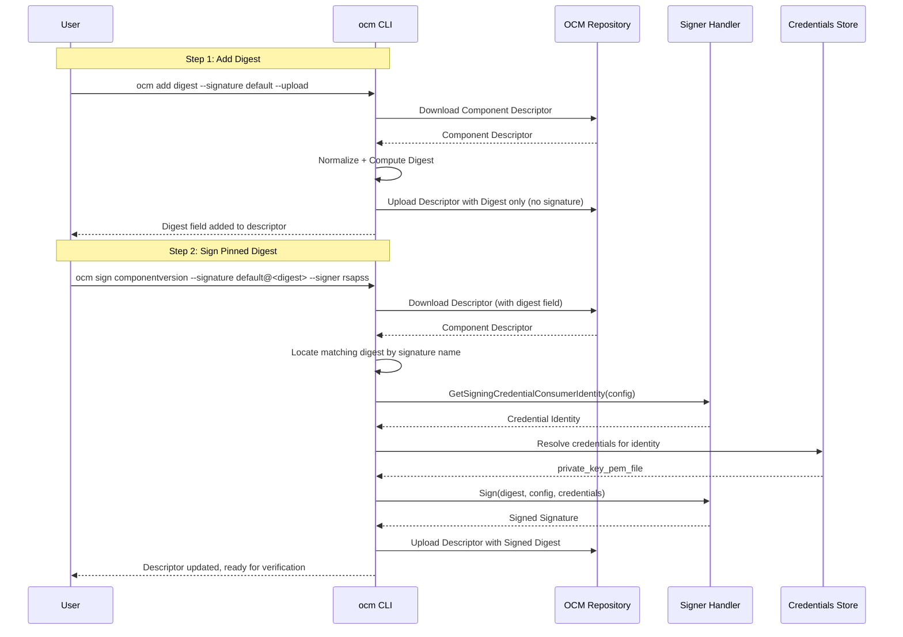
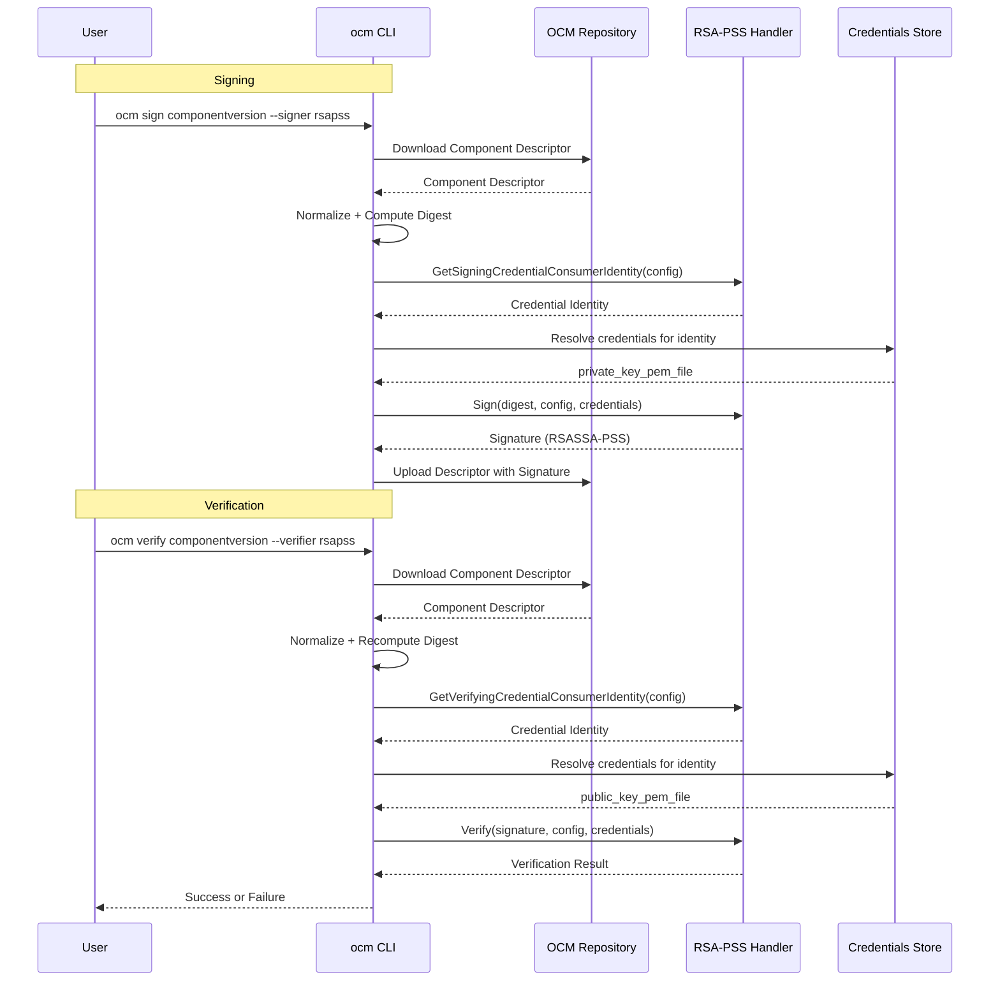
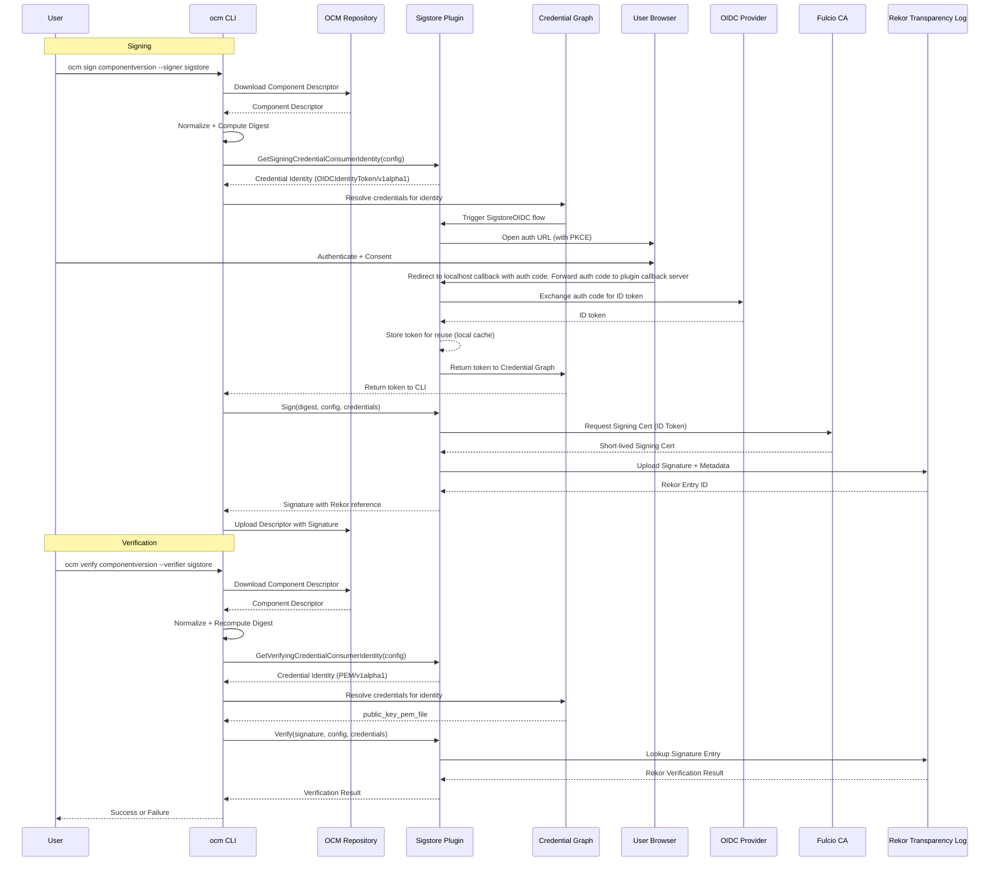

# Next Generation Component Constructor Support

* **Status**: proposed
* **Deciders**: OCM Technical Steering Committee
* **Date**: 2025.08.13

**Technical Story**:
Provide a consistent, pluggable way to sign and verify component descriptors based on a normalized representation.

---

## Context and Problem Statement

### Verification

To verify the integrity of a component version, users run:

```shell
ocm verify componentversion --signature mysig --verifier rsapss ghcr.io/open-component-model/ocm//ocm.software/ocm:0.17.0
```

This does:

1. Download the component version descriptor from the repository.
2. Inspect the [`signatures`](https://github.com/open-component-model/ocm-spec/blob/main/doc/01-model/03-elements-sub.md#signatures) field:

   ```yaml
   signatures:
     - name: mysig
       digest:
         hashAlgorithm: sha256
         normalisationAlgorithm: jsonNormalisation/v1
         value: cf08abae08bb874597630bc0573d941b1becc92b4916cbe3bef9aa0e89aec3f6
       signature:
         algorithm: RSASSA-PSS
         mediaType: application/vnd.ocm.signature.rsa
         value: 390157b7...75ab2705d6
   ```
3. Verify the signature using the configured verifier from `.ocmconfig`.

### Signing

Signing uses the analogous command:

```shell
ocm sign componentversion --signature mysig --signer rsapss ghcr.io/open-component-model/ocm//ocm.software/ocm:0.17.0
```

This downloads, normalizes, signs, and re-uploads the descriptor. This ADR will only cover the signing part.
Normalization and digest calculation are covered separately because they are technically not part of signature creation.

#### Two-Stage Signing

In most cases, normalizing/digesting and signing can be done in separate steps.
This is useful for cases where the descriptor is generated and hashed in a CI, which has a separate step for building
and signing.

In these cases, users can choose to add a digest to the descriptor and sign it separately:

```shell
ocm add digest {--signature default} {--hash-algorithm=sha256} {--normalisation-agorithm=jsonNormalisation/v1} {--dry-run=false} ghcr.io/open-component-model/ocm//ocm.software/ocm:0.17.0

> name: default
> digest:
>   hashAlgorithm: sha256
>   normalisationAlgorithm: jsonNormalisation/v1
>   value: cf08abae08bb874597630bc0573d941b1becc92b4916cbe3bef9aa0e89aec3f6
```

After this, as long as `--dry-run=false` is set (the default if not specified), the descriptor will be updated with this signature field, containing a digest,
but no actual signature value.

This can then be used to sign the descriptor against a pinned signature:

```shell
ocm sign componentversion ghcr.io/open-component-model/ocm//ocm.software/ocm:0.17.0 --signature default@cf08abae08bb874597630bc0573d941b1becc92b4916cbe3bef9aa0e89aec3f6 --signer rsapss
```

This will cause the descriptor to be downloaded, and the digest will be searched by the matching signature hash
algorithm and value.
Because the descriptor is not yet signed, the signature will be submitted to the given signer and the descriptor will be
updated with the signed digest afterwards, which will make the descriptor ready for verification. (The normalisation and
hash algorithm are derived from the digest specification)



---

## Decision Drivers

* **Simplicity**: Keep signing and verification decoupled from normalization internals.
* **Extensibility**: Support new algorithms and key types via plugins.
* **Maintainability**: Clear contracts and separation of concerns to enable testing.

---

## Outcome

Implement a plugin-driven signing/verification system based on a **ComponentSignatureHandler** contract to compute normalized digests and sign/verify them.

---

## Contract Structure

**Module**

```text
bindings/go/descriptor/signature
```

**Responsibilities**

* Working with `ComponentSignatureHandler` implementations defined by an interface.
* Config parsing and resolution.
* Orchestration of normalization, digest calculation, signing, and verification.

### Adding new Signing / Verification Handlers

**Module**

```text
bindings/go/<technology>/go.mod
```

**Package**

```text
bindings/go/<technology>/signing/method
```

Example for `RSA-PSS` signing:

```text
bindings/go/rsa/go.mod
bindings/go/rsa/signing/pss
```

---

## `ComponentSignatureHandler` Contract

> Contract name used in code: `ComponentSignatureHandler`.

```go
package handler

import (
    "context"

    "ocm.software/open-component-model/bindings/go/blob"
    descruntime "ocm.software/open-component-model/bindings/go/descriptor/runtime"
    "ocm.software/open-component-model/bindings/go/runtime"
)

// ComponentSignatureHandler groups signing and verification.
// Implementations MUST be able to verify descriptors they produce via Sign.
type ComponentSignatureHandler interface {
    ComponentSignatureSigner
    ComponentSignatureVerifier
}

// ComponentSignatureSigner signs a normalized Component Descriptor.
//
// Implementations MUST:
// - Expect that ALL unsigned signature digests were already precomputed from scratch for artifacts and component references BEFORE calling Sign.
// See: https://ocm.software/docs/getting-started/sign-component-versions/
// - Reject signature specifications without a precalculated digest specification
// - Not modify the given signature digest specification in any way when signing
// 
// Implementations SHOULD:
// - Use a well-known registered default configuration and be modifiable in their behavior, assuming sane defaults.
// - Offer versioned, stable signature implementations differentiated by the config type.
// - Reject signing specifications if there is no credential available that is required for the handler.
//
// The returned signature SHOULD be attached to the descriptor `signatures` field after a successful call to Sign.
type ComponentSignatureSigner interface {
    // GetSigningCredentialConsumerIdentity resolves the credential consumer identity of the given configuration to use for credential resolution
    // when signing new signatures with the given configuration.
    // If successful, the returned identity SHOULD be used for credential resolution. (i.e. against the OCM credential graph)
    // If unsuccessful, an error MUST be returned, and Sign MAY be called without credentials.
    GetSigningCredentialConsumerIdentity(ctx context.Context, config runtime.Typed) (identity runtime.Identity, err error)

    // Sign signs the descriptor using the provided config.
    // An extensible config SHOULD support media type and algorithm selection, if multiple are availalbe.
    //
    // Configurations MUST NOT contain any private key or otherwise sensitive material. This is a security risk.
    // Instead, the signer MUST use the provided credentials and well-known attributes to sign the digest specification.
    // The signer SHOULD fallback to environment or implementation
    // defaults based on its configuration when no credentials are provided.
    Sign(ctx context.Context, unsigned descruntime.Digest, config runtime.Typed, credentials map[string]string) (signed descruntime.SignatureInfo, err error)
}

// ComponentSignatureVerifier validates signatures and digests for a Component Descriptor.
//
// Implementations MUST:
// - Verify the cryptographic signature over the normalized digest using the provided configuration.
// - Return an error if any selected signature or required digest check fails.
//
// Implementations SHOULD:
// - Use a well-known registered default configuration derived from configuration and specification and be modifiable in their behavior, assuming sane defaults.
// - Offer versioned, stable verification implementations differentiated by the config type.
// - Reject verification specifications if there is no credential available that is required for the handler to verify the signature.
//
// See: https://ocm.software/docs/reference/ocm-cli/verify/componentversions/
type ComponentSignatureVerifier interface {
    // GetVerifyingCredentialConsumerIdentity resolves the credential consumer identity of the given configuration to use for credential resolution
    // when verifying signatures with the given configuration.
    // If successful, the returned identity SHOULD be used for credential resolution (i.e. against the OCM credential graph)
    // If unsuccessful, an error MUST be returned, and Verify CAN be called without credentials.
    GetVerifyingCredentialConsumerIdentity(ctx context.Context, config runtime.Typed) (identity runtime.Identity, err error)
    
    // Verify performs signature and digest checks using the provided config.
    //
    // An extensible config SHOULD support timeout / limit configurations for signature validation.
    // Configurations MUST NOT contain any key or otherwise sensitive material. This is a security risk.
    // Instead, the verifier MUST use the provided credentials and well-known attributes to verify the signature.
    // If the media type cannot be verified, the signature verification MUST fail.
    // The verifier SHOULD fallback to environment or implementation
    // defaults based on its configuration when no credentials are provided.
    Verify(ctx context.Context, signed descruntime.Signature, config runtime.Typed, credentials map[string]string) error
}
```

---

## Example Configuration (RSASSA-PSS)

RSASSA-PSS is our default handler that works as is:

- Signing/Verification Handler with `RSASSA-PSS/v1alpha1`
  - This handler can request credentials of type `PEM/v1alpha1` to use for signing and/or for verification
- This handler is configured by default

### Flow



### Config

```yaml .ocmconfig
- type: credentials.config.ocm.software
  consumers:
  - identity:
      type: PEM/v1alpha1
      name: "rsapss"
    credentials:
    - type: Credentials/v1
      properties:
        private_key_pem_file: "/path/to/myprivatekey.pem"
        public_key_pem_file: "/path/to/mypublickey.pem"
```

### Signing via `--signer-spec`

```yaml ./rsapss.yaml
type: RSASSA-PSS/v1alpha1
```

```shell
ocm sign componentversion --signature mysig --signer-spec ./rsapss.yaml ghcr.io/open-component-model/ocm//ocm.software/ocm:0.17.0
```

### Verification via `--verifier-spec`

```yaml ./rsapss.yaml
type: RSASSA-PSS/v1alpha1
```

```shell
ocm verify componentversion --signature mysig --verifier-spec ./rsapss.yaml ghcr.io/open-component-model/ocm//ocm.software/ocm:0.17.0
```

### Credentials

Generated Credential Consumer Identity for `GetSigningCredentialConsumerIdentity` or
`GetVerifyingCredentialConsumerIdentity`:

```yaml
type: RSASSA-PSS/v1alpha1
name: "rsapss"
```

Returned Credentials from `credentials.config.ocm.software`:

```yaml
private_key_pem_file: "/path/to/myprivatekey.pem"
public_key_pem_file: "/path/to/mypublickey.pem"
```

These credentials can be used for both signing and verifying, and can also be separately referenced when only signing or
verifying.

## Example Configuration (Sigstore)

Sigstore requires a special external plugin that works as:

- Signing Handler with `sign.sigstore.dev/v1alpha1`
  - This handler can request credentials of type `OIDCIdentityToken/v1alpha1` to use for signing.
- Verification Handler with `verify.sigstore.dev/v1alpha1`
  - This handler can request credentials of type `PEM/v1alpha1` to use for offline verification.
- Credential Graph Plugin
  - This plugin can resolve credentials of type `SigstoreOIDC/v1` to use for signing.

### Flow



```yaml .ocmconfig
- type: credentials.config.ocm.software
  consumers:
    - identity:
        # use this identity token to authenticate for signing
        type: OIDCIdentityToken/v1alpha1
        name: "sigstore"
      credentials:
      # resolve credentials for this identity token via the SigstoreOIDC credential plugin.
      - type: SigstoreOIDC/v1alpha1
        flow: normal # request an auth code with PKCE, use for token exchange with id token, stores auth code in local cache for reuse, equivalent to authorization_code in OIDC terms but name kept as in sigstore
    - identity:
        # use this identity token to provide a fallback public key for offline verification
        type: PEM/v1alpha1
        name: "sigstore"
      credentials:
        - type: Credentials/v1
          properties:
            public_key_pem_file: "/path/to/mypublickey.pem"
```

### Signing via `--signer-spec`

```yaml ./sigstore.yaml
type: sign.sigstore.dev/v1alpha1
fulcioURL: https://fulcio.sigstore.dev
rekorURL: https://rekor.sigstore.dev
OIDCIssuerURL: https://oauth2.sigstore.dev/auth
OIDCClientID: "sigstore"
```

```shell
ocm sign componentversion --signature mysig --signer-spec ./sigstore.yaml ghcr.io/open-component-model/ocm//ocm.software/ocm:0.17.0
```

### Verification via `--verifier-spec`

```yaml ./sigstore-verify.yaml
type: verify.sigstore.dev/v1alpha1
rekor:
  publicKeyLookupPolicy: Default
```

```shell
ocm verify componentversion --signature mysig --verifier-spec ./sigstore-verify.yaml ghcr.io/open-component-model/ocm//ocm.software/ocm:0.17.0
```

### Credentials

Generated Credential Consumer Identity for `GetSigningCredentialConsumerIdentity`:

```yaml
type: OIDCIdentityToken/v1alpha1
name: "sigstore"
```

Returned Credentials from `SigstoreOIDC/v1alpha1` after a successful normal / implicit OIDC flow:

```yaml
token: <base64 id token that contains email and openid scope => id token>
```

These credentials are retrieved via the plugin by using the [interactive OIDC flow from Sigstores OIDC implementation](https://github.com/sigstore/sigstore/blob/main/pkg/oauthflow/interactive.go#L48) via plugin.

Because OIDC allows to open a browser with a redirect, the plugin can dynamically open a browser window to authenticate the user and redirect back to its own small webserver retrieving the auth code. This works across binary boundaries, because the webserver is running in the same process as the plugin. Potentially, even if the server is not running on the same machine, the browser can still open a window when the client_credentials flow is used (not realized in this ADR, but possible).

Generated Credential Consumer Identity for `GetVerifyingCredentialConsumerIdentity`:

```yaml
type: PEM/v1alpha1
name: "sigstore"
```

Returned Credentials from `credentials.config.ocm.software`:

```yaml
type: Credentials/v1
properties:
  public_key_pem_file: "/path/to/mypublickey.pem"
```

These credentials can be used for offline verification in case the Rekor public key log or the TUF root is not available.

---

## Processing Architecture

1. **Input**

    * Descriptor reference or JSON/YAML.
    * Operation mode: sign or verify.
    * Resolved config from `.ocmconfig` or CLI flags.

2. **Normalization**

    * Apply configured normalization algorithm to the descriptor.
    * Recompute all artifact and reference digests.

3. **Digest Computation**

    * Compute the component-version digest over normalized bytes.
    * (If 2 step signing is used, this stops the first step of just adding the digest)

4. **Signing** *(sign mode)*

    * Produce signature envelope using selected signer plugin
    * Attach computed signature to descriptor `signatures`, using the candidate name if provided, otherwise use `default`
    * (If 2 step signing is used, this is done in a second command)

5. **Verification** *(verify mode)*

    * Filter candidate signatures by name if provided, otherwise verify all signatures present.
    * Verify signature(s) against recomputed digest and trust material.

6. **Output**

    * Sign: success with updated descriptor as long as `--dry-run=false` is set (default). Always returns the signature specification, or an error.
    * Verify: success or detailed error per failing signature.

---

## Pros and Cons

### Pros

* Consistent user experience for signing and verification.
* Pluggable algorithms and key formats.
* Decoupled from normalization internals.
* Testable contracts and clear error surfaces.
* Safe integration into credential graph system.

### Cons

* Requires plugin registry management.
* Implementors must understand normalization and digest rules BEFORE calling sign
* Risk of duplicated helpers if plugins ignore shared utilities.

---

## Conclusion

Adopt a unified, pluggable signing/verification contract around normalized component descriptors. This enforces spec compliance, preserves interoperability, and enables new cryptographic algorithms and trust models without changes to core CLI logic.
