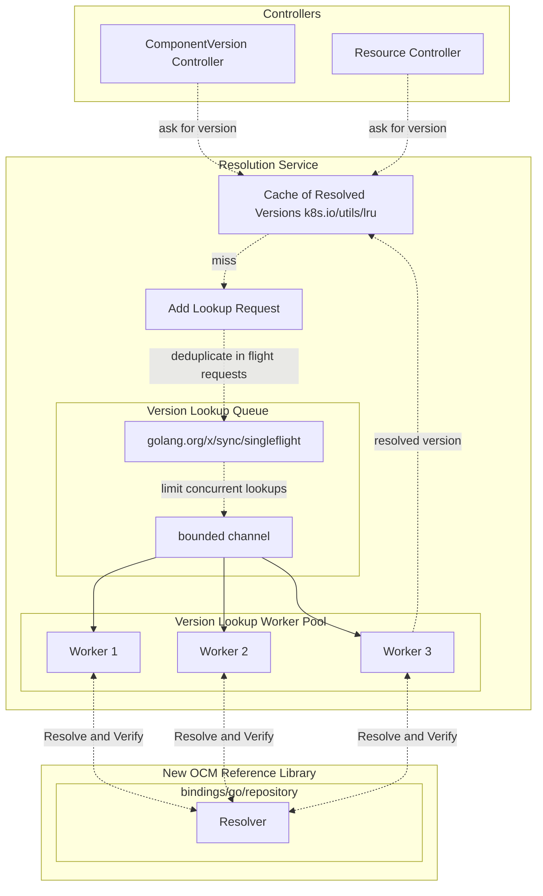
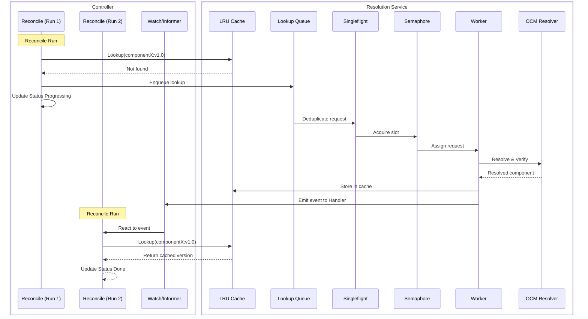

# OCM Kubernetes Controller Toolkit Migration Plan to new OCM Reference Library

* **Status**: proposed
* **Deciders**: OCM Technical Steering Committee
* **Date**: 2025.09.23

**Technical Story**:  
Enable a clear and efficient migration path for engineers moving the OCM controllers (formerly ocm-k8s-toolkit) to the new reference library set maintained in the Open Component Model (OCM) monorepo.

---

## Context and Problem Statement

The *ocm-k8s-toolkit* (now renamed to `open-component-model/kubernetes/controller`, referred to as the OCM Kubernetes Controller Toolkit) provides a set of controllers for managing OCM objects within Kubernetes clusters. Its primary responsibilities include:

1. Synchronizing and verifying OCM Component Versions and derived resources from OCM repositories.
2. Aggregating and interpreting `.ocmconfig` configurations to enable repository access and configuration.

Beyond these core functions, the toolkit also offers:

1. A controller to deploy OCM resources into Kubernetes clusters.
2. A controller to replicate OCM Component Versions between source and target repositories.

Most of the functionality is implemented as a set of Kubernetes controllers powered by the [old reference library of OCM](https://github.com/open-component-model/ocm).

While this library is offering an "out-of-the-box" experience for dealing with all known technology extensions of OCM, the library has proven to be problematic for various reasons:

1. It is extremely difficult to test and maintain due to close coupling.
2. It is difficult to extend and customize due to complexity of the interface abstractions.
3. It is difficult to use safely due to various hard-coded dependencies that frequently require triage.
4. It is difficult to integrate due to various assumptions on session and repository management.

The new [reference library of OCM](https://github.com/open-component-model/open-component-model/tree/main/bindings/go) is designed to be more modular and extensible, and offers a more flexible and safe interface for dealing with OCM.

The goal of this proposal is to provide a basic implementation path for the migration of the OCM Toolkit to the new reference library.

---

### Non-Goals

This migration plan will not cover:

- Providing a replacement for the replication controller as the new reference library still does not offer sufficient abstraction for migration (TBD Q4 2025).
- Detailed explanations on migration of the OCM Config System and implementation details for replacing OCM Context and Sessions. There is a guidance provided as architecture reference instead.

---

## Considered Options

When migrating huge amounts of code, it is important to consider the differences between different approaches. The following options were considered:

---

## Option Comparison

| Option                                                                      | Implementation Effort | Tech Debt Reduction | Maintainability | Extensibility | Risk Level | Migration Complexity | Alignment with OCM Goals                   |
|-----------------------------------------------------------------------------|-----------------------|---------------------|-----------------|---------------|------------|----------------------|--------------------------------------------|
| **Full Re-implementation**                                                  | Very High             | Maximum             | High            | High          | High       | Very High            | Strong (clean slate, aligned to new lib)   |
| **Partial Re-implementation + Rearchitecture**                              | High                  | High                | High            | High          | Medium     | High                 | Strong (modernizes design, balances reuse) |
| **Partial Re-implementation (no Arch changes)**                             | Medium                | Medium              | Medium          | Low–Medium    | Medium     | Medium               | Moderate (limits benefits of new lib)      |
| **Direct Wrappers/Adapters** (reuse old code with thin adapters to new lib) | Low                   | Low                 | Low             | Low           | Low–Medium | Low                  | Weak (short-term patch, delays migration)  |
| **Hybrid Incremental Migration** (gradual refactor per controller)          | Medium–High           | Medium–High         | Medium–High     | Medium–High   | Medium     | Medium–High          | Strong (risk spread, steady adoption)      |

---

### Recommendation

We recommend a **phased migration strategy** combining *Partial Re-implementation + Re-architecture* with *Hybrid Incremental Migration*.  
This balances risk, effort, and long-term maintainability.

#### Phase 1 — Critical Rearchitecture for Component Version Resolution

Focus on the most critical controllers where the old library caused recurring issues:

- **Repository controller**
- **Component version controller** (depends on repository)

This ensures a solid foundation with consistent performance and scalability.

Focus areas:

- Scaling across 100s of component versions in 100s of repositories.
- Avoiding cost-inefficient digest and hash recalculation.

#### Phase 2 — Base Controllers for Resource Resolution

Reimplement core building blocks on top of the new library:

- **Resource controller** reusing cache architecture of Phase 1. (accessing the same LRU cache / resolution service)
  - When downloading resources, the required verification architecture is very similar to the resolution service.
  - We should likely reuse digest verification code from the CLI "ocm verify cv" code for our logic here.

#### Phase 3 — Supplemental Controllers

Migrate higher-level controllers after the base is stable:

- **Deployment controller**
- **Replication controller** (pending transfer mechanisms).

---

#### Why this approach

- Avoids full rewrite cost and risk.
- Reduces technical baggage: breaks away from outdated abstractions.
- Improves maintainability and extensibility with clean interfaces.
- Spreads risk with gradual rollout.
- Delivers long-term value via alignment with OCM architecture goals.

---

## Decision Drivers

* **Maintainability**: Controllers should be testable, loosely coupled, and resilient to OCM core changes.
* **Performance**: Support high-volume repositories and components without bottlenecks.
* **Alignment**: Ensure toolkit adheres to long-term OCM design principles of modularity and extensibility.
* **Risk**: Minimize risk of introducing new bugs and regressions.

---

## A scalable processing architecture for component versions

To support the migration strategy, the first phase will require a careful rearchitecture of the critical controllers.  
In the current controller architecture, the fetching and resolution of component versions is performed directly within reconciliation.

This is problematic for two reasons:

1. Resolution is tightly coupled to the reconciliation loop, which reduces throughput and introduces blocking.
2. The same resolution logic cannot be easily reused across multiple controllers, resulting in duplicated effort and inconsistent behavior.

### Proposed Solution: Component Version Resolution Service

We propose introducing a dedicated **Component Version Resolution Service** as the substrate for all controllers.  
This service encapsulates resolution logic behind a consistent interface and provides caching, deduplication, and concurrency control.

#### Responsibilities

* **On-demand resolution** of component versions (keyed by repository, component name, and version).
* **Result caching** with a bounded LRU policy to avoid repeated expensive lookups.
* **Deduplication** of concurrent requests for the same key using singleflight semantics.
* **Concurrency limiting** with a worker pool to bound resource usage when resolving large volumes of components.
* **Reusable API** that can be called from multiple controllers without embedding resolution logic.

#### Architecture of Core Component Version Resolution Logic



Explanation of flowchart components:

- Controllers always hit the LRU cache first.
- On a cache miss, the request is added to the lookup queue, and status is set to "in progress"
- singleflight deduplicates requests for the same key (see below) to ensure only one actual backend fetch occurs.
- the semaphore ensures no more than N concurrent lookups proceed, protecting both cluster and remote repositories.
- requests are then handled by a worker pool, where workers call the OCM Resolver in the new reference library.
- once resolved, results are added back to the LRU cache, ready for the next reconcile loop.



Explanation of sequence:

- The controller’s first lookup never blocks on a remote call; if the cache misses, the request is queued.
  This decouples the controller queue from the underlying resolution logic.
- Resolution happens asynchronously in the background via worker pool.
- Deduplication (singleflight) prevents wasted duplicate calls.
- Concurrency is bounded globally by the semaphore.
- The result is written back to the cache.
- On the next reconcile, the controller finds the version ready (or error state) in the cache.
- We can extend the behavior to trigger a requeue once the version has been resolved.

This combination of flow and sequence views makes it clear that:

- Controllers are decoupled from resolution latency.
- Deduplication and bounded concurrency ensure scalability and safety.
- The new OCM reference library is the single backend integration point.

#### On Caching Component Versions

Caching component versions is critical to achieving both performance and correctness in the migration.  
The design must balance fast lookups with safe invalidation to prevent stale or inconsistent results.

##### Cache Key Generation

Cache keys must uniquely and deterministically represent all inputs relevant to resolution:

- **Configuration inputs**: Repository access credentials, secrets, or configuration objects that affect resolution.
- **Repository specification**: Canonicalized representation of repository type, URL, and options.
- **Component identity**: Name and version of the component.

Keys are generated as follows:

`Compute key = SHA-256(Canonical(config) + Canonical(repoSpec) + componentName + version)`

1. Serialize each input deterministically (e.g., canonical JSON with sorted keys).
2. Concatenate serialized inputs in a fixed order.
3. Compute a stable digest (e.g., SHA-256) to produce a fixed-size cache key.

This ensures that any change to configuration, repository, or component identity leads to a different cache key.

##### Invalidation Strategy

To ensure correctness, cache entries should be invalidated when their inputs change. To combine this with our existing
informers in the controllers, we will add event handlers that call back to the cache for invalidation:

- **Event-driven invalidation**
  - Watch Kubernetes objects (Secrets, ConfigMaps, Repository CRs).
  - Evict all cache entries derived from updated objects, use partial references to limit scope.
    Assuming an aggregated cache key like:
    
    ```shell
    SHA-256(Canonical(config) + Canonical(repoSpec) + Component A + version)
    SHA-256(Canonical(config) + Canonical(repoSpec) + Component B + version)
    ```
    
    then the invalidation of `Canonical(config)` or `Canonical(repoSpec)` would lead to invalidation of all cvs under that given scope, so both `A` and `B` would have to be fetched again.

  - Example: On Secret change, evict all entries using that Secret for repository access.

- **Time-based invalidation (TTL)**
  - Apply TTL for entries derived from all component versions due to potential updates in the repository.
  - Example: A component version was last fetched 10 minutes ago; if TTL is 30 minutes, keep it.

- **Negative caching**
  - Cache failed lookups with a short TTL to avoid hammering failing backends.

- **Hierarchical keys**
  - Structure keys as `config -> repo → component → version` to allow partial reuse and targeted eviction.

#### Benefits

* **Performance**: Scales across hundreds of repositories and thousands of versions without overloading backends.
* **Reuse**: A single service reused by multiple controllers avoids duplicate logic.
* **Consistency**: Guarantees that all controllers see the same resolved result for the same component version.
* **Maintainability**: Clear separation of concerns—controllers focus on reconciliation, the service handles resolution.

#### Phase 1 Application

As part of **Phase 1 — Critical Rearchitecture**, this service will replace in-reconciliation resolution logic in the **Repository** and **Component Version** controllers.  
This lays the foundation for Phase 2 and Phase 3 migrations, where additional controllers (Resource, Deployment, Replication) can be migrated to use the same shared substrate.

#### On Metrics and Observability

The new service will be integrated with the existing metrics and observability infrastructure available under a scraping endpoint in prometheus format available under controller-runtime.

We will expose metrics for:

- **Cache hit rate**
- **Cache miss rate**
- **Concurrent lookups**
- **Total lookups**
- **Total resolved versions**
- **Total errors**
- **Running lookups**
- **Queue size**
- **Worker pool size**

This can be used to monitor the health of the service lookup and identify bottlenecks as they occur. 

---

## Pros and Cons

### Pros

* Clear migration path without full rewrite.
* High alignment with new OCM library goals.
* Strong reduction in technical debt.
* Improves testing ability and scalability.
* Supports incremental rollout.

### Cons

* Requires at least minimal dual maintenance during migration phases.
* Some legacy controllers (e.g. replication) blocked until new abstractions exist.
* Higher up-front effort than simple adapters.

---

## Metrics of Success

To measure the effectiveness of the migration, the following indicators will be tracked:

- **Controller performance**:
  - <100ms average reconcile loop time for repository and component version controllers under typical load with most architectures and configurations.
  - <1s P95 for resolving component versions with cache enabled.

- **Scalability**:
  - Support for 100+ repositories and 1,000+ component versions in a single cluster without error amplification.
  - Concurrency limiter keeps remote repository call failure rates <1% under load.

- **Maintainability**:
  - Unit test coverage for controllers ≥70%.
  - Separation of concerns between controllers and resolution service.

## Dependencies

The migration depends on the following internal and external factors:

- **OCM Reference Library (bindings/go)**
  - Stable APIs for `repository` and `resolver` packages.
  - Availability of caching, verification, and hash utilities for digesting
  - For Phase 3: Availability of `transfer` and various accesses for `deployment` controllers.

- **OCM Community Alignment**
  - TSC approval of phased migration approach.
  - Agreement on deprecation schedule for old reference library.
  - Coordination with OCM SIG Runtime for replication controller abstractions (target Q4 2025).

---

## Conclusion

Adopt a **phased hybrid migration** strategy starting with rearchitecture of critical controllers through a central component version resolution service.

This minimizes risk, ensures alignment with the future direction of the Open Component Model, and delivers sustainable maintainability and extensibility for the OCM Kubernetes Controller Toolkit.  

We will introduce a new set of EPICs for tracking:

- **Phase 1**: Rearchitecture of critical controllers.
  - Component Version Resolution Service and Cache
  - Migration of Repository Controller
  - Migration Component Version Controller
  - Any leftovers such as replacement of the OCM Context with our new Config Lookups
- **Phase 2a**: Implementation of Deployment Controllers.
- **Phase 2b**: Implementation of Resource Controllers.
