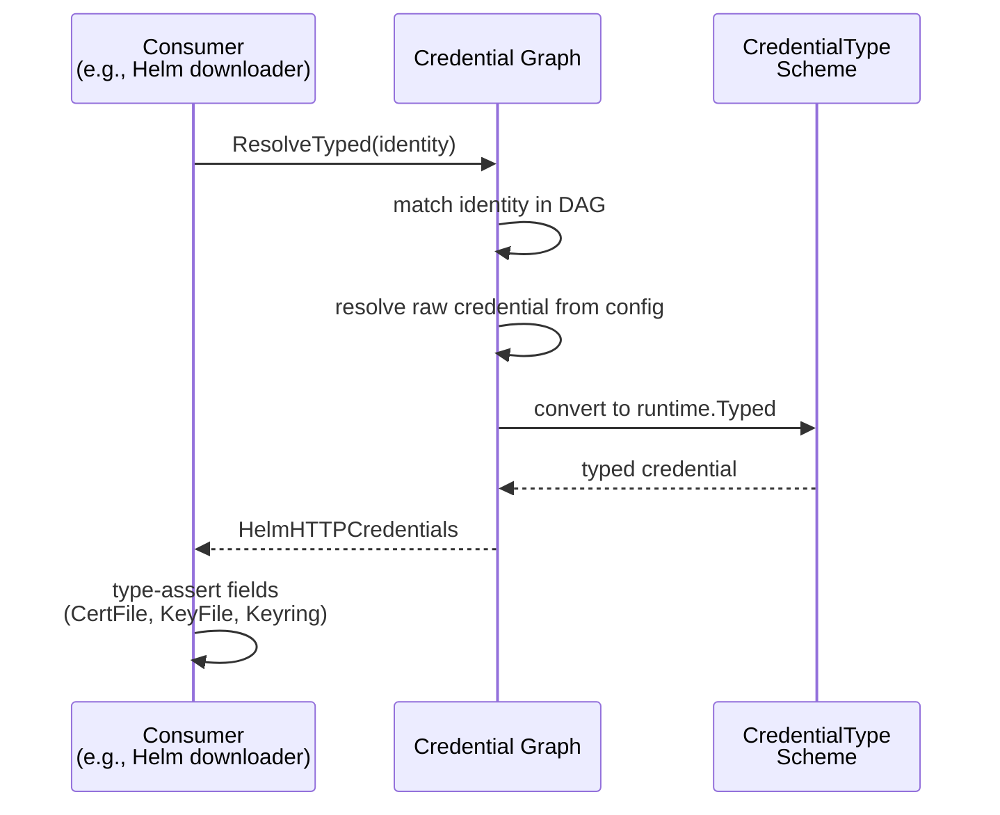
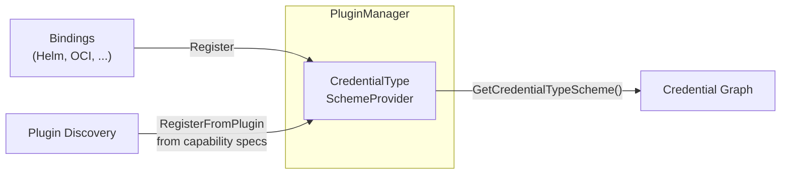

# Typed Credentials and Consumer Identity Types

* **Status**: proposed
* **Deciders**: OCM Technical Steering Committee
* **Date**: 2026-04-15

Technical Story: Evolve the OCM credential system from untyped `map[string]string` credentials into a type-safe,
self-documenting system that validates credential and identity types at both configuration time and consumption time.

## Context and Problem Statement

The credential graph (see [ADR 0002](0002_credentials.md)) resolves credentials for consumer identities through a DAG.
The resolution model is sound, but credentials and identities are untyped:

- **Credentials are `map[string]string`** — key names like `username`, `password`, `accessToken` are scattered string
  constants with no compile-time guarantees.
  A real bug exists where OCI resource downloads used `access_token` (snake_case) while docker config resolution used
  `accessToken` (camelCase), causing silent auth failures
  ([ocm-project#985](https://github.com/open-component-model/ocm-project/issues/985)).

- **Consumer identity types are scattered strings** — `"OCIRegistry"`, `"HelmChartRepository"`, `"RSA/v1alpha1"` defined
  independently per binding with no central registry, inconsistent versioning, and no way to enumerate them.

- **No validation of identity ↔ credential compatibility** — configuring RSA credentials for a Helm identity produces no
  warning. Users have no way to discover what credentials each identity type accepts.

- **No credential type specialization** — a Helm HTTP repository needs `certFile`/`keyFile`/`keyring`, while an
  OCI-backed Helm repository needs `username`/`password`/`accessToken`. Both use the same generic map today, making
  invalid combinations representable.

## Decision Drivers

1. **Type safety** — Invalid credential fields caught at compile time, not runtime
2. **Validation** — Mismatched identity/credential pairs detected at configuration time
3. **Discoverability** — Users and tooling can enumerate identity types, their accepted credential types, and required
   fields
4. **Backward compatibility** — Existing `.ocmconfig` files continue to work unchanged
5. **Gradual migration** — Multi-module monorepo requires non-blocking, per-binding migration
6. **Extensibility** — Plugins can register custom types without collisions

## Decision Outcome

### Typed Credential Specs

Each binding defines typed Go structs for its credentials, registered in a `runtime.Scheme`. The type system enforces
valid credential shapes — for example, Helm HTTP credentials have `CertFile`/`KeyFile`/`Keyring` fields, while OCI
credentials have `AccessToken`/`RefreshToken`. Invalid combinations are unrepresentable.

Where a single consumer supports multiple credential shapes (e.g., Helm supports both HTTP and OCI repositories),
separate credential types are defined per access mode rather than one type with all fields.

### Resolver Evolution

The existing `Resolver` interface gains a `ResolveTyped` method that returns `runtime.Typed` instead of
`map[string]string`. `ResolveTyped` accepts `runtime.Identity` as its identity parameter — the same shape used by the
deprecated `Resolve`. Identity matching in the graph relies on `runtime.Identity.Match` (glob/path/URL semantics for
e.g. `ghcr.io/my-org/*`), and there is no equivalent matching model for arbitrary `runtime.Typed` identity structs
today. Until that gap is designed, the identity parameter stays as `runtime.Identity`.

The graph stores credentials as `runtime.Typed` internally and resolves typed credentials from config when a
`CredentialTypeSchemeProvider` is configured. `DirectCredentials/v1` serves as the fallback for old configurations.

Adding a method to an interface breaks implementors (all in our codebase), not consumers. Each binding migrates from
`Resolve` to `ResolveTyped` independently, with no changes to function signatures, context wiring, or intermediate
layers that thread the resolver through.

A separate `TypedResolver` interface was considered and prototyped. It creates cascading signature changes: every
intermediate layer (context, builder, transformers) must carry and pass both interfaces during migration. A single
interface with two methods avoids this — bindings change only the method they call, not what they accept. A generic
interface (`TypedResolver[T any]`) was also tested; it does not work because the graph returns `runtime.Typed`
(type-erased) and Go generics are invariant, so `TypedResolver[runtime.Typed]` cannot satisfy
`TypedResolver[*HelmHTTPCredentials]`.

```go
// Pseudocode — updated Resolver interface
type Resolver interface {
Resolve(ctx context.Context, identity runtime.Identity) (map[string]string, error) // deprecated
ResolveTyped(ctx context.Context, identity runtime.Identity) (runtime.Typed, error) // new
}

// Pseudocode — consumer usage (Phase 2+)
identity := runtime.Identity{
"type":     "HelmChartRepository/v1",
"hostname": "charts.example.com",
"path":     "/stable",
}
typed, err := resolver.ResolveTyped(ctx, identity)
creds := typed.(*HelmHTTPCredentials) // type-safe access
fmt.Println(creds.CertFile, creds.KeyFile)
```



### Credential Resolution: Direct, Indirect, and Repository Fallback

The credential graph resolves credentials through three paths, tried in order on every lookup. The path for
each consumer entry is decided at ingestion time; the repository fallback is consulted at lookup time when
neither of the first two yields a result.

**Direct credentials** apply when a consumer's credential entry is a `Credentials/v1` (plain `properties` map) or a typed
credential registered in the `CredentialTypeScheme` (e.g., `HelmHTTPCredentials/v1`). The graph stores these as
`runtime.Typed` directly on the identity node at ingestion time; `ResolveTyped` returns them immediately as a leaf
lookup with no plugin call.

**Indirect credentials** apply when the credential type requires a plugin (e.g., `AWSSecretsManager`,
`HashiCorpVault`). The plugin is looked up via the `CredentialPluginProvider`.
It is used at ingestion time to call `GetConsumerIdentity`, which tells the graph what identity the plugin
itself needs credentials for; the graph then creates a DAG edge from the consumer identity to that credential identity.
At resolution time the `CredentialPluginProvider` is used again to call `Resolve` with the credentials that were
recursively resolved for the credential identity.

This enables transitive chains of arbitrary depth. See
[Credential Graph Example / Recursive Traversal](0002_credentials.md#credential-graph-example--recursive-traversal)
in ADR-0002 for a worked example with a `OCIRegistry → HashiCorpVault → DirectCredentials` chain. Resolution is
bottom-up: each plugin is called with the credentials produced by resolving its child. Cycles are detected at
ingestion time and rejected.

**Repository fallback** is consulted only when the DAG yields no match for the queried identity and a
`RepositoryPluginProvider` is wired into the graph. The graph hands the identity to every configured credential
repository (e.g., `DockerConfig/v1` reading `~/.docker/config.json`) concurrently — first success wins.

### Typed Identity Structs

Typed identity structs are `runtime.Typed` objects that represent consumer identities with structured fields instead of
untyped maps. Consumers pass them in their shallow `map[string]string` representation as `runtime.Identity` to `ResolveTyped` — the graph handles matching internally.
Due to the nature of `runtime.Identity.Match` (glob/path/URL semantics for e.g. `ghcr.io/my-org/*`), there is no equivalent matching model for arbitrary typed identity structs yet, 
so the identity parameter stays as `runtime.Identity`.

```go
// Consumer usage — pass typed identity as runtime.Identity 
identity := &HelmChartRepositoryIdentity{Hostname: "charts.example.com"}
typed, err := resolver.ResolveTyped(ctx, ToIdentity(identity))
```

### Type Registries and Graph Independence

The credential graph must remain independent of binding-specific types. It receives a single registry via its
configuration:

- **`CredentialTypeSchemeProvider`** — provides a `runtime.Scheme` that can create typed credential objects (e.g.,
  `HelmHTTPCredentials/v1`)

The `PluginManager` owns this registry. Both built-in bindings and external plugins register their credential types
into it. The graph never knows or cares where a type came from — it reads from the registry through its interface.

#### Registration

Each binding's `Register` function receives the credential type scheme and registers its types — following the same
self-registration pattern used by all other plugin types (OCI, signing, etc.):

```go
// Pseudocode — builtin Helm registration
func Register(credentialTypeScheme *runtime.Scheme) {
credentialTypeScheme.MustRegisterWithAlias(&HelmHTTPCredentials{}, HelmHTTPCredentialsVersionedType, HelmHTTPCredentialsType)
}
```

External plugins (separate binaries) declare custom credential types they introduce in the `customCredentialTypes`
field of their JSON capability spec. The `PluginManager` registers these into the credential type scheme during
plugin discovery — no manual CLI aggregation needed. Built-in types (e.g., `HelmHTTPCredentials/v1`,
`OCICredentials/v1`) are already registered by the built-in bindings at startup and must not be re-declared here.

#### Graph Consumption

The graph reads from the registry through its interface:

- `CredentialTypeSchemeProvider.GetCredentialTypeScheme()` — returns the `runtime.Scheme` for credential type
  deserialization

This separation means the graph depends only on the registry interface, never on the binding packages.



The scheme serves a fundamentally different purpose than the credential plugins. The `CredentialPlugin` interface
resolves credentials from external sources (Vault, AWS) at **query time**. The credential type scheme deserializes
typed credentials from `.ocmconfig` at **ingestion time** — before any plugin is called. Inline typed credentials
configured directly by the user (e.g., `type: HelmHTTPCredentials/v1` with `username`/`certFile` fields) do not
involve a plugin at all; only the scheme is needed to turn the config JSON into a Go struct.

**Plugin type naming convention — for coexistence, not collision prevention:** External plugin type names are prefixed
with the plugin's reverse-domain ID (e.g., `com.hashicorp.vault.VaultCredentials/v1`); built-ins use short names (e.g.,
`HelmHTTPCredentials/v1`). This is a *naming convention*, not a safety mechanism — uniqueness is already enforced
mechanically by `runtime.Scheme.TypeAlreadyRegisteredError`, which rejects duplicate registrations at startup.

The convention exists to **let two independent plugin authors coexist** when they independently pick the same short
name. Without namespacing, two plugins both declaring `OCICredentials/v1` collide at startup and the user has to drop
one. With reverse-domain prefixes, `com.vendora.OCICredentials/v1` and `com.vendorb.OCICredentials/v1` load side by
side. This follows the same idea as Jenkins plugin identifiers.

This means:

- Adding a new binding or plugin does not modify the credential graph
- The graph resolves types generically through the scheme provider interface
- Built-in types are registered as Go structs via `RegisterProvider`, external plugin types as `runtime.Raw` via
  `RegisterFromPlugin` — consumers use `scheme.Convert` to get typed structs
- Built-ins register first (at startup), plugins register after (at discovery) — duplicate registrations error out
  via `runtime.Scheme.TypeAlreadyRegisteredError`; there is no silent override or precedence
- The credential type scheme provider is optional (nil-safe) — the graph degrades to `DirectCredentials` behavior
  when no provider is configured

### Backward Compatibility

- `.ocmconfig` format is unchanged — `Credentials/v1` with `properties` continues to work
- `DirectCredentials/v1` is the universal fallback, registered with all aliases
- Bindings MUST provide a `FromDirectCredentials` helper to lift legacy `Credentials/v1` configs
  (nested `properties` map) into their typed struct (flat fields). The graph never calls it — consumers call it when
  `ResolveTyped` returns `*DirectCredentials` instead of the expected typed struct. Without this helper, the legacy
  fallback path fails because generic `scheme.Convert` cannot do this lift (the JSON shapes differ: nested `properties`
  map vs flat fields). This is not enforced by a framework interface, but every binding that supports legacy configs
  needs it for the `DirectCredentials` → typed struct conversion at the consumer level.

### External Plugin Integration

External plugins (separate binaries) communicate with the plugin manager over HTTP carrying JSON. The transport is
unchanged. Today the contract signature is `credentials map[string]string`; Phase 3 changes the **Go contract
signature** to `credentials runtime.Typed`, with `scheme.Convert(typed, *runtime.Raw)` /
`scheme.Convert(*runtime.Raw, typed)` handling serialization at the sender and receiver. The HTTP bytes are JSON either
way — only the Go API shape changes.

**At discovery time:** The plugin manager runs each plugin binary with `capabilities` and reads the capability JSON.
The plugin manager registers any types listed in `customCredentialTypes` into the credential type scheme — covering
only custom types the plugin introduces, not built-ins already registered at startup.

**At the plugin boundary (post Phase 3):** The graph hands the resolved `runtime.Typed` directly to the plugin
contract; the plugin transport marshals it to canonical JSON via the scheme and the plugin-side handler unmarshals
back into its typed struct. No per-type `FromDirectCredentials` call is needed on this path.

**Type naming for plugins:** See *Plugin type naming convention* above — reverse-domain prefixes are a naming
convention that lets two independent plugins coexist; `runtime.Scheme` still enforces uniqueness.

**Consumer-side conversion:** Consumers that need to work with plugin-declared credential types can either register
their own Go struct in the credential type scheme (giving direct type-assertion support) or use `scheme.Convert` to
convert from `*runtime.Raw` to a typed struct after resolution.

## Migration Path

The OCM codebase is a multi-module Go monorepo where each binding has its own `go.mod`. Interface changes cascade across
module boundaries. Without `go.work`, modules resolve from the proxy — so changes must be published in dependency order.

### Phase 1: Foundation

Add `ResolveTyped(ctx, runtime.Identity)` to `Resolver` and `CredentialTypeSchemeProvider` for graph consumption.
The graph stores credentials as `runtime.Typed` internally; identities continue to be `runtime.Identity`.
No downstream breakage — all existing code continues to work.

### Phase 2: Binding migration (parallelizable)

Each binding creates its typed credential specs and migrates internal code to use `ResolveTyped` with type
assertions. Bindings can be migrated independently in separate PRs.

### Phase 3: Credential interfaces — final `credentials` cut

`Resolve(ctx, runtime.Identity) (map[string]string, error)` is **replaced** in `Resolver`, `CredentialPlugin`, and
`RepositoryPlugin`. The interfaces only expose `Resolve` with `runtime.Typed`. The deprecation period planned in the original Phase 6
is skipped — downstream bindings break against the new release and migrate when they consume it.

Plugin HTTP transport in the credential-related registries (`credentialrepository/`, `credentialplugin/`) is flipped to
`runtime.Typed`. The HTTP wire format is unchanged JSON; only the Go signatures change.

Consumers that still hold a `map[string]string` surface (Phase 4 / Phase 5 binding APIs) inline a
`*DirectCredentials` type assertion against the `Resolve` with `runtime.Typed` result. No generic `runtime.Typed → map[string]string`
helper ships from `bindings/go/credentials` — the inline assertion is short enough not to warrant one, and it keeps the
typed-handling-not-yet-plumbed path explicit at each call site. The inline form goes away during Phase 4 / Phase 5 as
each binding flips its API to `runtime.Typed`.

`FromDirectCredentials` per-binding helpers and the `DirectCredentials/v1` fallback are retained per
*Backward Compatibility* — they are required to lift legacy `Credentials/v1` configs into typed structs.

**Phase 3 is the final release of `bindings/go/credentials` for this epic.** Phase 4 and later phases do not author
changes in `bindings/go/credentials`. `bindings/go/plugin`, on the other hand, sees additional cuts during Phase 4 —
each Phase 4 binding-interface flip cascades into the corresponding plugin registry because the registries hold
compile-time assertions against `repository.ComponentVersionRepositoryProvider`, `constructor.ResourceInputMethod`,
`constructor.ResourceDigestProcessor`, and `signing.Handler`. Absorbing those binding flips into Phase 3 would
collapse Phase 4 into a single mega-PR; that trade-off was rejected to keep Phase 4 PRs reviewable per-binding.

### Phase 4: Repository interfaces (no `credentials` changes)

Update `ResourceRepository`, `ComponentVersionRepositoryProvider`, `ResourceDigestProcessor`, `Signer`/`Verifier`, and
constructor interfaces to accept `runtime.Typed`. Each affected binding (in `bindings/go/constructor`,
`bindings/go/repository/*`, `bindings/go/signing/*`, etc.) bumps `bindings/go/credentials` to the Phase 3 release,
flips its own API, removes its own inline `*DirectCredentials` assertions as part of the flip, and ships a matching
update to the relevant `bindings/go/plugin/manager/registries/*` package (because the registry's compile-time
assertion against the binding interface would otherwise break). The plugin module is therefore re-released alongside
each Phase 4 binding that owns a corresponding registry.

### Phase 5: Consumer migration

CLI commands, K8s controller, and remaining consumers switch to `Resolve` and drop their inline
`*DirectCredentials` assertions as their downstream APIs flip. No changes to `bindings/go/credentials` or
`bindings/go/plugin`.

### Phase 6: Close-out

Verify no inline `*DirectCredentials` map-extraction patterns remain after Phases 4 and 5 — that is, every consumer
has flipped to typed credential handling end-to-end.

### Key Constraints

- Module publish order matters — each phase must be merged and published before downstream phases.
- Phase 2 PRs can run in parallel across bindings.
- `bindings/go/credentials` is cut **once** (at Phase 3) for this epic. Every breaking change to the credential
  interfaces lands in that release. `bindings/go/plugin` is **not** single-cut: it re-releases alongside each Phase 4
  binding-interface flip because the registries assert compile-time interface conformance against the consuming
  bindings.
- Backward compatibility is broken at Phase 3 (credential interface removal) and at each downstream binding's
  Phase 4 / Phase 5 PR (its own credential surface flip). There is no deprecation window.
- Old `.ocmconfig` files work at every stage (via `DirectCredentials/v1` fallback + per-binding `FromDirectCredentials`
  helpers).

## Conclusion

The typed credential system makes invalid credential configurations unrepresentable through Go's type system. Each
binding owns its credential types. The graph stores typed credentials natively. The gradual migration path ensures no
development blocking while transitioning the multi-module monorepo.

## Changelog

### 2026-06-01 — Rename `SupportedCredentialTypes` to `CustomCredentialTypes`

- **`CapabilitySpec.SupportedCredentialTypes` renamed to `CustomCredentialTypes`** (JSON: `customCredentialTypes`).
  The old name implied plugins should declare all credential types they can return; the field's actual purpose is
  registration of custom types the plugin introduces. Built-in types are already registered at startup and must
  not be listed here.

### 2026-05-21 — Phase 4: constructor binding migrated (#2598)

- **`bindings/go/constructor` interfaces flipped to `runtime.Typed`.** `ProcessResource`, `ProcessSource`,
  `ProcessResourceDigest`, and `DownloadResource` now accept `runtime.Typed` instead of `map[string]string`.
- **`resolveCredentials` calls `ResolveTyped`.** The deprecated `Resolve` call is removed; `resolveCredentials`
  returns `runtime.Typed` and calls `provider.ResolveTyped` directly.
- **`credentials` bumped to `v0.0.11`** in `bindings/go/constructor/go.mod`, matching the OCI binding (#2594).
- The corresponding `bindings/go/plugin` registries (`input/`, `digestprocessor/`) will need a follow-up release
  to absorb the compile-time interface assertion changes.

### 2026-05-15 — Phase 6 cleanup absorbed into Phase 3 / Phase 4; `Resolve` removed outright

- **`Resolve` replaced, not deprecated.** Phase 3 replaces `Resolve` with its `runtime.Typed` version in `Resolver`, `CredentialPlugin`, and
  `RepositoryPlugin`; the planned Phase 6 deprecation period is skipped. The interfaces only expose
  `Resolve` with `runtime.Typed` instead of `map[string]string`.
- **`bindings/go/credentials` cut once.** All credential-side interface changes for this epic land in Phase 3.
  Phase 4 and Phase 5 do not author changes in `bindings/go/credentials`. Each downstream binding bumps once during
  its own PR.
- **`bindings/go/plugin` not single-cut.** Phase 3 flips the credential-related registries
  (`credentialrepository/`, `credentialplugin/`). The other registries (`input/`, `signinghandler/`,
  `digestprocessor/`, `componentversionrepository/`, `componentlister/`, `blobtransformer/`, `resource/`) hold
  compile-time assertions against `repository`/`constructor`/`signing` binding interfaces and must re-release whenever
  those interfaces flip in Phase 4. Absorbing Phase 4 binding flips into Phase 3 was considered and rejected — it
  would collapse Phase 4 into one mega-PR.
- **No generic `runtime.Typed → map[string]string` helper ships from `bindings/go/credentials`.** Consumers that still
  hold a `map[string]string` downstream API inline a `*DirectCredentials` type assertion at the call site. The inline
  form goes away during Phase 4 / Phase 5 as each binding flips. A generic helper was considered (`TypedToMap`) and
  rejected — it papered over typed-handling-not-yet-plumbed paths and would have left orphan code in
  `bindings/go/credentials` after the epic.
- **`FromDirectCredentials` + `DirectCredentials/v1` retained.** Per-binding helpers (`oci`, `rsa`, etc.) remain the
  bridge for legacy `Credentials/v1` configs. Rationale recorded in `bindings/go/credentials/doc.go`.

### 2026-05-11 — Roll back typed identities and IdentityTypeRegistry

- **`ResolveTyped` reverted to `runtime.Identity`** (from `runtime.Typed`). Identity lookup in the graph relies on
  `runtime.Identity.Match` for glob, path, and URL semantics (e.g. `ghcr.io/my-org/*`). There is no equivalent
  matching model for arbitrary typed identity structs yet, and no current consumer of typed identities, so the
  parameter type stays as `runtime.Identity` until
  a [typed matching design exists](https://github.com/open-component-model/ocm-project/issues/800).
  Credential values remain typed (`runtime.Typed` return type) — only the identity side is rolled back.
- **`IdentityTypeRegistry` dropped from the credential graph.** `Options.IdentityTypeRegistry`, the graph's
  `identityTypeRegistry` field, and `validateConsumerIdentityTypes` are removed. With typed identities rolled back,
  the registry no longer has a job to do in the graph: it existed to validate that a typed identity's declared
  credential types matched what was configured. Validation lives at the consumer (where the type assertion happens)
  for now. `CredentialTypeSchemeProvider` stays — typed credential deserialization is still useful.
- **`toIdentity` bridge function removed** — no longer needed once `ResolveTyped` accepts `runtime.Identity` directly.
- **`isAccepted` helper removed** — was only called by `validateConsumerIdentityTypes`.

### 2026-05-05 — Credential resolution mechanics documented

- **Three resolution paths** clarified. Direct credentials (`Credentials/v1` or typed credentials registered in
  the `CredentialTypeScheme`) are stored as leaf nodes and returned immediately. Indirect credentials (plugin-backed
  types such as `AWSSecretsManager` or `HashiCorpVault`) create DAG edges at ingestion time; at resolution time the
  graph traverses edges depth-first, calling each plugin with the credentials resolved for its own consumer identity.
  Chains of arbitrary depth are supported; cycles are rejected at ingestion. Repository plugins (e.g., `DockerConfig`)
  serve as a flat, parallel fallback when no DAG node matches the queried identity — first success wins. By design,
  repository-to-repository recursion is not supported, and credentials backing an indirect entry are not eligible for
  repository fallback.

### 2026-04-25 — Phase 1 implementation refinements

- **`ResolveTyped` accepts `runtime.Typed`**, not `runtime.Identity`. The graph internally works with `runtime.Typed`
  throughout. `runtime.Identity` is only accepted at the deprecated `Resolve` method boundary. Typed identity structs
  can be passed directly to `ResolveTyped`.
- **`runtime.Scheme.ResolveCanonicalType`** added — resolves alias types to their canonical default type. Used by
  `isAccepted`
  for identity → credential type validation, replacing the previous `reflect.TypeOf` + `NewObject` comparison.
- **`CredentialAcceptor` interface replaced by `IdentityTypeRegistry`**. The accepted credential types mapping is now
  declarative (stored at registration time via `RegisterWithAcceptedCredentials`) rather than behavioral (implemented
  as an interface on identity structs). This removes the cross-package import coupling between identity and credential
  type packages and aligns built-in bindings with the same registration model used by external plugins.
- **`IdentityTypeSchemeProvider` replaced by `IdentityTypeRegistry`**. The registry wraps a `runtime.Scheme` and adds
  the accepted credential types mapping. The graph receives it via `Options.IdentityTypeRegistry`.
- **`toIdentity` bridge function** added as private migration scaffolding in the credentials package. It exists because
  `CredentialPlugin` and `RepositoryPlugin` interfaces still accept `runtime.Identity` (Phase 3 removes this).
