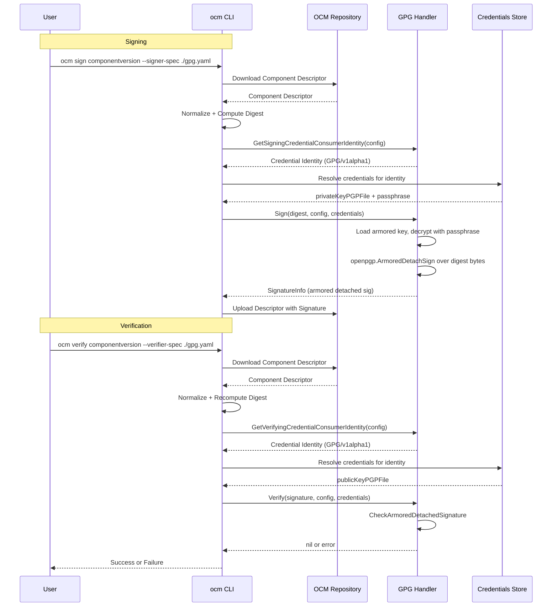

# GPG / OpenPGP Signing Support

* **Status**: proposed
* **Deciders**: OCM Technical Steering Committee
* **Date**: 2026.05.18

**Technical Story**: Users with passphrase-protected GPG keys cannot sign component versions today. OCM only supports RSA/PEM keys. This blocks projects like OpenBao from reusing their established key material (see [ocm/#1544](https://github.com/open-component-model/ocm/issues/1544)).

---

## Context and Problem Statement

`ocm sign componentversion` calls through a plugin-based signing registry. The only built-in handler today is RSA (RSASSA-PSS / PKCS1-v1.5). It accepts unencrypted PEM-encoded private keys. Users who hold GPG / OpenPGP keys — especially passphrase-protected ones — have no path to sign without first exporting and decrypting their key material, which is operationally unacceptable and weakens key hygiene.

## Decision Drivers

* Allow existing GPG key material to be used without decrypting keys to disk
* Match the OCM signing plugin contract exactly so no core changes are required
* Support passphrase-protected keys (the primary ask in issue #1544)
* Keep the implementation auditable and dependency-minimal

## Considered Options

* **Option A**: Native GPG handler as a built-in plugin (`bindings/go/gpg/`)
* **Option B**: External process plugin (separate binary, communicates over stdio)
* **Option C**: Pre-processing step — decrypt key outside OCM, pass unencrypted PEM

## Decision Outcome

Chosen **Option A**: native built-in GPG handler.

Justification:

* Follows the exact same pattern as the RSA handler — no new infrastructure needed
* Passphrase stays in memory; never written to disk in decrypted form
* Credential graph integration is free: passphrase can come from file or inline config
* Option B adds operational complexity (binary distribution, plugin discovery)
* Option C is the status quo and is what we are trying to fix

---

## Option A: Native GPG Built-in Handler

### Description

A new Go module `ocm.software/open-component-model/bindings/go/gpg` implements the `signing.Handler` interface using the ProtonMail OpenPGP library (`github.com/ProtonMail/go-crypto`). The handler will be registered as a built-in plugin in the `ocm` CLI in a follow-up PR after module tagging.

Passphrase support is provided through the standard OCM credential map: a `passphrase` credential key is used to decrypt the in-memory private key before signing. The private key is never written to disk in decrypted form.

### High-level Architecture



### Contract

Credential keys for `GPG/v1alpha1`:

| Key | Description |
|-----|-------------|
| `privateKeyPGP` | Inline ASCII-armored PGP private key |
| `privateKeyPGPFile` | Path to ASCII-armored PGP private key file |
| `passphrase` | Passphrase to decrypt the private key (if protected) |
| `publicKeyPGP` | Inline ASCII-armored PGP public key |
| `publicKeyPGPFile` | Path to ASCII-armored PGP public key file |

Produced `SignatureInfo`:

```yaml
algorithm: GPG
mediaType: application/vnd.ocm.signature.gpg
value: <ASCII-armored OpenPGP detached signature>
```

### Example Config

Signer/verifier spec (`gpg.yaml`):

```yaml
type: GPGSigningConfiguration/v1alpha1
```

Signing credentials in `.ocmconfig`:

```yaml
type: generic.config.ocm.software/v1
configurations:
- type: credentials.config.ocm.software
  consumers:
  - identity:
      type: GPG/v1alpha1
      signature: default
    credentials:
    - type: Credentials/v1
      properties:
        privateKeyPGPFile: /path/to/signing-key.asc
        passphrase: <your-key-passphrase>
```

Verification credentials in `.ocmconfig`:

```yaml
type: generic.config.ocm.software/v1
configurations:
- type: credentials.config.ocm.software
  consumers:
  - identity:
      type: GPG/v1alpha1
      signature: default
    credentials:
    - type: Credentials/v1
      properties:
        publicKeyPGPFile: /path/to/public-key.asc
```

#### Passing Credentials via Environment Variables

The OCM credential system supports environment-based credential providers. The passphrase (and any other credential key) can be injected without a config file by using the `OCM_CREDENTIALS` environment variable or a credential provider that reads from the environment.

For example, to pass the passphrase via the environment:

```bash
OCM_CREDENTIALS='{"consumers":[{"identity":{"type":"GPG/v1alpha1","signature":"default"},"credentials":[{"type":"Credentials/v1","properties":{"privateKeyPGPFile":"/path/to/signing-key.asc","passphrase":"my-passphrase"}}]}]}' \
  ocm sign component-version ...
```

This avoids writing the passphrase to disk entirely. The exact mechanism follows the same credential resolution path used by all other credential types in OCM.

---

## Pros and Cons of the Options

### Option A: Native Built-in Handler (Chosen)

Pros:

* Zero new infrastructure — mirrors RSA handler pattern exactly
* Passphrase in-memory only, never written to disk
* Works with all existing credential providers (file, inline)
* Single binary — no plugin discovery needed
* `github.com/ProtonMail/go-crypto` already used transitively by the CLI

Cons:

* `github.com/ProtonMail/go-crypto` becomes a direct dependency of `bindings/go/gpg`

### Option B: External Process Plugin

Pros:

* Completely isolated; can use `gpg` system binary or arbitrary tooling

Cons:

* Users must distribute and install a second binary
* Plugin discovery and lifecycle management overhead
* No credential graph integration without custom protocol

### Option C: Pre-decrypt

Pros:

* No code changes required today

Cons:

* Forces user to expose decrypted private key material on disk
* Defeats the purpose of passphrase protection — the whole problem this addresses

---

## Discovery and Distribution

The handler will ship as part of the `ocm` CLI binary in a follow-up PR after module tagging. No separate installation will be needed. Config follows the existing `.ocmconfig` credential pattern documented in ADR-0002.

## Conclusion

Add a native GPG signing handler built-in plugin. It implements `signing.Handler` using the ProtonMail OpenPGP library, receives passphrase via the credential map, and decrypts the private key in-memory per signing operation. This unblocks GPG key users with zero infrastructure overhead.
