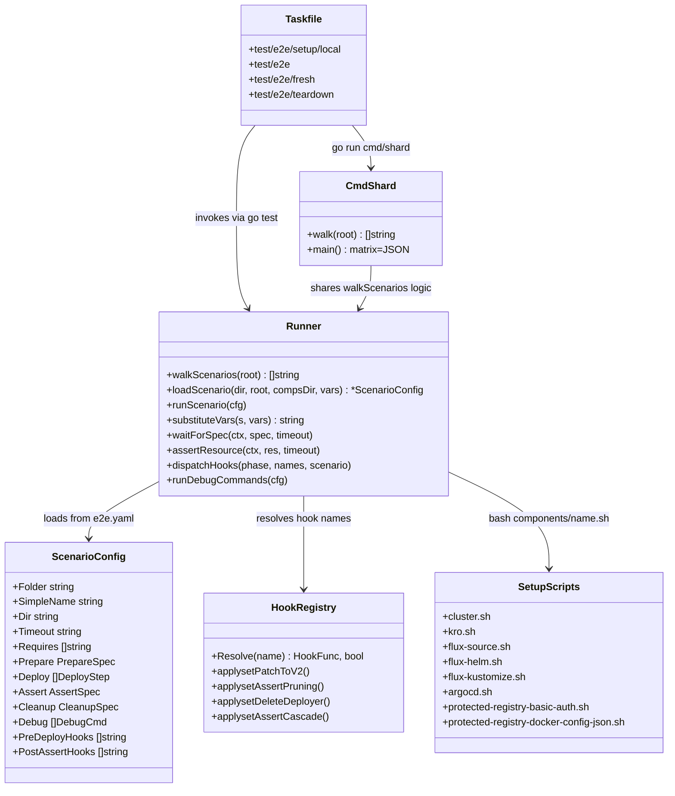
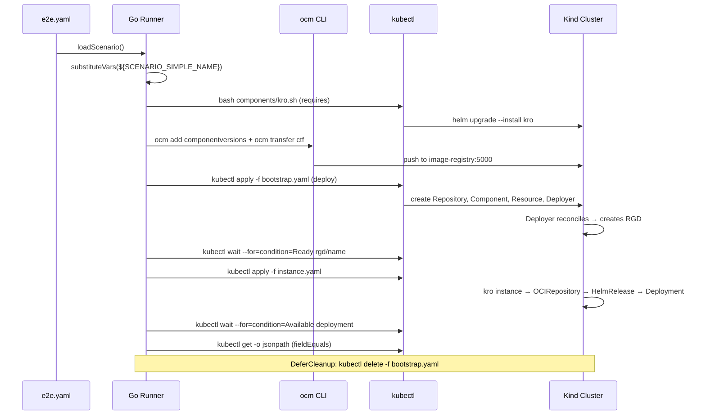

# Authoring an e2e scenario

A short, task-oriented guide for adding a new e2e scenario. For the architectural
rationale, locked decisions (Q1–Q16), and the full schema reference see
[`DESIGN.md`](./DESIGN.md).

> **Status:** implemented. The runner described here is live; all scenarios
> follow the declarative `e2e.yaml` schema. See `DESIGN.md` for the full
> architectural rationale and migration history.

## E2E Pipeline Architecture

<details>
<summary>Detailed class diagram</summary>



</details>

<details>
<summary><strong>How a scenario runs (detailed diagrams)</strong></summary>

### Sequence: what each phase does to the cluster



</details>

---

## Two audiences, two locations

Pick the location based on **who the scenario is for**:

| Scenario kind | Location | Discovery |
|---|---|---|
| **User-facing demo** — something a user might copy as a starting point | `kubernetes/controller/examples/<family>/<scenario>/` | Auto-discovered |
| **Test-only fixture** — exercises a corner case, edge condition, or feature whose only consumer is the test suite | `kubernetes/controller/test/e2e/scenarios/<family>/<scenario>/` | Auto-discovered |

`<family>` groups related scenarios: `helm/`, `kustomize/`, `k8s-manifest/`,
`applyset/`, `credentials/`. Within `helm/`, examples are split a second
level by delivery tool: `helm/fluxcd/<scenario>/` for Flux-only and
`helm/argocd/<scenario>/` for ArgoCD-only (each scenario uses one tool, not
both — see DESIGN.md Q5b). `kustomize/` follows the same per-tool split:
Flux variants live under `kustomize/fluxcd/<scenario>/` and ArgoCD variants
under `kustomize/argocd/<scenario>/`. The runner walks both trees and stops
descending at the first `e2e.yaml` it finds. Anything below that file is
treated as scenario-private content.

If you cannot decide: ask yourself "would a user reading the examples folder
benefit from seeing this?" If no, it belongs under `test/e2e/scenarios/`.

---

## The scenario folder

Every scenario folder contains:

```
<scenario>/
├── e2e.yaml                  # required — declares how to run the scenario
├── component-constructor.yaml # required — OCM component to build
├── bootstrap.yaml            # required — top-level resource the runner deploys
├── rgd.yaml                  # optional — kro ResourceGraphDefinition
├── instance.yaml             # optional — RGD instance
├── ocm.software / ocm.software.pub  # optional — signing keys
└── ...                       # any other files referenced from e2e.yaml
```

The runner **only reads `e2e.yaml`**. Everything else is opaque content
referenced from inside it.

---

## Naming

Two variables are exposed to your `e2e.yaml`:

- `${SCENARIO_FOLDER}` — slash-joined family + folder, e.g. `helm/fluxcd/simple`.
  Used for log lines and Ginkgo spec descriptions.
- `${SCENARIO_SIMPLE_NAME}` — full path with `/` replaced by `-`, e.g.
  `helm-fluxcd-simple`. Safe to use in Kubernetes resource names. Use this
  anywhere a name lands on the cluster.

Plus everything in the **fixed variable list** (see DESIGN.md §"Templated
variables"): `${IMAGE_REGISTRY}`, `${IMAGE_REGISTRY_HOST}`,
`${CONTROLLER_NAMESPACE}`, `${PROTECTED_REGISTRY_BASIC_AUTH}`,
`${PROTECTED_REGISTRY_DOCKER_CONFIG_JSON}`, `${SCENARIO_DIR}`.

No Go templates. No `{{ ... }}`. Only `${VAR}` envsubst-style substitution
against the fixed list. Unknown variables are a hard error at parse time.

---

## Minimal `e2e.yaml`

Smallest viable scenario — bootstrap a kro RGD, wait for a deployment:

```yaml
requires:
  - kro
  - flux-source
  - flux-helm

deploy:
  - apply: bootstrap.yaml
    waitFor:
      - kubectl: "--for=create --for=condition=Ready=true rgd/helm-fluxcd-simple"
  - apply: instance.yaml
    waitFor:
      - kubectl: "--for=create --for=condition=Available deployment.apps/helm-fluxcd-simple-podinfo"
```

That's the whole file. The runner handles OCM component transfer (defaults to
`component-constructor.yaml`), namespace scoping, log dumping on failure, and cleanup.


<details>
<summary>Full schema reference with all fields</summary>

```yaml
apiVersion: e2e.ocm.software/v1
kind: Scenario

# Optional. Overrides the global E2E_TIMEOUT for this scenario.
timeout: 5m

# Required. Components the harness must install before the scenario runs.
requires:
  - kro
  - flux-source
  - flux-helm

# Optional. Defaults to component-constructor.yaml if that file exists.
prepare:
  components:
    - signingKey: ocm.software                     # optional; private key path
      ocmConfig: .ocmconfig                        # optional; --config for `ocm transfer`
      copyResources: true                          # optional; adds --copy-resources to transfer

# Optional. Hooks (named Go functions) chained in array order.
preDeployHooks: []
postDeployHooks: []
preAssertHooks: []
postAssertHooks: []
preCleanupHooks: []
postCleanupHooks: []

# Required. Ordered deploy steps.
deploy:
  - apply: bootstrap.yaml
    waitFor:
      - kubectl: "--for=create --for=condition=Ready=true rgd/my-scenario"
        timeout: 2m                                # optional, overrides scenario timeout
    debug:                                         # optional; runs on step failure
      - kubectl: get rgd my-scenario -o yaml
      - kubectl: get events --field-selector involvedObject.name=my-scenario
  - apply: instance.yaml
    waitFor:
      - kubectl: "--for=create --for=condition=Available deployment.apps/my-scenario-podinfo"
      - kubectl: "--for=condition=Ready=true pod -l app.kubernetes.io/name=my-scenario-podinfo"

# Optional. Final-state validation after deploy completes.
assert:
  kubectl:
    - "wait --for=condition=Ready=true pod -l app.kubernetes.io/name=my-scenario-podinfo --timeout=5m"
  fieldEquals:
    - resource: pod -l app.kubernetes.io/name=my-scenario-podinfo
      jsonPath: '{.items[0].spec.containers[0].image}'
      value: ${IMAGE_REGISTRY_HOST}/stefanprodan/podinfo:6.9.1

# Optional. Cleanup options.
cleanup:
  cascadeFromBootstrap: false
  cascadeTimeout: 5m

# Optional. Diagnostics on failure or debug mode.
debug:
  - kubectl: get pods -n ${CONTROLLER_NAMESPACE} -o wide
    label: controller-pods
  - kubectl: get helmrelease -A -o wide
    label: helmreleases
```

</details>
---

## Adding behaviour the schema does not cover

If a scenario needs imperative work — generate a secret, mutate a CR mid-flight,
verify a side-effect that is not a Kubernetes resource — **do not** add fields
to `e2e.yaml`. Instead, write a hook.

```yaml
preDeployHooks:
  - createBasicAuthSecret
postAssertHooks:
  - verifySignedComponent
```

Each name must exist in [`kubernetes/controller/test/e2e/hooks/registry.go`](./hooks/registry.go).
Hooks run in array order. The six phases — `preDeployHooks`, `postDeployHooks`,
`preAssertHooks`, `postAssertHooks`, `preCleanupHooks`, `postCleanupHooks` — are
documented in DESIGN.md.

A hook is a Go function:

```go
func createBasicAuthSecret(ctx context.Context, s *hooks.Scenario) error {
    // s.Folder, s.SimpleName, s.Dir
}
```

Adding a hook is a code change. Reviewers will push back on hooks that
duplicate something `assert.resources` or `assert.fieldEquals` could express.

---

## Picking a delivery tool for helm scenarios

Helm scenarios pick exactly one delivery tool — Flux or ArgoCD — based on
their folder:

| Folder | Delivery tool | `requires:` | rgd.yaml resources |
|---|---|---|---|
| `examples/helm/fluxcd/<name>/` | Flux | `kro`, `flux-source`, `flux-helm` | `Resource` → `OCIRepository` → `HelmRelease` |
| `examples/helm/argocd/<name>/` | ArgoCD | `kro`, `argocd` | `Resource` → `Application` |

A Flux scenario waits for the Flux-managed deployment:

```yaml
deploy:
  - apply: instance.yaml
    waitFor:
      - kubectl: "--for=create --for=condition=Available deployment.apps/helm-fluxcd-simple-podinfo"
      - kubectl: "--for=condition=Ready=true pod -l app.kubernetes.io/name=helm-fluxcd-simple-podinfo"
```

An ArgoCD scenario waits for both the `Application`'s sync/health and the deployment:

```yaml
deploy:
  - apply: instance.yaml
    waitFor:
      - kubectl: "--for=create --for=jsonpath={.status.sync.status}=Synced --for=jsonpath={.status.health.status}=Healthy applications.argoproj.io/helm-argocd-simple -n argocd"
      - kubectl: "--for=create --for=condition=Available deployment.apps/helm-argocd-simple-podinfo -n default-argocd"
```

ArgoCD-managed releases use the suffix `-argocd` to avoid colliding with the
Flux release name; the namespace is `default-argocd`. See
[`examples/helm/fluxcd/simple/`](../../examples/helm/fluxcd/simple/) and [`examples/helm/argocd/simple/`](../../examples/helm/argocd/simple/) for the
canonical wiring of each tool.

If you need a side-by-side parity demo (both tools deploying the same chart),
that belongs under `test/e2e/scenarios/helm/parity/`, not under `examples/`
(see DESIGN.md Q5b).

---

## When the OCM component must be signed

Place the private key alongside `component-constructor.yaml` as
`ocm.software`, and the public key as `ocm.software.pub`. The runner detects
the keys by name and signs/verifies automatically — no `e2e.yaml` field
required.

If signature behaviour is the *thing being tested*, write a hook that flips
the public key, re-runs the relevant resource transfer, and asserts the
controller error condition. Don't try to express that in YAML.

---

## Cleanup

By default the runner deletes only the resources it deployed. If your scenario
needs the full OCM-managed graph torn down (component → resource → release),
opt in:

```yaml
cleanup:
  cascadeFromBootstrap: true
```

This is opt-in because OCM cleanup cascade is itself a behaviour worth testing
deliberately, not a side-effect every scenario should pay for.

---

## Diagnostics on failure (or in debug mode)

The runner executes the kubectl commands declared in `debug:` whenever
**either** of these is true:

- the scenario fails, **or**
- the GitHub Actions workflow is in debug mode — `RUNNER_DEBUG=1` (set when
  an operator picks "Re-run with debug logging") or `ACTIONS_STEP_DEBUG=true`
  is exported into the runner environment.

**Scenario-level `debug:`** runs at the end of the scenario. **Per-step `debug:`**
runs immediately when that specific deploy step fails (before the scenario aborts):

```yaml
deploy:
  - apply: bootstrap.yaml
    waitFor:
      - kubectl: "--for=create --for=condition=Ready=true rgd/my-scenario"
    debug:
      - kubectl: get rgd my-scenario -o yaml
      - kubectl: get events --field-selector involvedObject.name=my-scenario
```

If you omit scenario-level `debug:`, a default set runs (controller pods/logs,
kro pods/events, RGD conditions). Override it to add scenario-specific
diagnostics:

```yaml
debug:
  - kubectl: get pods -n argocd -o wide
    label: argocd-pods
  - kubectl: get applications.argoproj.io -A -o wide
    label: argocd-apps
```

Each `kubectl:` value is passed directly to `kubectl` (split on whitespace).
`label:` is optional — used to group output lines in the log.

To force the snapshot on a green run locally, prepend `RUNNER_DEBUG=1`:

```sh
RUNNER_DEBUG=1 task kubernetes/controller:test/e2e -- helm/fluxcd/simple
```

---

## Local iteration

```sh
# Teardown + fresh cluster + run one scenario (full clean slate)
task kubernetes/controller:test/e2e/fresh -- helm/fluxcd/simple

# Provision a fresh kind cluster (components installed on demand by the runner)
task kubernetes/controller:test/e2e/setup/local

# Or: pre-install all components for fast repeated focused runs
task kubernetes/controller:test/e2e/setup/local -- --all-components

# Run everything
task kubernetes/controller:test/e2e

# Run one scenario (exact match — won't run nested-signed when you say nested)
task kubernetes/controller:test/e2e -- helm/fluxcd/simple

# Tear down the cluster and registry when done
task kubernetes/controller:test/e2e/teardown
```

The scenario name passed via `--` is matched exactly (anchored). The local
cluster is persistent across runs; CI uses the default (cluster only) so each
shard only installs the components its scenario declares in `requires:`.
See DESIGN.md §"Operator UX" for the full command table.

---

## Checklist before opening a PR

- [ ] Scenario folder is in the correct audience location.
- [ ] `e2e.yaml` parses (`task kubernetes/controller:test/e2e -- --focus="<scenario>" --dry-run`).
- [ ] Every `${VAR}` is in the fixed variable list.
- [ ] Every hook name resolves at `BeforeSuite`.
- [ ] Local run passes from a fresh kind cluster.
- [ ] If user-facing: scenario shows up in `examples/README.md` family table.
- [ ] If test-only: brief comment at the top of `e2e.yaml` saying *what corner
      case* this exists to cover.

---

## Where to read more

- [`DESIGN.md`](./DESIGN.md) — full schema, locked decisions, migration plan.
- [`hooks/registry.go`](./hooks/registry.go) — list of named hooks.
- [`examples/helm/fluxcd/simple/`](../../examples/helm/fluxcd/simple/) — canonical Flux helm reference.
- [`examples/helm/argocd/simple/`](../../examples/helm/argocd/simple/) — canonical ArgoCD helm reference.
- [`test/e2e/scenarios/applyset/pruning/`](./scenarios/applyset/pruning/) — canonical test-only reference.
