# Authoring an e2e scenario

A short, task-oriented guide for adding a new e2e scenario. For the architectural
rationale, locked decisions (Q1–Q16), and the full schema reference see
[`DESIGN.md`](./DESIGN.md).

> **Status:** implemented. The runner described here is live; all scenarios
> follow the declarative `e2e.yaml` schema. See `DESIGN.md` for the full
> architectural rationale and migration history.

## How a scenario runs

### High-level: the 30-second mental model

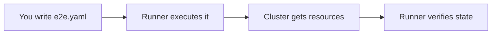

### Mid-level: phases

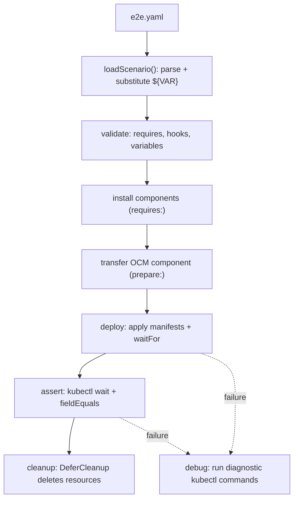

### Detailed: what each phase does to the cluster

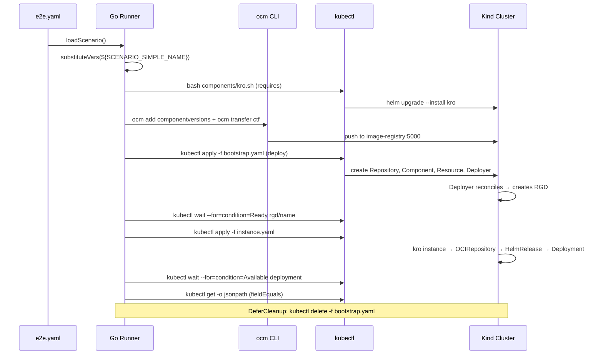

### Decision tree: what happens when things go wrong

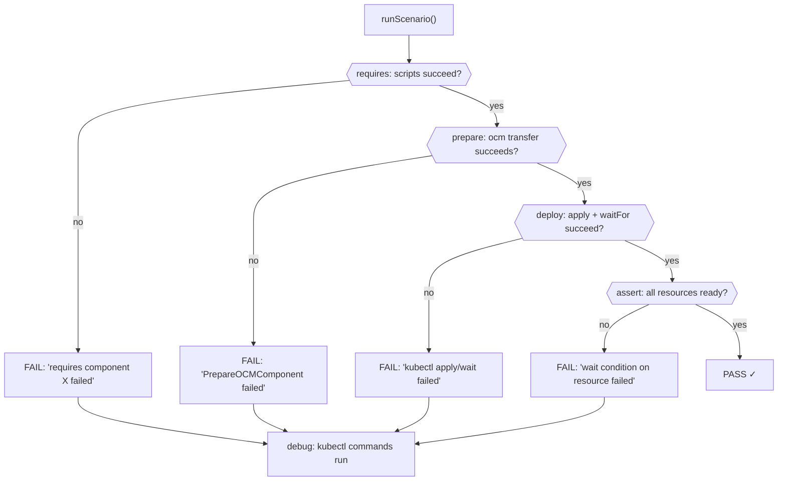

## Folder structure at a glance

### High-level: two roots

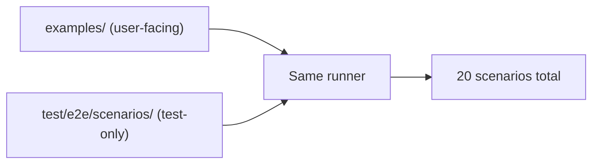

### Mid-level: family grouping

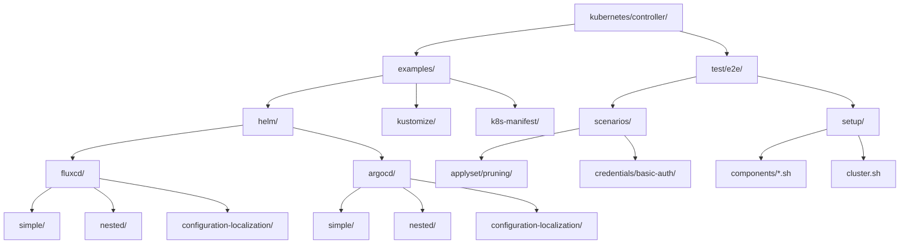

### Detailed: what's inside a scenario folder

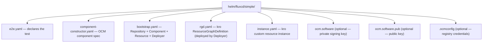

### Discovery: how the walker finds scenarios

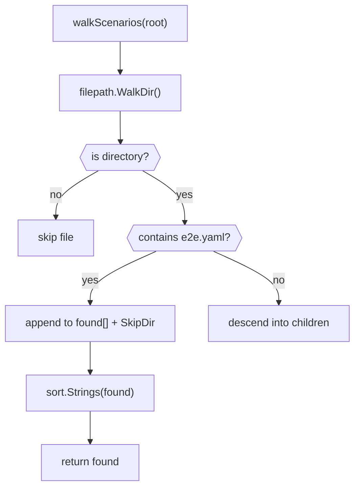

## Local iteration workflow

### High-level: the loop

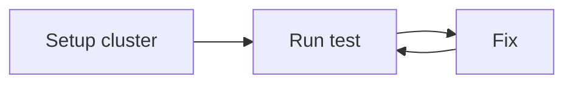

### Mid-level: commands

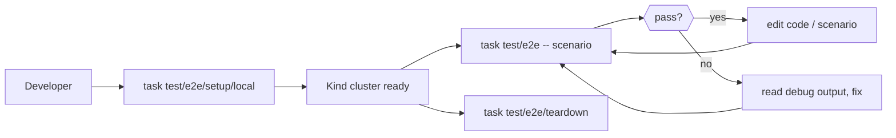

### Detailed: what each command does under the hood

```mermaid
flowchart TD
    subgraph "task test/e2e/setup/local"
        SL1["docker build controller image (--load)"]
        SL1 --> SL2["bash setup/local.sh"]
        SL2 --> SL3["cluster.sh: kind create + registry + RBAC"]
        SL3 --> SL4["kind load docker-image controller:latest"]
    end

    subgraph "task test/e2e -- helm/fluxcd/simple"
        TE1["helm upgrade --install controller chart/"]
        TE1 --> TE2["anchor focus: '^.*helm/fluxcd/simple$'"]
        TE2 --> TE3["go test ./test/e2e/ -ginkgo.focus=..."]
        TE3 --> TE4["Ginkgo matches 1 of 20 specs"]
        TE4 --> TE5["runScenario(cfg)"]
    end

    subgraph "task test/e2e/teardown"
        TD1["kind delete cluster"]
        TD1 --> TD2["docker rm -f image-registry"]
    end

    subgraph "task test/e2e/fresh -- scenario"
        TF1["teardown"] --> TF2["setup/local"]
        TF2 --> TF3["test/e2e -- scenario"]
    end
```

### CI vs local: side-by-side comparison

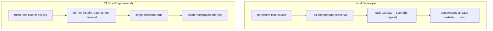

---

## Two audiences, two locations

Pick the location based on **who the scenario is for**:

| Scenario kind | Location | Discovery |
|---|---|---|
| **User-facing demo** — something a user might copy as a starting point | `kubernetes/controller/examples/<family>/<scenario>/` | Auto-discovered |
| **Test-only fixture** — exercises a corner case, edge condition, or feature whose only consumer is the test suite | `kubernetes/controller/test/e2e/scenarios/<family>/<scenario>/` | Auto-discovered |

`<family>` groups related scenarios: `helm/`, `kustomize/`, `k8s-manifest/`,
`applyset/`, `credentials/`. Within `helm/`, examples are split a second
level by delivery tool: `helm/fluxcd/<scenario>/` for Flux-only and
`helm/argocd/<scenario>/` for ArgoCD-only (each scenario uses one tool, not
both — see DESIGN.md Q5b). `kustomize/` follows the same per-tool split:
Flux variants live under `kustomize/fluxcd/<scenario>/` and ArgoCD variants
under `kustomize/argocd/<scenario>/`. The runner walks both trees and stops
descending at the first `e2e.yaml` it finds. Anything below that file is
treated as scenario-private content.

If you cannot decide: ask yourself "would a user reading the examples folder
benefit from seeing this?" If no, it belongs under `test/e2e/scenarios/`.

---

## The scenario folder

Every scenario folder contains:

```
<scenario>/
├── e2e.yaml                  # required — declares how to run the scenario
├── component-constructor.yaml # required — OCM component to build
├── bootstrap.yaml            # required — top-level resource the runner deploys
├── rgd.yaml                  # optional — kro ResourceGraphDefinition
├── instance.yaml             # optional — RGD instance
├── ocm.software / ocm.software.pub  # optional — signing keys
└── ...                       # any other files referenced from e2e.yaml
```

The runner **only reads `e2e.yaml`**. Everything else is opaque content
referenced from inside it.

---

## Naming

Two variables are exposed to your `e2e.yaml`:

- `${SCENARIO_FOLDER}` — slash-joined family + folder, e.g. `helm/fluxcd/simple`.
  Used for log lines and Ginkgo spec descriptions.
- `${SCENARIO_SIMPLE_NAME}` — full path with `/` replaced by `-`, e.g.
  `helm-fluxcd-simple`. Safe to use in Kubernetes resource names. Use this
  anywhere a name lands on the cluster.

Plus everything in the **fixed variable list** (see DESIGN.md §"Templated
variables"): `${IMAGE_REGISTRY}`, `${IMAGE_REGISTRY_HOST}`,
`${CONTROLLER_NAMESPACE}`, `${PROTECTED_REGISTRY_BASIC_AUTH}`,
`${PROTECTED_REGISTRY_DOCKER_CONFIG_JSON}`, `${SCENARIO_DIR}`.

No Go templates. No `{{ ... }}`. Only `${VAR}` envsubst-style substitution
against the fixed list. Unknown variables are a hard error at parse time.

---

## Minimal `e2e.yaml`

Smallest viable scenario — bootstrap a kro RGD, wait for a deployment:

```yaml
apiVersion: e2e.ocm.software/v1
kind: Scenario

requires:
  - kro
  - flux-source
  - flux-helm

prepare:
  components:
    - constructor: component-constructor.yaml

deploy:
  - apply: bootstrap.yaml
  - waitFor:
      kind: rgd
      name: ${SCENARIO_SIMPLE_NAME}
      conditions: [create, condition=Ready=true]
  - apply: instance.yaml

assert:
  resources:
    - kind: deployment.apps
      name: ${SCENARIO_SIMPLE_NAME}-podinfo
      waitFor: [create, condition=Available]
```

That's the whole file. The runner handles ordering, OCM transfer, namespace
scoping, log dumping on failure, and cleanup.

---

## Adding behaviour the schema does not cover

If a scenario needs imperative work — generate a secret, mutate a CR mid-flight,
verify a side-effect that is not a Kubernetes resource — **do not** add fields
to `e2e.yaml`. Instead, write a hook.

```yaml
preDeployHooks:
  - createBasicAuthSecret
postAssertHooks:
  - verifySignedComponent
```

Each name must exist in `kubernetes/controller/test/e2e/hooks/registry.go`.
Hooks run in array order. The six phases — `preDeployHooks`, `postDeployHooks`,
`preAssertHooks`, `postAssertHooks`, `preCleanupHooks`, `postCleanupHooks` — are
documented in DESIGN.md.

A hook is a Go function:

```go
func createBasicAuthSecret(ctx context.Context, s *hooks.Scenario) error {
    // s.Folder, s.SimpleName, s.Dir
}
```

Adding a hook is a code change. Reviewers will push back on hooks that
duplicate something `assert.resources` or `assert.fieldEquals` could express.

---

## Picking a delivery tool for helm scenarios

Helm scenarios pick exactly one delivery tool — Flux or ArgoCD — based on
their folder:

| Folder | Delivery tool | `requires:` | rgd.yaml resources |
|---|---|---|---|
| `examples/helm/fluxcd/<name>/` | Flux | `kro`, `flux-source`, `flux-helm` | `Resource` → `OCIRepository` → `HelmRelease` |
| `examples/helm/argocd/<name>/` | ArgoCD | `kro`, `argocd` | `Resource` → `Application` |

A Flux scenario asserts the Flux-managed deployment:

```yaml
assert:
  resources:
    - kind: deployment.apps
      name: ${SCENARIO_SIMPLE_NAME}-podinfo
      waitFor: [create, condition=Available]
      pods:
        selector: app.kubernetes.io/name=${SCENARIO_SIMPLE_NAME}-podinfo
        condition: condition=Ready=true
```

An ArgoCD scenario asserts both the `Application`'s sync/health status and
the ArgoCD-managed deployment in `default-argocd`:

```yaml
assert:
  resources:
    - kind: applications.argoproj.io
      name: ${SCENARIO_SIMPLE_NAME}
      namespace: argocd
      waitFor:
        - create
        - jsonpath={.status.sync.status}=Synced
        - jsonpath={.status.health.status}=Healthy
    - kind: deployment.apps
      name: ${SCENARIO_SIMPLE_NAME}-podinfo
      namespace: default-argocd
      waitFor: [create, condition=Available]
      pods:
        selector: app.kubernetes.io/name=${SCENARIO_SIMPLE_NAME}-podinfo
        condition: condition=Ready=true
```

ArgoCD-managed releases use the suffix `-argocd` to avoid colliding with the
Flux release name; the namespace is `default-argocd`. See
`examples/helm/fluxcd/simple/` and `examples/helm/argocd/simple/` for the
canonical wiring of each tool.

If you need a side-by-side parity demo (both tools deploying the same chart),
that belongs under `test/e2e/scenarios/helm/parity/`, not under `examples/`
(see DESIGN.md Q5b).

---

## When the OCM component must be signed

Place the private key alongside `component-constructor.yaml` as
`ocm.software`, and the public key as `ocm.software.pub`. The runner detects
the keys by name and signs/verifies automatically — no `e2e.yaml` field
required.

If signature behaviour is the *thing being tested*, write a hook that flips
the public key, re-runs the relevant resource transfer, and asserts the
controller error condition. Don't try to express that in YAML.

---

## Cleanup

By default the runner deletes only the resources it deployed. If your scenario
needs the full OCM-managed graph torn down (component → resource → release),
opt in:

```yaml
cleanup:
  cascadeFromBootstrap: true
```

This is opt-in because OCM cleanup cascade is itself a behaviour worth testing
deliberately, not a side-effect every scenario should pay for.

---

## Diagnostics on failure

When a scenario fails, the runner executes kubectl commands declared in `debug:`.
If omitted, a default set runs (controller pods/logs, kro pods/events, RGD
conditions). Override it to add scenario-specific diagnostics:

```yaml
debug:
  - kubectl: get pods -n argocd -o wide
    label: argocd-pods
  - kubectl: get applications.argoproj.io -A -o wide
    label: argocd-apps
  - kubectl: logs -n ${CONTROLLER_NAMESPACE} deploy/ocm-k8s-toolkit-controller-manager --tail=80
    label: controller-logs
```

Each `kubectl:` value is passed directly to `kubectl` (split on whitespace).
`label:` is optional — used to group output lines in the log.

---

## Local iteration

```sh
# Teardown + fresh cluster + run one scenario (full clean slate)
task kubernetes/controller:test/e2e/fresh -- helm/fluxcd/simple

# Provision a fresh kind cluster (components installed on demand by the runner)
task kubernetes/controller:test/e2e/setup/local

# Or: pre-install all components for fast repeated focused runs
task kubernetes/controller:test/e2e/setup/local -- --all-components

# Run everything
task kubernetes/controller:test/e2e

# Run one scenario (exact match — won't run nested-signed when you say nested)
task kubernetes/controller:test/e2e -- helm/fluxcd/simple

# Tear down the cluster and registry when done
task kubernetes/controller:test/e2e/teardown
```

The scenario name passed via `--` is matched exactly (anchored). The local
cluster is persistent across runs; CI uses the default (cluster only) so each
shard only installs the components its scenario declares in `requires:`.
See DESIGN.md §"Operator UX" for the full command table.

---

## Checklist before opening a PR

- [ ] Scenario folder is in the correct audience location.
- [ ] `e2e.yaml` parses (`task kubernetes/controller:test/e2e -- --focus="<scenario>" --dry-run`).
- [ ] Every `${VAR}` is in the fixed variable list.
- [ ] Every hook name resolves at `BeforeSuite`.
- [ ] Local run passes from a fresh kind cluster.
- [ ] If user-facing: scenario shows up in `examples/README.md` family table.
- [ ] If test-only: brief comment at the top of `e2e.yaml` saying *what corner
      case* this exists to cover.

---

## Where to read more

- [`DESIGN.md`](./DESIGN.md) — full schema, locked decisions, migration plan.
- `hooks/registry.go` — list of named hooks (once Stage 1 lands).
- `examples/helm/fluxcd/simple/` — canonical Flux helm reference.
- `examples/helm/argocd/simple/` — canonical ArgoCD helm reference.
- `test/e2e/scenarios/applyset/pruning/` — canonical test-only reference.
