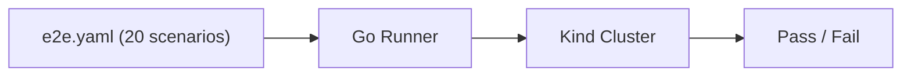
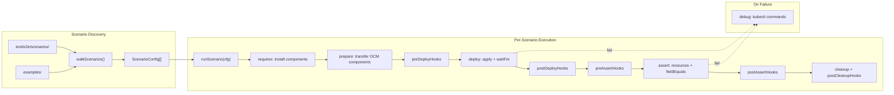
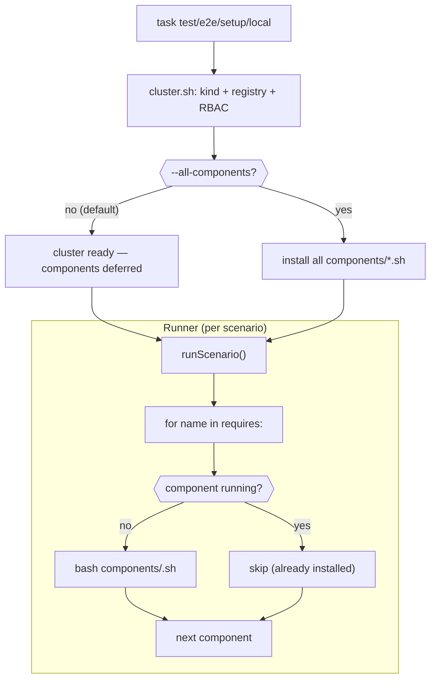
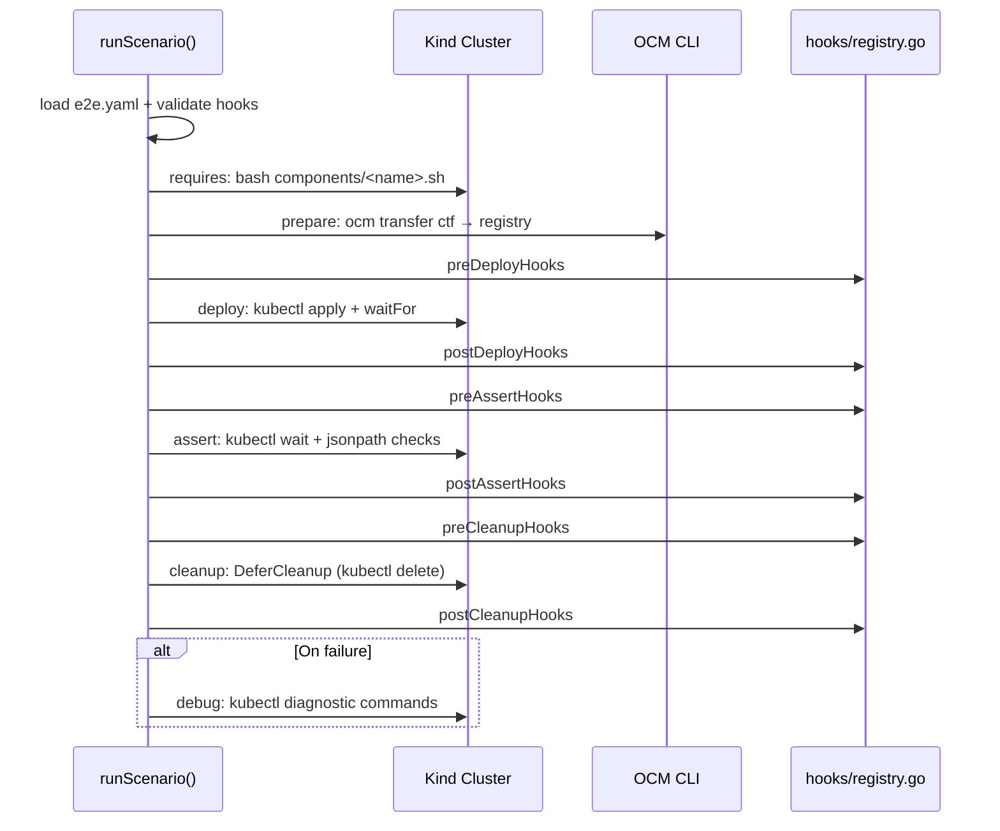
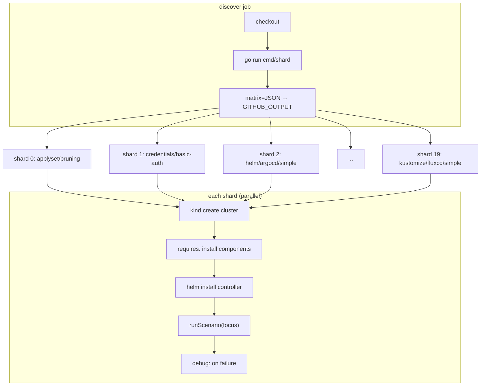

# E2E Test Harness — Design

This document describes the architecture of the controller's end-to-end test harness:
what scenarios are, how they're discovered, declared, executed, and parallelised in CI.
It is the source of truth for the harness; update it when the design changes.

## Status

- **State:** implemented. Stages 1–5 are complete; the sharded CI workflow is active.
- **Replaces:** the monolithic `e2e_examples_test.go` / `e2e_credentials_test.go` /
  `e2e_applyset_test.go` files plus the single `hacks/setup.sh` script.
- **Supersedes:** `task test/e2e/example NAME=...` (removed).

## Architecture overview

**what the harness does**:


<details>
<summary>discovery → execution → diagnostics (detailed)</summary>




</details>

<details>
<summary>Setup composition flow</summary>


</details>

## Why this exists

The previous harness had two structural problems:

1. **Setup was monolithic.** `hacks/setup.sh` installed kind, flux, ArgoCD, kro, and the
   protected registries every time, regardless of whether a given scenario needed all of
   them. Iteration loops were dominated by setup cost. Scenarios that need none of those
   (e.g. `applyset-pruning`, which only needs the controller-manager) paid for the full
   stack.
2. **Adding a scenario was imperative.** New scenarios required either a new Go test file
   (credentials, applyset) or special-casing inside `e2e_examples_test.go` (the
   `argoproj.io` substring check, the `-configuration-localization` suffix check, the
   `ignoreExamples` map). The harness leaked scenario knowledge into Go.

The new harness replaces both with a declarative per-scenario `e2e.yaml`, a generic Go
runner, and per-component setup scripts the harness composes from each scenario's
`requires:` list.

## Audience separation

Scenarios fall into two distinct audiences:

- **User-facing demos** — readable, minimal, illustrative, referenced from the README.
  Live under `kubernetes/controller/examples/`.
- **Test-only fixtures** — exercise edge cases the demos do not (multi-stage choreography,
  protected-registry credentials, etc.). Live under
  `kubernetes/controller/test/e2e/scenarios/` and never appear in user docs.

A scenario has exactly one home. Both roots use the same `e2e.yaml` schema, the same
walker, and the same runner.

## Folder layout

<details>
<summary>Full directory tree</summary>

```
kubernetes/controller/
  Taskfile.yml                                # E2E_TIMEOUT default, focus passthrough
  examples/                                   # user-facing demos (also tested)
    README.md
    helm/
      fluxcd/                                 # Flux HelmRelease delivery
        simple/
        simple-nested-status/
        nested/
        nested-signed/                        # ships ocm.software signing keypair
        signing/                              # ships ocm.software signing keypair
        configuration-localization/
      argocd/                                 # ArgoCD Application delivery
        simple/
        simple-nested-status/
        nested/
        nested-signed/                        # ships ocm.software signing keypair
        signing/                              # ships ocm.software signing keypair
        configuration-localization/
    kustomize/                                # split by delivery tool
      fluxcd/                                 # Flux Kustomization delivery
        simple/
        configuration-localization/
      argocd/                                 # ArgoCD Application delivery
        simple/
        configuration-localization/
    k8s-manifest/
      simple/
  test/e2e/
    DESIGN.md                                 # this file
    e2e_suite_test.go                         # BeforeSuite, env parsing, hook validation
    e2e_runner.go                             # walker, registerScenarios, runScenario
    cmd/
      shard/main.go                           # CI shard helper (Q14)
    setup/
      local.sh                                # entry: cluster + all components
      components/                             # one script per component (Q3, Q7a)
        cluster.sh                            # always invoked
        kro.sh
        flux-source.sh
        flux-helm.sh
        flux-kustomize.sh
        argocd.sh
        protected-registry-basic-auth.sh
        protected-registry-docker-config-json.sh
    hooks/
      registry.go                             # central map literal (Q16)
      applyset.go                             # applyset-* hooks
    scenarios/                                # test-only fixtures
      applyset/
        pruning/
      credentials/
        basic-auth/
        docker-config-json/
```

</details>

Each scenario directory contains an `e2e.yaml` plus the fixture files the scenario
references (bootstrap, component-constructor, rgd, instance, k8s-manifest, signing keys,
`.ocmconfig`, etc.).

### Naming

Scenarios are identified by their **slash-separated path relative to their root**.
`${SCENARIO_FOLDER}` exposes that name verbatim (`helm/fluxcd/simple`,
`credentials/basic-auth`); `${SCENARIO_SIMPLE_NAME}` is the dashed form
(`helm-fluxcd-simple`, `credentials-basic-auth`) for embedding in Kubernetes
resource names, where `/` is invalid.

### Discovery rule

The walker descends each root recursively. **The first directory containing an
`e2e.yaml` is treated as a scenario; the walker does not descend into it further.**
Nested scenarios are illegal and cause a load-time error. Directories without an
`e2e.yaml` are walked through, allowing intermediate grouping folders (`helm/`,
`helm/fluxcd/`, `credentials/`) and incidental files (`README.md`).

## The `e2e.yaml` schema

Minimal example:

```yaml
apiVersion: e2e.ocm.software/v1
kind: Scenario

requires: [kro, flux-source, flux-helm]

prepare:
  components:
    - constructor: component-constructor.yaml

deploy:
  - apply: bootstrap.yaml
  - waitFor:
      kind: rgd
      name: ${SCENARIO_SIMPLE_NAME}
      conditions: [create, condition=Ready=true]
  - apply: instance.yaml

assert:
  resources:
    - kind: deployment.apps
      name: ${SCENARIO_SIMPLE_NAME}-podinfo
      waitFor: [create, condition=Available]
```

<details>
<summary>Full schema reference with all fields</summary>

```yaml
apiVersion: e2e.ocm.software/v1
kind: Scenario

# Optional. Overrides the global E2E_TIMEOUT for this scenario.
# Applies to deploy[].waitFor and assert.resources[] waits.
timeout: 5m

# Required. Components the harness must install before the scenario runs. Each name
# corresponds to a script at test/e2e/setup/components/<name>.sh. Unknown names cause
# a load-time error. Order matters: dependencies first.
requires:
  - kro
  - flux-source
  - flux-helm
  - argocd

# Optional. OCM components to prepare (transfer to the local registry) before deploy.
# Each entry runs the equivalent of the current PrepareOCMComponent helper.
prepare:
  components:
    - constructor: component-constructor.yaml      # required, scenario-relative path
      signingKey: ocm.software                     # optional; private key path
      ocmConfig: .ocmconfig                        # optional; --config for `ocm transfer`
      copyResources: true                          # optional; adds --copy-resources to transfer

# Optional. Hooks (named Go functions) chained in array order. Each phase wraps the
# corresponding harness step. Resolved against test/e2e/hooks/registry.go at load
# time; missing hooks fail BeforeSuite.
preDeployHooks: []
postDeployHooks: []
preAssertHooks: []
postAssertHooks: []
preCleanupHooks: []
postCleanupHooks: []

# Required. Ordered deploy steps. Each step is one of:
#   - apply only:                  - apply: <path>
#   - waitFor only:                - waitFor: { ... }
#   - apply followed by wait:      - apply: <path>
#                                    waitFor: { ... }
# A wait failure is a deploy-step failure (not an assertion failure): assert: does
# not run, cleanup still does.
deploy:
  - apply: bootstrap.yaml
  - waitFor:                                          # waitFor-only: the Deployer creates the RGD
      kind: rgd
      name: ${SCENARIO_SIMPLE_NAME}
      namespace: default                           # optional
      conditions:                                  # any kubectl wait condition
        - create
        - condition=Ready=true

# Required. Final-state validation, run after deploy completes.
assert:
  resources:
    - kind: deployment.apps
      name: ${SCENARIO_SIMPLE_NAME}-podinfo
      namespace: default                           # optional
      waitFor: [create, condition=Available]
      pods:                                        # optional pod-readiness check
        selector: app.kubernetes.io/name=${SCENARIO_SIMPLE_NAME}-podinfo
        condition: Ready=true
    - kind: applications.argoproj.io
      name: ${SCENARIO_SIMPLE_NAME}
      namespace: argocd
      waitFor: [create]
      jsonPath:                                    # field-equality on status
        '{.status.sync.status}': Synced
        '{.status.health.status}': Healthy

  # Optional. Field-equality checks against rendered cluster state, expressed as
  # `kubectl get <resource> -o jsonpath=<jsonPath>` == <value>.
  fieldEquals:
    - resource: pod -l app.kubernetes.io/name=${SCENARIO_SIMPLE_NAME}-podinfo
      jsonPath: '{.items[0].spec.containers[0].image}'
      value: ${IMAGE_REGISTRY_HOST}/stefanprodan/podinfo:6.9.1

# Optional. Default no-op. When cascadeFromBootstrap is true, the harness deletes the
# Bootstrap resource and waits for the cascade to clear all derived resources within
# cascadeTimeout. Used to assert OCM teardown contracts.
cleanup:
  cascadeFromBootstrap: false
  cascadeTimeout: 5m

# Optional. kubectl commands to run on failure for diagnostics. Each entry
# specifies a kubectl subcommand and a label for log grouping. When omitted,
# a default set runs (controller pods/logs, kro pods/events, RGD conditions).
debug:
  - kubectl: get pods -n ${CONTROLLER_NAMESPACE} -o wide
    label: controller-pods
  - kubectl: logs -n ${CONTROLLER_NAMESPACE} deploy/ocm-k8s-toolkit-controller-manager --tail=80 --all-containers
    label: controller-logs
  - kubectl: get helmrelease -A -o wide
    label: helmreleases
```

</details>

### Templated variables

All string fields support `${VAR}` substitution. The variable list is fixed; unknown
references cause a load-time error.

| Variable | Value | Example |
|---|---|---|
| `${SCENARIO_FOLDER}` | path relative to root, slash-separated | `helm/fluxcd/simple` |
| `${SCENARIO_SIMPLE_NAME}` | scenario folder with `/` → `-` (k8s-safe) | `helm-fluxcd-simple` |
| `${SCENARIO_DIR}` | absolute path to scenario folder | `/.../examples/helm/fluxcd/simple` |
| `${IMAGE_REGISTRY}` | full URL incl. scheme | `http://image-registry:5000` |
| `${IMAGE_REGISTRY_HOST}` | host:port, no scheme | `image-registry:5000` |
| `${PROTECTED_REGISTRY_BASIC_AUTH}` | basic-auth registry URL | `http://localhost:31002` |
| `${PROTECTED_REGISTRY_DOCKER_CONFIG_JSON}` | dcj registry URL | `http://localhost:31003` |
| `${CONTROLLER_NAMESPACE}` | controller-manager namespace | `ocm-k8s-toolkit-system` |

`${PROTECTED_REGISTRY_*}` resolve only when the scenario lists the corresponding
component in `requires:`.

<details>
<summary>Lifecycle (per scenario)</summary>



</details>

## The runner

[`e2e_runner.go`](./e2e_runner.go) exposes a single entry point `runScenario(cfg)`. The Ginkgo suite
calls it once per discovered scenario. See
[`e2e_scenarios_test.go`](./e2e_scenarios_test.go) and
[`e2e_runner.go`](./e2e_runner.go) for the full implementation.

### Hook registry

Hooks are registered as a single map literal in
[`test/e2e/hooks/registry.go`](./hooks/registry.go). `BeforeSuite` walks every
loaded scenario, resolves every name in every `*Hooks` array against the registry,
and fails the suite (with scenario file path and bad name) if any reference is
unknown. This catches typos before any cluster work begins.

## Setup composition

[`test/e2e/setup/local.sh`](./setup/local.sh) is the single entrypoint operators use to set up a fresh kind
cluster. By default it only runs [`cluster.sh`](./setup/cluster.sh) (kind cluster + host registry + RBAC).
Component installation is deferred to the e2e runner, which installs each scenario's
dependencies on demand via `requires:`. Pass `--all-components` to also pre-install
every component script — useful for fast local iteration when you want focused runs
to start instantly without waiting for component setup.

```sh
# Default: cluster only — components installed on demand by the runner
task test/e2e/setup/local

# Pre-install all components — good for rapid focused iteration
task test/e2e/setup/local -- --all-components
```

Per-scenario, the runner calls only the scripts named in `requires:`. When
`--all-components` was used, these calls are idempotent no-ops (each script
detects the component is already running and exits immediately). Without
`--all-components`, the runner's `requires:` invocation is the actual install path.

Each component script must be **idempotent**: invoking it on a cluster that already has
the component installed must succeed without changes. This lets the runner re-invoke a
script as a no-op when an earlier scenario already required it.

## CI sharding

[`test/e2e/cmd/shard`](./cmd/shard/main.go) is a small Go program that:

1. Walks both roots, enumerates scenario names (same logic as `walkScenarios`).
2. By default, assigns one shard per scenario. Pass `--shards=N` to group
   scenarios into N round-robin buckets instead.
3. Emits `matrix=...` to `$GITHUB_OUTPUT` as a JSON array, one entry per shard.

The GitHub Actions workflow consumes the matrix:

```yaml
jobs:
  discover:
    outputs:
      matrix: ${{ steps.discover.outputs.matrix }}
    steps:
      - uses: actions/checkout@v4
      - id: discover
        run: go run ./test/e2e/cmd/shard >> "$GITHUB_OUTPUT"

  e2e:
    needs: discover
    strategy:
      fail-fast: false
      matrix:
        include: ${{ fromJSON(needs.discover.outputs.matrix) }}
    steps:
      - uses: actions/checkout@v4
      - run: task kubernetes/controller:test/e2e/setup/local
      - run: task kubernetes/controller:test/e2e -- "${{ matrix.focus }}"
```

Each shard provisions only the cluster (the default); component installation is deferred
to the runner's `requires:` step, so each shard only installs what its scenario needs.

<details>
<summary>CI sharding diagram</summary>



</details>

## Operator UX

Single Taskfile target, optional positional regex passed to Ginkgo `--focus=`:

| Command | Effect |
|---|---|
| `task test/e2e` | run all 20 scenarios |
| `task test/e2e -- helm/fluxcd/simple` | run one scenario |
| `task test/e2e -- helm/fluxcd/` | run all six Flux helm scenarios |
| `task test/e2e -- helm/argocd/` | run all six ArgoCD helm scenarios |
| `task test/e2e -- helm/` | run all twelve helm scenarios |
| `task test/e2e -- credentials/` | run both credentials scenarios |
| `task test/e2e -- examples` | run only the `Context("examples")` block (17 demos) |
| `task test/e2e/fresh -- helm/fluxcd/simple` | teardown + setup + run one scenario from scratch |
| `task test/e2e/setup/local` | provision kind cluster (components installed on demand by runner) |
| `task test/e2e/setup/local -- --all-components` | provision kind cluster + pre-install all components |
| `task test/e2e/teardown` | delete kind cluster and registry |
| `E2E_TIMEOUT=10m task test/e2e` | bump global timeout |

The retired `task test/e2e/example NAME=foo` is replaced by `task test/e2e -- foo`.

## Worked examples

<details>
<summary>1a. Flux-only helm demo (<code>examples/helm/fluxcd/simple/e2e.yaml</code>)</summary>

```yaml
requires: [kro, flux-source, flux-helm]

prepare:
  components:
    - constructor: component-constructor.yaml

deploy:
  - apply: bootstrap.yaml
  - waitFor:
      kind: rgd
      name: ${SCENARIO_SIMPLE_NAME}
      conditions: [create, condition=Ready=true]
  - apply: instance.yaml

assert:
  resources:
    - kind: deployment.apps
      name: ${SCENARIO_SIMPLE_NAME}-podinfo
      waitFor: [create, condition=Available]
      pods:
        selector: app.kubernetes.io/name=${SCENARIO_SIMPLE_NAME}-podinfo
        condition: Ready=true
```

The `rgd.yaml` declares only the OCM `Resource` → `OCIRepository` → `HelmRelease`
chain. No ArgoCD `Application`. `argocd` is *not* in `requires:`.

</details>

<details>
<summary>1b. ArgoCD-only helm demo (<code>examples/helm/argocd/simple/e2e.yaml</code>)</summary>

```yaml
requires: [kro, argocd]

prepare:
  components:
    - constructor: component-constructor.yaml

deploy:
  - apply: bootstrap.yaml
  - waitFor:
      kind: rgd
      name: ${SCENARIO_SIMPLE_NAME}
      conditions: [create, condition=Ready=true]
  - apply: instance.yaml

assert:
  resources:
    - kind: applications.argoproj.io
      name: ${SCENARIO_SIMPLE_NAME}
      namespace: argocd
      waitFor: [create]
      jsonPath:
        '{.status.sync.status}': Synced
        '{.status.health.status}': Healthy
    - kind: deployment.apps
      name: ${SCENARIO_SIMPLE_NAME}-argocd-podinfo
      namespace: default-argocd
      waitFor: [create, condition=Available]
      pods:
        selector: app.kubernetes.io/name=${SCENARIO_SIMPLE_NAME}-argocd-podinfo
        condition: Ready=true
```

The `rgd.yaml` declares only the OCM `Resource` chain feeding an ArgoCD
`Application`. No `OCIRepository` or `HelmRelease`. `flux-source`/`flux-helm`
are *not* in `requires:`.

</details>

<details>
<summary>2. Multi-stage test choreography (<code>test/e2e/scenarios/applyset/pruning/e2e.yaml</code>)</summary>

```yaml
timeout: 5m

requires: []                       # only controller-manager (always present)

prepare:
  components:
    - constructor: component-constructor.yaml
    - constructor: component-constructor-2.yaml

deploy:
  - apply: bootstrap.yaml
  - apply: bootstrap-deployer.yaml

assert:
  resources:
    - kind: deployment.apps
      name: ${SCENARIO_SIMPLE_NAME}-podinfo
      waitFor: [create, condition=Available]

postAssertHooks:
  - applysetPatchToV2          # kubectl patch component … semver=2.0.0
  - applysetAssertPruning      # v1 resources gone, v2 resources present
  - applysetDeleteDeployer     # kubectl delete deployer
  - applysetAssertCascade      # all derived resources gone
```

</details>

<details>
<summary>3. Protected-registry credentials (<code>test/e2e/scenarios/credentials/basic-auth/e2e.yaml</code>)</summary>

```yaml
timeout: 5m

requires: [protected-registry-basic-auth, kro, flux-source, flux-helm]

prepare:
  components:
    - constructor: component-constructor.yaml
      ocmConfig: .ocmconfig
      registry: ${PROTECTED_REGISTRY_BASIC_AUTH}

deploy:
  - apply: bootstrap.yaml
  - waitFor:
      kind: rgd
      name: basic-auth
      conditions: [create, condition=Ready=true]
  - apply: instance.yaml

assert:
  resources:
    - kind: deployment.apps
      name: ${SCENARIO_SIMPLE_NAME}-podinfo
      waitFor: [create, condition=Available]
      pods:
        selector: app.kubernetes.io/name=${SCENARIO_SIMPLE_NAME}-podinfo
        condition: Ready=true
```

</details>

<details>
## Decision summary
<summary>Decision summary (Q1–Q16)</summary>

| # | Decision | Choice | Rationale |
|---|---|---|---|
| Q1 | Driving problem | Fix setup time **and** declarative scenario addition | Both pains are real; one without the other is a half-fix. |
| Q2 | Per-scenario contract | `e2e.yaml` | Single file authors edit; the alternative was Go test code per scenario. |
| Q3 | Component provisioning | Opaque scripts under `setup/components/<name>.sh` | New components = drop a script; harness has no taxonomy to migrate. |
| Q4 | Cluster lifecycle | Persistent local, ephemeral CI shards | Optimises both audiences: dev iteration speed, CI hermeticity. |
| Q5 | Folder layout | Audience-split: `examples/` (demos) vs `test/e2e/scenarios/` (test-only), family-grouped | Honors the audience split; one home per scenario, no duplication. |
| Q5b | Helm sub-grouping | Within `examples/helm/`, split by delivery tool: `helm/fluxcd/<name>/` and `helm/argocd/<name>/`. Each scenario uses **only** its named tool. | Removes the implicit "Flux + ArgoCD always shipped together" coupling; gives readers an unambiguous reference for each tool; the runner can skip the unused stack via `requires:`. |
| Q6 | Interpreter | Generic runner + named Go hooks (chainable arrays) | Imperative escape hatch without per-scenario Go file. |
| Q7a | `requires:` shape | Opaque list, validated against script existence | Avoids schema lock-in as the component taxonomy evolves. |
| Q7b | `prepare:` shape | Structured `components: []` block | The full preparation matrix is small and finite; structure beats hooks. |
| Q7c | Hook phases | Six (pre/post × deploy/assert/cleanup) | Symmetric seams cover known needs (`applyset-pruning`, future cleanup). |
| Q7d | Assertion DSL | Generic `resources: []` + `fieldEquals: []` | No baked naming conventions; all scenarios written the same way. |
| Q7e | Templating | `${VAR}` envsubst, fixed list | Stays declarative; rejects Go templates' Turing-complete invitation. |
| Q8 | Cleanup | Default no-op; opt-in `cleanup.cascadeFromBootstrap` | Cleanup-as-assertion (deliberate) over cleanup-as-housekeeping (silent). |
| Q9 | Registration & discovery | Recursive walk, `e2e.yaml`-presence discriminator, slash-named, descend-stops-at-first-`e2e.yaml` | Auto-discovery; family grouping in folders; no manual registration. |
| Q10 | `deploy:` shape | Ordered step list with discriminator-key + combined `apply`+`waitFor` shorthand | Author controls intermediate waits; common case stays terse. |
| Q11 | Timeout layering | Global default + scenario override | Step-level was speculative; scenario-level handles all observed variation. |
| Q12 | Global timeout source | `E2E_TIMEOUT` env var, defaulted in Taskfile | Operator surface is the Taskfile, not Go code. |
| Q13 | Invocation | Ginkgo `--focus=` via Taskfile `{{.CLI_ARGS}}` | Reuses Ginkgo's existing matcher; no harness regex code. |
| Q14 | CI sharding | Dynamic `cmd/shard`, one shard per scenario by default | Self-updating as scenarios are added/removed; pass `--shards=N` to group into fewer buckets. |
| Q15 | `description:` field | Omitted; optional `README.md` next to `e2e.yaml` | Folder name is self-documenting; descriptions invite marketing copy. |
| Q16 | Hook registry | Map literal in `hooks/registry.go`, validated at `BeforeSuite` | Single source of truth; typos surface before any cluster work. |

</details>

<details>
## Migration plan 
<summary>Migration plan (Stages 1–6)</summary>

Implementation lands in stages so the suite stays green throughout.

### Stage 1 — runner skeleton (no scenarios moved yet)

- Land `e2e_runner.go`, `walkScenarios`, `mustLoadE2EYaml`, the variable substitution
  helper, and the `runScenario` orchestration loop.
- Land `test/e2e/hooks/registry.go` with an empty `Registry` map.
- Land `cmd/shard` (CI shard helper).
- Refactor `e2e_suite_test.go` to call the new `BeforeSuite` (env parsing, hook
  validation pass — vacuously passes with no scenarios yet).
- The legacy `e2e_examples_test.go` / `e2e_credentials_test.go` /
  `e2e_applyset_test.go` files continue to run against the existing flat layout.
  Both code paths coexist in this stage.

### Stage 2 — split setup into per-component scripts

- Decompose `hacks/setup.sh` into `setup/local.sh` + `setup/components/*.sh`.
- `setup/local.sh` invokes every component script in order (matches today's behavior).
- Each component script must be idempotent.
- No test changes; existing tests still pass.

### Stage 3 — migrate examples scenarios

- Move each user-facing example into the family-grouped layout under `examples/`.
- Each split scenario's `rgd.yaml` declares only the resources for *its* delivery tool.
- Author `e2e.yaml` for each migrated scenario.
- Delete the legacy `e2e_examples_test.go`.

### Stage 4 — migrate test-only scenarios

- Move `test/e2e/testdata/` → `test/e2e/scenarios/credentials/`.
- Author `e2e.yaml` plus the `applyset*` hooks.
- Delete `e2e_credentials_test.go` and `e2e_applyset_test.go`.

### Stage 5 — wire CI sharding

- Update the GitHub Actions workflow to use the `discover` + matrix pattern.
- Default: one shard per scenario; pass `--shards=N` to reduce parallelism if needed.

### Stage 6 — cleanup

- Remove `task test/e2e/example` from the Taskfile.
- Update README and any docs that linked `examples/<name>/` to the new paths.
- Remove `hacks/` if `setup.sh` is the only thing left.

Each stage is independently mergeable and leaves the suite passing.

</details>
