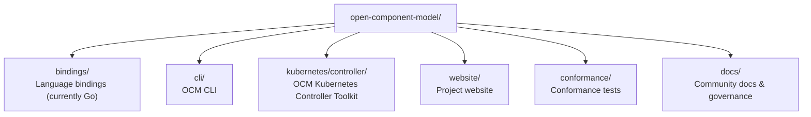
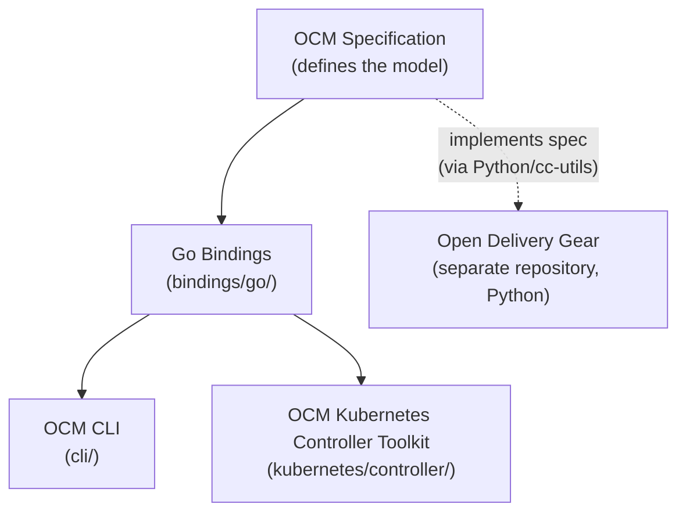

Welcome to the Open Component Model (OCM). This page gives you everything you need to orient yourself in the project,
understand how it is built, and find the right starting point for your interests.



- **To use the OCM CLI**

  Basic command-line experience and familiarity with container images or software packaging concepts.

- **To use the Kubernetes controllers**

  Working knowledge of Kubernetes (clusters, manifests, custom resources).

- **To contribute code**

  The core libraries, CLI, and controllers are written in Go (1.26+) and use [Task](https://taskfile.dev/) as their build
runner. Contributions in other areas - such as language bindings, documentation, the website, or tooling - may use
different languages and are equally welcome.


## What is OCM?

OCM is a standard and toolkit for describing, signing, transporting, and deploying software artifacts as a single,
versioned unit. These overview pages explain the model in depth:







## Getting Started

The getting-started guides walk you through the full workflow - from installing the CLI to deploying with Kubernetes
controllers. The first two guides (CLI installation and creating a component version) require no Kubernetes knowledge.





## Advanced Topics

Once you are comfortable with the basics, explore these concept pages for a deeper technical understanding:









## The Mono-Repository

All active OCM development happens in a single repository:
[open-component-model](https://github.com/open-component-model/open-component-model). The mono-repo contains the Go
library, the CLI, the Kubernetes controllers, conformance tests, and this website - all sharing one dependency tree and
one test suite.


The [ocm](https://github.com/open-component-model/ocm) and
[ocm-controller](https://github.com/open-component-model/ocm-controller) repositories are the previous generation of
OCM tooling. They are maintained but no longer receive new features. All new development targets the mono-repo above.
Read the [OCM v2 announcement]() for background on the rewrite.


## Technical Layers

OCM is built as a stack of layers. Each layer builds on the one below it:

<!-- markdownlint-disable MD034 -- bare URLs are expected in shortcode href attributes -->

### OCM Specification

The formal standard that defines how components, resources, and signatures are represented. It is technology-agnostic
and lives in its [own repository](https://github.com/open-component-model/ocm-spec).






### Go Bindings

The reference implementation of the specification in Go, located in
[`bindings/go/`](https://github.com/open-component-model/open-component-model/tree/main/bindings/go). The `bindings/`
directory is structured to welcome implementations in other languages in the future. This library provides the core
types and operations (creating, signing, resolving, transferring component versions) that the CLI and controllers build
on.







### OCM CLI

A command-line tool for the Pack-Sign-Transport workflow, located in
[`cli/`](https://github.com/open-component-model/open-component-model/tree/main/cli). Built on the Go bindings, it is
designed for interactive use and CI/CD pipelines. Start with
[Install the OCM CLI]().







### OCM Kubernetes Controller Toolkit

A set of controllers that handle deployment and verification of OCM component versions in Kubernetes clusters, located
in [`kubernetes/controller/`](https://github.com/open-component-model/open-component-model/tree/main/kubernetes/controller).
They use a dependency chain of custom resources: Repository, Component, Resource, and Deployer.







### Open Delivery Gear

A compliance automation engine that subscribes to OCM component versions and continuously scans delivery artifacts for
security and compliance issues, located in its
[own repository](https://github.com/open-component-model/open-delivery-gear). ODG tracks findings against configurable
SLAs, supports assisted rescoring, and provides a Delivery Dashboard UI for both platform operators and application
teams. It is designed for public and sovereign cloud scenarios where trust-but-verify assurance is required.





<!-- markdownlint-enable MD034 -->

## Project Organization

OCM is an open standard contributed to the [Linux Foundation](https://www.linuxfoundation.org/) under the
[NeoNephos Foundation](https://neonephos.org/). A Technical Steering Committee (TSC) provides technical oversight,
sets project direction, and coordinates across working groups. Specific technical areas are owned by Special Interest
Groups (SIGs). Currently, **SIG Runtime** maintains the Go bindings, CLI, and Kubernetes controllers.




<!-- markdownlint-disable MD034 -- bare URLs are expected in shortcode href attributes -->


<!-- markdownlint-enable MD034 -->


## Contributing and Engaging

Ready to contribute or connect with the community? If you are looking for something to work on, check the
[`kind/good-first-issue`](https://github.com/search?q=org%3Aopen-component-model+label%3A%22kind%2Fgood-first-issue%22+state%3Aopen&type=issues)
label across our repositories.







The easiest way to get started is to say hello. Join our monthly
[community call](/community/#community-call) or ask for an invite to the
[daily standup](/community/how-we-work/#meetings) - it is a casual sync, not mandatory, and not necessarily work-related.
You can reach us on [Slack](/community/#slack) or [Zulip](/community/#zulip) anytime.

