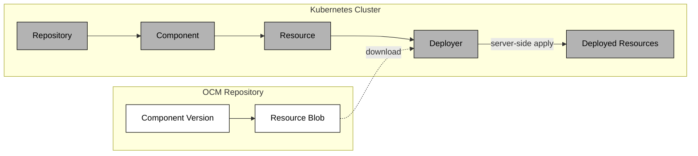

The Deployer is a Kubernetes controller that takes an OCM resource, typically containing Kubernetes manifests such as a `ResourceGraphDefinition`, plain YAML, or other deployable content, downloads it from a `Resource`, and applies it to the cluster using server-side apply.

The Deployer references an OCM `Resource` object. When the status of that resource becomes `Ready`, the Deployer downloads the referenced blob, decodes any YAML/JSON manifests it contains, and applies them to the cluster.

To reach the successful deployment status, the following chain of objects has to be reconciled: `Repository` -> `Component` -> `Resource` -> `Deployer`.

The `Repository` validates that the OCM repository is reachable. The `Component` downloads and verifies the component version descriptor from that repository. Once the component is `Ready`, the `Resource` will fetch the resource descriptor and store it in its status. The Deployer watches for this and when the `Resource` is `Ready`, it downloads the content and applies it to the cluster.

## ApplySet Semantics

The Deployer uses [ApplySet](https://github.com/kubernetes/enhancements/blob/master/keps/sig-cli/3659-kubectl-apply-prune/README.md) (KEP-3659) for resource lifecycle management.

Every apply operation goes through Kubernetes server-side apply, which means updates are atomic and conflict-free. When a manifest no longer includes a resource that was previously applied, the `Deployer` automatically prunes it. Ownership is tracked through the `applyset.kubernetes.io/part-of` label, which ties each deployed resource back to the `Deployer` instance that created it.

The Deployer manages the full lifecycle of what it deploys: creation, updates, and cleanup.

## Drift Detection

The Deployer registers dynamic informers for every resource it deploys. If something modifies or deletes a deployed resource externally, the Deployer picks up the change and re-applies the desired state on the next reconciliation.

These informers are created at runtime and only for the specific resource types that are actually deployed.

## Deletion and Finalizers

When a `Deployer` object is deleted, cleanup happens in two phases. First, the `delivery.ocm.software/applyset-prune` finalizer removes all deployed resources through ApplySet pruning. Once that completes, the `delivery.ocm.software/watch` finalizer unregisters the dynamic informers.

The `Deployer` will not be fully removed until both phases finish, ensuring no orphaned resources are left behind.

## Caching

Downloaded resource blobs are cached by digest in an LRU cache. If the digest has not changed between reconciliations, the Deployer skips re-downloading and re-applying. This reduces both network traffic and unnecessary applies.

There is also another cache during the component resolution that caches the component descriptor. But that happens before this part is even reached.

## Labels and Annotations

The Deployer stamps deployed resources with metadata for traceability in the form of **labels** and **annotations**:




| Label | Value |
| ----- | ----- |
| `app.kubernetes.io/managed-by` | `deployer.delivery.ocm.software` |
| `app.kubernetes.io/name` | Resource name |
| `app.kubernetes.io/version` | Resource version |
| `app.kubernetes.io/part-of` | Deployer name |




| Annotation | Value |
| ---------- | ----- |
| `digest.resource.delivery.ocm.software/value` | Resource digest |
| `component.delivery.ocm.software/name` | Component name |
| `component.delivery.ocm.software/version` | Component version |




## Common Use Cases

Which of the sections below applies depends on two independent choices: whether your
application is packaged as a Helm chart or plain manifests, and whether you want kro's RGDs to
orchestrate the deployment or apply it directly with the `Deployer`.

### No orchestration: apply manifests directly

If your application is already plain Kubernetes manifests and you don't need an RGD's templating or
composition, skip kro entirely. The [Deploy Manifests with Deployer]()
how-to applies a Deployment straight from an OCM component using only the OCM Controllers.

### Helm chart, RGD applied manually

The [Deploy a Helm Chart]() getting-started tutorial
walks through applying a `ResourceGraphDefinition` for the [Podinfo](https://github.com/stefanprodan/podinfo)
application using the `Deployer`, with the RGD written and applied by hand. Start here if you're new to RGDs.

### Helm chart, RGD shipped inside the component (bootstrap pattern)

Packaging the `ResourceGraphDefinition` ([RGD](https://kro.run/docs/concepts/rgd/overview)) inside the OCM
component itself, rather than applying it by hand, lets developers ship deployment instructions alongside
their software. Once the Deployer applies the RGD, [kro](https://kro.run/) reconciles it into a CRD that
operators instantiate. The RGD includes the deployer-specific CRDs — `HelmRelease` and `OCIRepository` for
Flux, or `Application` for Argo CD. See [Deploy an Application from a Helm Chart with OCM and kro]() for a full walkthrough.

### Plain manifests, RGD shipped inside the component, no Helm

The same bootstrap pattern, but for applications that aren't packaged as a Helm chart: the RGD renders plain
manifests directly, so there's no chart and no GitOps deployer in the path. Two RGDs are [chained
together](https://kro.run/docs/building-abstractions/rgd-chaining/), one creating an instance of the other's
kind, which gives the application its own typed Kubernetes API. See [Deploy an Application from Chained RGDs
with OCM and kro]() for a full walkthrough.

## Related Documentation

- [OCM Controllers](), overview of the controller ecosystem
- [Setup Controller Environment](), prerequisites for running the controllers
