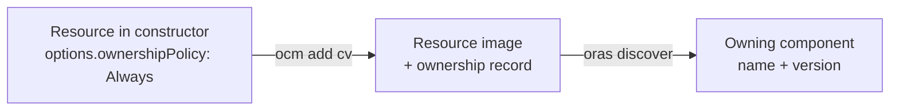

## Goal

Attach **ownership** information to a resource so that, given the resource image in a registry, anyone can trace it
back to the OCM component version that owns it — then verify that link with standard registry tools.

For the background on *why* this works and *what* an ownership record is, see the
[Ownership]() concept.

## You'll end up with

- A component version whose resource carries an **ownership record**
- The owning component name and version discovered directly from the resource image
- A verified, authentic link between the artifact and its component version

**Estimated time:** ~10 minutes

## How it works



Ownership tracking is **opt-in per resource**. You mark a resource with `options.ownershipPolicy: Always`, and OCM
pushes a separate ownership record pointing back at that resource. The original artifact is never modified.

## Prerequisites

- [OCM CLI installed]()
- [`oras`](https://oras.land/docs/installation) installed (used here for discovery and verification)
- [`jq`](https://jqlang.org) — used in the examples to parse and pretty-print JSON output
- A registry that supports the [Referrers API](https://github.com/opencontainers/distribution-spec/blob/v1.1.0/spec.md#listing-referrers).
  Most modern registries do; on registries that do not, `oras` and OCM fall back to a tag-based scheme
  automatically. The examples here use GitHub Container Registry (`ghcr.io`).
- Push access to that registry, configured for both OCM and `oras` (see
  [Configure Multiple Credentials]()).

## Add ownership information

This walkthrough keeps the opted-in image, its ownership record, and the verification in one registry you control, so
everything happens in a registry you own. The example uses `ghcr.io/<your-org>`;
substitute your own repository.




### Push the image for the opted-in resource

The constructor in the next step includes a resource that opts into ownership and points at an image in your own
repository, `ghcr.io/<your-org>/podinfo:6.7.1`. Push one there with `oras` so the reference resolves — copying a
public image is enough:

```bash
oras cp ghcr.io/stefanprodan/podinfo:6.7.1 ghcr.io/<your-org>/podinfo:6.7.1
```




### Author a component constructor that opts in

A resource opts in with `options.ownershipPolicy: Always`. Each resource carries its own policy, so you can mix them
freely. The constructor below puts an opted-out and an opted-in resource side by side:

```bash
cat > component-constructor.yaml << EOF
components:
  - name: ocm.software/ownership-demo
    version: 1.0.0
    provider:
      name: ocm.software
    resources:
      - name: backend
        version: 1.0.0
        type: ociArtifact
        options:
          ownershipPolicy: Never
        access:
          type: OCIImage/v1
          imageReference: ghcr.io/stefanprodan/podinfo:6.7.1
      - name: backend-ref
        version: 1.0.0
        type: ociArtifact
        options:
          ownershipPolicy: Always
        access:
          type: OCIImage/v1
          imageReference: ghcr.io/<your-org>/podinfo:6.7.1
EOF
```

The two resources differ in whether they opt into ownership tracking:

| Resource | Access | Ownership |
| --- | --- | --- |
| `backend` | An upstream image you don't control (`ghcr.io/stefanprodan/podinfo`) | Opted out (`Never`) — no ownership record |
| `backend-ref` | An image in a repository you own (`ghcr.io/<your-org>/podinfo`) | Opted in (`Always`) — an ownership record is pushed next to the image; because you have write access to that registry, the record is persisted there |


`ownershipPolicy` defaults to `Never`. Without `options.ownershipPolicy: Always`, no ownership record is created —
the resource is uploaded exactly as it would be otherwise.





### Create the component version

```bash
ocm add cv \
  --repository ghcr.io/<your-org> \
  --constructor component-constructor.yaml
```

OCM stores the component version in `ghcr.io/<your-org>` and pushes an ownership record next to the opted-in
`backend-ref` image. Because the record is content-addressed, re-running this command converges on the same record —
you never end up with duplicates.




## Verify ownership information


Ownership records are currently supported only on OCI registries, so this guide uses `oras` to verify them. OCM does
not yet provide its own command to read ownership back, and support for other storage backends is not available yet.





### Find the resource image reference

The ownership record sits on the image of the opted-in `backend-ref` resource. Read its reference from the component
descriptor — OCM pinned it to a digest during `ocm add cv`, so you query exactly the artifact the component version
refers to:

```bash
IMAGE_REF=$(ocm get cv ghcr.io/<your-org>//ocm.software/ownership-demo:1.0.0 -o json \
  | jq -r '.[0].component.resources[] | select(.name=="backend-ref") | .access.imageReference')
echo "$IMAGE_REF"
```




### Discover the ownership record

List what is attached to the resource, filtered by the ownership artifact type. The component name and version are
returned **inline** in the listing — no second fetch needed.

```bash
oras discover "$IMAGE_REF" \
  --artifact-type "application/vnd.ocm.software.ownership.v1+json" \
  --format json | jq '.referrers[0].annotations'
```

<details>
<summary>You should see this output</summary>

```json
{
  "software.ocm.component.name": "ocm.software/ownership-demo",
  "software.ocm.component.version": "1.0.0",
  "software.ocm.artifact": "{\"identity\":{\"name\":\"backend-ref\",\"version\":\"1.0.0\"},\"kind\":\"resource\"}"
}
```

</details>

Read together, these three annotations are the full answer to "who owns this image?":

| Annotation | What it tells you |
| --- | --- |
| `software.ocm.component.name` | The owning component |
| `software.ocm.component.version` | Its version |
| `software.ocm.artifact` | *Which* resource within that component version (the resource identity) |





## Troubleshooting

| Symptom | Likely cause and fix |
| --- | --- |
| `oras discover` returns an empty `referrers` array | The resource did not opt in. Confirm `options.ownershipPolicy: Always` is set on the resource and re-run `ocm add cv`. |
| Empty results even though a record was created | You may be querying the wrong subject. Discover the digest-pinned `imageReference` recorded in the component descriptor, not another copy of the image — referrers live per repository and digest. |
| `subject.digest` does not match the descriptor digest | The record points at a different artifact — treat the ownership claim as unverified. |
| Ownership record not visible on an older registry | The registry may not support the Referrers API. `oras` falls back to a tag-based scheme automatically; ensure you query with a recent `oras` version. |

## Related Documentation

- [Concept: Ownership]() — what ownership records are and why OCM links artifacts this way
- [How-To: Use the OCM CLI Container Image]() — create and read component versions
- [Tutorial: Create Component Versions]() — author and store component versions
- [Concept: Transfer and Transport]() — how resources and their ownership records move between repositories
