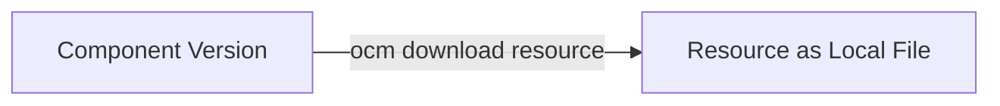

## Goal

Download resources from a component version using the OCM CLI.
Learn how to fetch specific resources, optionally transform them to their native format,
and save them to your local filesystem.

## You'll end up with

- A resource file downloaded from a component version
- Optionally a resource transformed to its native format (e.g., Helm chart `.tgz`)

**Estimated time:** ~5 minutes

## How it works



The OCM CLI fetches a specific resource from a component version and saves it to your local filesystem.

## Prerequisites

- [OCM CLI installed]()
- [jq](https://jqlang.org) installed for JSON parsing (optional)
- A component version with resources to download (see [Create Component Versions]())

## Download Workflow

As mentioned in the [concept document for Component Identity](),
components can be stored in OCI registries or local CTF archives, but the way you access them is the same — using their unique identity.

The following examples show component versions stored in a local CTF archive and in a remote OCI registry.
The local CTF uses the component created in the [Getting Started: Create Component Versions]() tutorial,
while the remote OCI registry uses the Podinfo component published to GitHub Container Registry.







### List the available resources

First, check which resources are available in the component version. Until the OCM CLI supports resource listing,
you can use the [`ocm get cv`]() command
to see the complete component version descriptor, including the `resources` section.

```shell
ocm get cv ghcr.io/open-component-model//ocm.software/demos/podinfo:6.8.0 -oyaml
```

<details>
<summary>Inspect the component for resources</summary>

The output shows the component version descriptor.
We're interested in the `chart` resource, which is a Helm chart stored as OCI artifact in an OCI registry.

```yaml
- component:
    componentReferences: []
    creationTime: "2025-03-18T11:23:20Z"
    name: ocm.software/demos/podinfo
    provider: ocm.software
    repositoryContexts:
      - baseUrl: ghcr.io
        componentNameMapping: urlPath
        subPath: open-component-model
        type: OCIRegistry
    resources:
      - access:
          imageReference: ghcr.io/stefanprodan/podinfo:6.8.0
          type: OCIImage/v1
        digest:
          hashAlgorithm: SHA-256
          normalisationAlgorithm: ociArtifactDigest/v1
          value: 6c1975b871efb327528c84d46d38e6dd7906eecee6402bc270eeb7f1b1a506df
        name: image
        relation: external
        type: ociImage
        version: 6.8.0
      - access:
          imageReference: ghcr.io/stefanprodan/charts/podinfo:6.8.0
          type: OCIImage/v1
        digest:
          hashAlgorithm: SHA-256
          normalisationAlgorithm: ociArtifactDigest/v1
          value: 2360bdf32ddc50c05f8e128118173343b0a012a338daf145b16e0da9c80081a4
        name: chart
        relation: external
        type: helmChart
        version: 6.8.0
    sources: []
    version: 6.8.0
  meta:
    schemaVersion: v2
  signatures:
    - digest:
        hashAlgorithm: SHA-256
        normalisationAlgorithm: jsonNormalisation/v3
        value: 76082d5a6398c7f0d62bc614ec7857dc0ceb93e8cf0a36cbdeb963eddad0707f
      name: my-ocm
      signature:
        algorithm: RSASSA-PKCS1-V1_5
        mediaType: application/vnd.ocm.signature.rsa
        value: 08554a08acd6373e12cd6cea8fc71d6a734a45827fe5ed22900fbb4e3d689dbe0d5178389b8e4939e3e3a6d600fd8f287ca829ba19ddcb0fb7d8364f526651d677a84f75912c4aace8fe93650bfafdf09525bffc256ea0a5b23b47d21ab8ab2b17336c0f7516d4bd8e9aee89de313026be39b5226c31424a51dcafce7a06d5d17ea532a40caff4046beb2f7798892bdf26929b682ee3f1fd65cba3d9b3d0914d84253a6c91190174272bbdb52410f5f8f135d6303bbde6387691b636417111760306354664cb20cf02ed4ce1e31d4d0f27e0309b0a4041c56b7de2e1abe65b564cffe6f6dfe38dc94197ab8e52523b652ac37b4b841a9242ef30c5b3d31098e4
```

</details>


 

### Download the resource

Use the `ocm download resource` command with the `--identity` flag to specify which resource to download.
We download the `chart` resource, which is a Helm chart:

```shell
 ocm download resource ghcr.io/open-component-model//ocm.software/demos/podinfo:6.8.0 \
   --identity name=chart \
    --output helmchart-oci
 ```

<details>
<summary >You should see this output</summary>

```text
{"time":"2026-04-10T14:06:57.85304+02:00","level":"INFO","msg":"capabilities sent"}
time=2026-04-10T14:07:01.593+02:00 level=INFO msg="resource downloaded successfully" output=helmchart-oci
```

</details>




### Verify the Download

Check that the downloaded resource exists and has content:

```shell
ls -la helmchart-oci
```

The downloaded Helm chart is in OCI blob format. 

```shell
total 8
drwxr-xr-x  5 D032990 160 März  4 13:38 .
drwxrwxrwt 23 root    736 März  4 13:42 ..
drwxr-xr-x  3 D032990  96 März  4 13:38 blobs
-rw-r--r--  1 D032990 282 März  4 13:38 index.json
-rw-r--r--  1 D032990  30 März  4 13:38 oci-layout
```

```shell
jq . helmchart-oci/index.json
```

```json
{
  "schemaVersion": 2,
  "manifests": [
    {
      "mediaType": "application/vnd.oci.image.manifest.v1+json",
      "digest": "sha256:2360bdf32ddc50c05f8e128118173343b0a012a338daf145b16e0da9c80081a4",
      "size": 828,
      "annotations": {
        "org.opencontainers.image.ref.name": "ghcr.io/stefanprodan/charts/podinfo:6.8.0"
      }
    }
  ]
}
```










### List available resources

First, check which resources are available in the component version. Until the OCM CLI supports resource listing,
you can use the [`ocm get cv`]() command
to see the complete component version descriptor, including the `resources` section.

```shell
ocm get cv /tmp/helloworld/transport-archive//github.com/acme.org/helloworld:1.0.0 -oyaml
```

<details>
<summary>Inspect the component for resources</summary>

The output shows the component version descriptor. We're interested in the `mylocalfile` resource, which is a plain text file.

```yaml
- component:
    componentReferences: null
    name: github.com/acme.org/helloworld
    provider: acme.org
    repositoryContexts: null
    resources:
      - access:
          localReference: sha256:70a2577d7b649574cbbba99a2f2ebdf27904a4abf80c9729923ee67ea8d2d9d8
          mediaType: text/plain; charset=utf-8
          type: LocalBlob/v1
        digest:
          hashAlgorithm: SHA-256
          normalisationAlgorithm: genericBlobDigest/v1
          value: 70a2577d7b649574cbbba99a2f2ebdf27904a4abf80c9729923ee67ea8d2d9d8
        name: mylocalfile
        relation: local
        type: blob
        version: 1.0.0
      - access:
          imageReference: ghcr.io/stefanprodan/podinfo:6.11.1@sha256:8fa56908408de98f24aed2a162b1bb42c0b98df7abfcc5a76a14a8be510457c5
          type: OCIImage/v1
        digest:
          hashAlgorithm: SHA-256
          normalisationAlgorithm: genericBlobDigest/v1
          value: 8fa56908408de98f24aed2a162b1bb42c0b98df7abfcc5a76a14a8be510457c5
        name: image
        relation: external
        type: ociImage
        version: 1.0.0
    sources: null
    version: 1.0.0
  meta:
    schemaVersion: v2
```

</details>




### Download resource

Use the `ocm download resource` command with the `--identity` flag to specify which resource to download.
We download the `mylocalfile` resource, which is a plain text file:

```shell
 ocm download resource /tmp/helloworld/transport-archive//github.com/acme.org/helloworld:1.0.0 \
   --identity name=mylocalfile \
   --output mylocalfile-downloaded
 ```

<details>
<summary >You should see this output</summary>

```text
{"time":"2026-04-10T11:01:02.313565+02:00","level":"INFO","msg":"capabilities sent"}
time=2026-04-10T11:01:02.320+02:00 level=INFO msg="resource downloaded successfully" output=mylocalfile-downloaded
```

</details>




### Verify Download

Check that the downloaded resource exists and has content:

```shell
ls -la mylocalfile-downloaded
```

```shell
-rw------- 1 D032990 45 Apr. 10 11:01 mylocalfile-downloaded
```

```shell
cat mylocalfile-downloaded
```

```text
My first local Resource for an OCM component
```







## Using Transformers

To download resources in their native format instead of OCI blob format, use the `--transformer` flag.

In this example, we download the Helm chart resource using the `helm` transformer,
which converts the OCI blob back into a standard Helm chart archive.
The Helm chart is downloaded into a directory specified by `--output`.

```shell
ocm download resource ghcr.io/open-component-model//ocm.software/demos/podinfo:6.8.0 \
  --identity name=chart \
  --output helmchart-tgz \
  --transformer helm
```

<details>
<summary>You should see this output</summary>

```text
time=2026-03-04T13:59:23.279+01:00 level=INFO msg="transforming resource..."
time=2026-03-04T13:59:24.238+01:00 level=INFO msg=copied descriptor.mediaType=application/vnd.cncf.helm.config.v1+json descriptor.digest=sha256:eb2808c21a03a7007ef9a7b5207af0a3b4115be5ce4bb340e0bf501abaf8d31e descriptor.size=348
time=2026-03-04T13:59:24.359+01:00 level=INFO msg=copied descriptor.mediaType=application/vnd.cncf.helm.chart.content.v1.tar+gzip descriptor.digest=sha256:ddf24dfc79800f80a8f1e5b8d462b15619c22d77c8ffe454636fef3b9a6d4f60 descriptor.size=14956
time=2026-03-04T13:59:24.361+01:00 level=INFO msg=copied descriptor.mediaType=application/vnd.oci.image.manifest.v1+json descriptor.digest=sha256:2360bdf32ddc50c05f8e128118173343b0a012a338daf145b16e0da9c80081a4 descriptor.size=828
time=2026-03-04T13:59:24.363+01:00 level=INFO msg="resource transformed successfully"
time=2026-03-04T13:59:24.363+01:00 level=INFO msg="resource downloaded successfully" output=helmchart-tgz
```
</details>


The downloaded archive is now a regular Helm chart archive:

```shell
tar tvf helmchart-tgz/podinfo-6.8.0.tgz
```

```shell
-rw-r--r-- 0/0             313 2025-03-11 10:31 podinfo/Chart.yaml
-rw-r--r-- 0/0            4351 2025-03-11 10:31 podinfo/values.yaml
-rw-r--r-- 0/0            1361 2025-03-11 10:31 podinfo/templates/NOTES.txt
-rw-r--r-- 0/0            1965 2025-03-11 10:31 podinfo/templates/_helpers.tpl
-rw-r--r-- 0/0             455 2025-03-11 10:31 podinfo/templates/certificate.yaml
-rw-r--r-- 0/0            8051 2025-03-11 10:31 podinfo/templates/deployment.yaml
-rw-r--r-- 0/0             995 2025-03-11 10:31 podinfo/templates/hpa.yaml
-rw-r--r-- 0/0            1154 2025-03-11 10:31 podinfo/templates/ingress.yaml
-rw-r--r-- 0/0            2338 2025-03-11 10:31 podinfo/templates/linkerd.yaml
-rw-r--r-- 0/0             437 2025-03-11 10:31 podinfo/templates/pdb.yaml
-rw-r--r-- 0/0             239 2025-03-11 10:31 podinfo/templates/redis/config.yaml
-rw-r--r-- 0/0            1928 2025-03-11 10:31 podinfo/templates/redis/deployment.yaml
-rw-r--r-- 0/0             369 2025-03-11 10:31 podinfo/templates/redis/service.yaml
-rw-r--r-- 0/0             988 2025-03-11 10:31 podinfo/templates/service.yaml
-rw-r--r-- 0/0             325 2025-03-11 10:31 podinfo/templates/serviceaccount.yaml
-rw-r--r-- 0/0             598 2025-03-11 10:31 podinfo/templates/servicemonitor.yaml
-rw-r--r-- 0/0             912 2025-03-11 10:31 podinfo/templates/tests/cache.yaml
-rw-r--r-- 0/0             607 2025-03-11 10:31 podinfo/templates/tests/fail.yaml
-rw-r--r-- 0/0             694 2025-03-11 10:31 podinfo/templates/tests/grpc.yaml
-rw-r--r-- 0/0             884 2025-03-11 10:31 podinfo/templates/tests/jwt.yaml
-rw-r--r-- 0/0             781 2025-03-11 10:31 podinfo/templates/tests/service.yaml
-rw-r--r-- 0/0             632 2025-03-11 10:31 podinfo/templates/tests/timeout.yaml
-rw-r--r-- 0/0             815 2025-03-11 10:31 podinfo/templates/tests/tls.yaml
-rw-r--r-- 0/0             333 2025-03-11 10:31 podinfo/.helmignore
-rw-r--r-- 0/0           11365 2025-03-11 10:31 podinfo/LICENSE
-rw-r--r-- 0/0           13442 2025-03-11 10:31 podinfo/README.md
-rw-r--r-- 0/0            3427 2025-03-11 10:31 podinfo/values-prod.yaml
```



## Specifying Resource Identity

If multiple resources share the same name, use additional identity attributes:

```shell
ocm download resource <repo>//<component>:<version> \
  --identity name=image,version=1.0.0 \
  --output image.tar
```

## CLI Reference

| Command | Description |
| --- | --- |
| [`ocm download resource`]() | Download a specific resource |
| [`ocm get cv`]() | Get component versions and resources |

## Related Documentation

- [Concept: Component Identity]() - Understanding component structure
- [Tutorial: Create Component Versions]() - Learn how to create components
