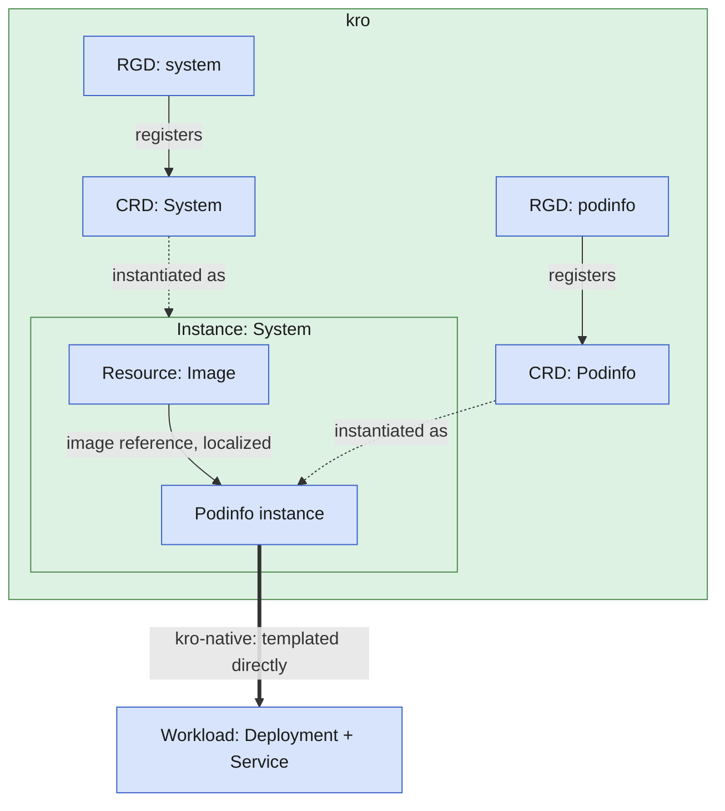

You have an application to run on Kubernetes. You want to ship it the same way every time:
one versioned package that carries the container image and the instructions to run it.
When you move that package from a development registry to production, or into an air-gapped
cluster, the image references must follow automatically. You should never hand-edit a
manifest to fix a registry path.

This tutorial builds exactly that. You package an application as an OCM component, describe
how to run it with two kro `ResourceGraphDefinition`s (RGDs) [chained
together](https://kro.run/docs/building-abstractions/rgd-chaining/), one creating an instance
of the other's kind, and let the OCM controllers deliver and localize it into your cluster.
kro renders plain Kubernetes manifests directly, so there is no Helm chart and no Flux or Argo
CD in the path. We use [Podinfo](https://github.com/stefanprodan/podinfo) as a stand-in for
your application.

By the end, you will have:

- An OCM component that bundles an image and two RGDs
- A running Podinfo application, deployed and kept in sync by kro
- A localized image reference that points at your registry, set automatically

## Prerequisites


Before starting, make sure you have set up your environment as described in the [setup guide]().


- [Controller environment]() with the OCM
  Controllers and kro installed (no GitOps deployer needed)
- [Custom RBAC]() configured so the OCM controller can manage
  `ResourceGraphDefinitions`, and so kro can create the `Podinfo` instance, the OCM `Resource`,
  and the Deployment and Service it renders — see [RBAC for CRDs kro creates at runtime]()
- [OCM CLI]()
- `envsubst` (part of `gettext`; on macOS install it with `brew install gettext`)
- An OCI registry you can push to, for example [ghcr.io](https://docs.github.com/en/packages/learn-github-packages/introduction-to-github-packages)


Once you've applied the [Custom RBAC]() guide, confirm the OCM
controller `ServiceAccount` (not your admin user) can manage RGDs:

```bash
kubectl auth can-i create resourcegraphdefinitions.kro.run \
  --as=system:serviceaccount:ocm-k8s-toolkit-system:ocm-k8s-toolkit-controller-manager
```

This must print `yes` before you continue. You may also see a line like
`Warning: resource 'resourcegraphdefinitions' is not namespace scoped in group 'kro.run'`.
That is harmless. The answer is the `yes` printed below it.


Set your registry location:

```bash
export GITHUB_USERNAME=<your-github-username>
export OCM_REPO=ghcr.io/$GITHUB_USERNAME/ocm-tutorial
```

## How it works

You deliver **two** RGDs inside one OCM component. The first (`podinfo`) defines the `Podinfo`
kind: the application as its own Kubernetes API. The second (`system`) creates a `Podinfo`
instance and sets its image to the one OCM localized into your registry. The OCM controllers
deliver both the same way described in [Concept: Kubernetes Deployer]():
a `Repository` and `Component` fetch the component, and one `Resource` + `Deployer` pair per
RGD applies it to the cluster. You then create a single `System` instance, and reconciliation
converges to a running Podinfo.

**Localization** keeps the image correct once it lands in kro's hands. [Transfer preserves
artifact integrity, and localization adapts the reference at deploy time]().
Here, that means the system RGD sets the `image` field of the `Podinfo` instance to the
rewritten reference, so the pod always pulls from the registry the component was delivered to.

The diagram below picks up once both RGDs are already applied, and shows what kro itself does
with them.

<details>
<summary>Architecture diagram</summary>

(Continues from [Concept: Kubernetes Deployer](), which
shows the `Repository` → `Component` → `Resource` → `Deployer` sequence that gets the RGD here.)



</details>

## Create the component

Work in a fresh directory:

```bash
mkdir -p kro-tutorial && cd kro-tutorial
```

### Define the component

The component bundles three resources: the Podinfo image and the two RGD files.

```bash
cat > component-constructor.yaml << 'EOF'
components:
  - name: ocm.software/ocm-k8s-toolkit/system
    version: "1.0.0"
    provider:
      name: ocm.software
    resources:
      - name: image-podinfo
        type: ociArtifact
        version: "1.0.0"
        access:
          type: OCIImage/v1
          imageReference: "ghcr.io/stefanprodan/podinfo:6.11.1@sha256:8fa56908408de98f24aed2a162b1bb42c0b98df7abfcc5a76a14a8be510457c5"
      - name: rgd-podinfo
        type: blob
        version: "1.0.0"
        input:
          type: File/v1
          path: ./rgd-podinfo.yaml
      - name: rgd-system
        type: blob
        version: "1.0.0"
        input:
          type: File/v1
          path: ./rgd-system.yaml
EOF
```

### Write the app RGD

This RGD registers the `Podinfo` API and renders the application: a Deployment and a Service.
kro templates values from the instance schema and reconciles resources in dependency order,
which it infers from the CEL references between them. `deployment` and `service` only reference
the schema, so they are independent and reconcile in parallel.

```bash
cat > rgd-podinfo.yaml << 'EOF'
apiVersion: kro.run/v1alpha1
kind: ResourceGraphDefinition
metadata:
  name: podinfo
spec:
  schema:
    apiVersion: v1alpha1
    kind: Podinfo
    spec:
      image: string
      message: string | default="Hello from OCM and kro"
      replicas: integer | default=1 minimum=0
  resources:
    - id: deployment
      readyWhen:
        - ${deployment.status.conditions.exists(c, c.type == 'Available' && c.status == 'True')}
      template:
        apiVersion: apps/v1
        kind: Deployment
        metadata:
          name: ${schema.metadata.name}
        spec:
          replicas: ${schema.spec.replicas}
          selector:
            matchLabels:
              app: ${schema.metadata.name}
          template:
            metadata:
              labels:
                app: ${schema.metadata.name}
            spec:
              containers:
                - name: podinfo
                  image: ${schema.spec.image}
                  ports:
                    - containerPort: 9898
                  env:
                    - name: PODINFO_UI_MESSAGE
                      value: ${schema.spec.message}
    - id: service
      template:
        apiVersion: v1
        kind: Service
        metadata:
          name: ${schema.metadata.name}
        spec:
          type: ClusterIP
          selector:
            app: ${schema.metadata.name}
          ports:
            - port: 80
              targetPort: 9898
EOF
```

### Write the system RGD

This RGD reads the localized image from the OCM component and creates a `Podinfo` instance
with it. The `resourceImage` node fetches the image reference. The `app` node assembles the
pod image as `registry`/`repository`@`digest` from the three fields `toOCI()` exposes under
`resourceImage.status.additional.oci`, then passes it with your message to the `Podinfo`
instance. Pinning the digest (not the tag) locks in the exact image OCM localized.

```bash
cat > rgd-system.yaml << 'EOF'
apiVersion: kro.run/v1alpha1
kind: ResourceGraphDefinition
metadata:
  name: system
spec:
  schema:
    apiVersion: v1alpha1
    kind: System
    spec:
      message: string | default="Hello from OCM and kro"
      replicas: integer | default=1 minimum=0
  resources:
    - id: resourceImage
      readyWhen:
        - ${resourceImage.status.conditions.exists(c, c.type == 'Ready' && c.status == 'True')}
      template:
        apiVersion: delivery.ocm.software/v1alpha1
        kind: Resource
        metadata:
          name: system-image-resource
        spec:
          componentRef:
            name: system-component
          resource:
            byReference:
              resource:
                name: image-podinfo
          additionalStatusFields:
            oci: resource.access.toOCI()
    - id: app
      readyWhen:
        - ${app.status.conditions.exists(c, c.type == 'Ready' && c.status == 'True')}
      template:
        apiVersion: kro.run/v1alpha1
        kind: Podinfo
        metadata:
          name: podinfo
        spec:
          image: ${resourceImage.status.additional.oci.registry}/${resourceImage.status.additional.oci.repository}@${resourceImage.status.additional.oci.digest}
          message: ${schema.spec.message}
          replicas: ${schema.spec.replicas}
EOF
```

### Why two RGDs, and when Helm is still simpler

You just wrote two RGDs instead of one. That split is deliberate:

- **The app RGD (`podinfo`)** is the Podinfo application packaged as its own API: it registers
  the `Podinfo` kind and renders the Deployment and Service you just wrote. It contains nothing
  OCM-specific.
- **The system RGD (`system`)** is the OCM-specific wiring. It reads the localized image from
  the OCM component and creates a `Podinfo` instance with that image and your message.

Whether this split is worth it depends on what you're shipping. If your application already
ships as a Helm chart, or you're doing a one-off install of someone else's chart, a
`HelmRelease` is simpler to write: see [Deploy an Application from a Helm Chart with OCM and kro]().
The plain-manifest RGDs pay off when you own the application: the app RGD turns it into a
first-class Kubernetes API, so operators run `kubectl get podinfo`, set fields with
validation, and read status like any built-in resource, all without needing to know OCM is
behind it. Keeping the system RGD separate is what lets that API stay reusable.

For one app you could fold both RGDs into one. Keeping them separate is what makes the
deployment reusable and composable: the application stays generic, the OCM wiring stays in one
place, and a real product just adds more app RGDs under one system RGD. The
[Scaling to a whole product](#scaling-to-a-whole-product) section at the end shows how.

## Build and transfer

Build the component version locally (`cv` is short for component version). This reads
`component-constructor.yaml` from the current directory and creates a `transport-archive`.

```bash
ocm add cv
```

On success it prints a summary table:

```text
 COMPONENT                           │ VERSION │ PROVIDER
─────────────────────────────────────┼─────────┼──────────────
 ocm.software/ocm-k8s-toolkit/system │ 1.0.0   │ ocm.software
```

Transfer it to your registry. `--copy-resources` copies the image into your registry instead
of leaving the component pointing back at `ghcr.io/stefanprodan`, and `--upload-as ociArtifact`
is what creates a standalone oci image that can be pulled individually; see [Resource
Handling: References vs. Copies]()
for why that distinction exists.

```bash
ocm transfer cv --copy-resources --upload-as ociArtifact \
  "transport-archive//ocm.software/ocm-k8s-toolkit/system:1.0.0" $OCM_REPO
```

The command streams `level=INFO` progress lines. It succeeded when the last line reads:

```text
... level=INFO msg="Transferring component versions: operation finished"
```

Confirm localization. The image reference now points at your registry, not `ghcr.io/stefanprodan`:

```bash
ocm get cv "$OCM_REPO//ocm.software/ocm-k8s-toolkit/system:1.0.0" -o yaml | grep imageReference
```

```text
imageReference: ghcr.io/<your-username>/ocm-tutorial/stefanprodan/podinfo:6.11.1
```

Only the registry and path changed. The original tag stays in the reference. At deploy
time the system RGD resolves this to a digest-pinned reference (`...@sha256:...`), which is
what the running pod uses. You will see that digest form in the verification step below.

A freshly pushed ghcr.io package is private. To make it public, go to the `packages` tab in
your GitHub repository `https://github.com/<your-github-username>?tab=packages`, select the package
`component-descriptors/ocm.software/ocm-k8s-toolkit/system`, and under "Package settings"
change the visibility to `public`. This lets the cluster pull it without credentials.

Alternatively, if you want to keep your package private, configure credentials for the OCM
Controllers and kro:


Create a pull secret from a token with `read:packages`, in the same namespace as the bootstrap
resources:

```bash
kubectl create secret docker-registry ghcr-secret \
  --namespace default \
  --docker-username=$GITHUB_USERNAME \
  --docker-password="$(gh auth token)" \
  --docker-server=ghcr.io
```

Then wire it into three places:

1. The `Repository` in `bootstrap.yaml`. Credentials propagate to the Component and Resources:

   ```yaml
   spec:
     repositorySpec:
       baseUrl: $OCM_REPO
       type: OCIRegistry
     interval: 1m
     ocmConfig:
       - kind: Secret
         name: ghcr-secret
   ```

2. The `resourceImage` node in `rgd-system.yaml`, so the controller can read the image:

   ```yaml
   additionalStatusFields:
     oci: resource.access.toOCI()
   ocmConfig:
     - kind: Secret
       name: ghcr-secret
   ```

3. The pod in `rgd-podinfo.yaml`, so the kubelet can pull the image. Add under the pod `spec`:

   ```yaml
   spec:
     imagePullSecrets:
       - name: ghcr-secret
     containers:
       - name: podinfo
   ```

Rebuild and transfer the component after editing the RGDs.

For more details, see [Configure Credentials for Controllers]().


## Deploy the application

### Deliver both RGDs

The bootstrap resources are OCM controller objects: a `Repository` and `Component` fetch the
component from your registry; then a `Resource` + `Deployer` pair per RGD applies it to the
cluster. The namespaced objects all live in `default`, so their cross-references and the
verification commands below work no matter which namespace your kubectl context points at. The
`Deployer` is cluster-scoped and finds its `Resource` through `resourceRef.namespace`.

```bash
cat > bootstrap.yaml << 'EOF'
apiVersion: delivery.ocm.software/v1alpha1
kind: Repository
metadata:
  name: system-repository
  namespace: default
spec:
  repositorySpec:
    baseUrl: $OCM_REPO
    type: OCIRegistry
  interval: 1m
---
apiVersion: delivery.ocm.software/v1alpha1
kind: Component
metadata:
  name: system-component
  namespace: default
spec:
  component: ocm.software/ocm-k8s-toolkit/system
  repositoryRef:
    name: system-repository
  semver: 1.0.0
  interval: 1m
---
apiVersion: delivery.ocm.software/v1alpha1
kind: Resource
metadata:
  name: system-rgd-podinfo
  namespace: default
spec:
  componentRef:
    name: system-component
  resource:
    byReference:
      resource:
        name: rgd-podinfo
---
apiVersion: delivery.ocm.software/v1alpha1
kind: Deployer
metadata:
  name: system-deployer-podinfo
spec:
  resourceRef:
    name: system-rgd-podinfo
    namespace: default
---
apiVersion: delivery.ocm.software/v1alpha1
kind: Resource
metadata:
  name: system-rgd-system
  namespace: default
spec:
  componentRef:
    name: system-component
  resource:
    byReference:
      resource:
        name: rgd-system
---
apiVersion: delivery.ocm.software/v1alpha1
kind: Deployer
metadata:
  name: system-deployer-system
spec:
  resourceRef:
    name: system-rgd-system
    namespace: default
EOF
```

Apply them. `envsubst` fills in `$OCM_REPO`:

```bash
envsubst < bootstrap.yaml | kubectl apply -f -
```

Wait for both RGDs to reach `Active`. This usually takes a few seconds:

```bash
kubectl get rgd
```

```text
NAME      APIVERSION   KIND      STATE    READY   AGE
podinfo   v1alpha1     Podinfo   Active   True    12s
system    v1alpha1     System    Active   True    11s
```

The `podinfo` RGD registers the `Podinfo` CRD, and the `system` RGD registers the `System`
CRD. The system RGD references the `Podinfo` kind. If it becomes `Active` before the podinfo
RGD, it recovers on its own once the `Podinfo` CRD is registered, so the order does not matter.

### Create the System instance

Create an instance of the `System` CRD:

```bash
cat > instance.yaml << 'EOF'
apiVersion: kro.run/v1alpha1
kind: System
metadata:
  name: system
  namespace: default
spec:
  message: "Hello from OCM and kro"
  replicas: 1
EOF
kubectl apply -f instance.yaml
```

Wait for it to become `Active`. This usually takes around 30 seconds, mostly the image pull:

```bash
kubectl get system,podinfo -n default
```

```text
NAME                    STATE    READY   AGE
system.kro.run/system   ACTIVE   True    30s

NAME                      STATE    READY   AGE
podinfo.kro.run/podinfo   ACTIVE   True    28s
```

## Verify

Check that the pod runs the localized image. The reference points at your registry and pins a
digest:

```bash
kubectl get pods -n default -l app=podinfo -o jsonpath='{.items[0].spec.containers[0].image}'
```

```text
ghcr.io/<your-username>/ocm-tutorial/stefanprodan/podinfo@sha256:8fa56908408de98f24aed2a162b1bb42c0b98df7abfcc5a76a14a8be510457c5
```

Check that your message reached the container:

```bash
kubectl get pods -n default -l app=podinfo \
  -o jsonpath='{.items[0].spec.containers[0].env[?(@.name=="PODINFO_UI_MESSAGE")].value}'
```

```text
Hello from OCM and kro
```

Call the application and see the message in its response:

```bash
kubectl port-forward -n default svc/podinfo 9898:80 &
sleep 2
curl -s http://localhost:9898/ | grep message
kill %1   # stops the port-forward (assumes no other background jobs)
```

The `sleep` gives the port-forward a moment to open. Without it, `curl` may run before the
tunnel is ready and return nothing.

```text
"message": "Hello from OCM and kro",
```

Change the message or replica count by editing `instance.yaml` and re-applying. kro
reconciles the running workload.


This tutorial uses a dev-friendly kro install with broad permissions (see [Prerequisites](#prerequisites)).
To harden the cluster and have more strict RBAC please read [RBAC for CRDs kro creates at runtime]().


## Clean up

Delete the instance before the RGDs. Deleting an RGD while its instances still exist can
strand them on a finalizer.

```bash
kubectl delete system system -n default
envsubst < bootstrap.yaml | kubectl delete -f -
```

By default kro keeps the `Podinfo` and `System` CRDs after the RGDs are gone. Installing kro
with `--set config.allowCRDDeletion=true` changes that: deleting the RGD then deletes its CRD
as well. Leftover CRDs are harmless: they carry no instances and cost nothing to leave.
Deleting a CRD removes every instance of that kind cluster-wide, so unless you know this is the
only thing on the cluster using those kinds, leave them. They disappear along with everything
else if you tear down the whole cluster, for example with `kind delete cluster`.

## Troubleshooting

**RGD stuck `Inactive`**: the system RGD cannot compile until the `Podinfo` CRD exists. Check
that the podinfo RGD is `Active` (`kubectl get rgd`). It converges automatically.

**Resource not `Ready` / image pull errors**: the cluster cannot read the package. Make the
ghcr.io package public, or follow the private-registry steps above.

**Nothing happens after applying bootstrap**: check the controller logs.

```bash
kubectl logs -n ocm-k8s-toolkit-system deploy/ocm-k8s-toolkit-controller-manager --tail=40
```

**RBAC denied**: re-check the impersonation command in Prerequisites and apply the
[Custom RBAC]() guide.

## What you learned

- Packaged an application as an OCM component with an image and two RGDs
- Used a system RGD to instantiate an app RGD with the localized image
- Delivered both RGDs with the OCM controllers, no Helm or GitOps tooling
- Confirmed the workload runs the localized image and your message

## Scaling to a whole product

One app is the small case. Real products are bigger: many apps and services, shipped and
versioned together. The good news is you already have the building block.

What you wrote is an **app RGD**. It gives one application a typed Kubernetes API, the
`Podinfo` kind, with a schema and status. It knows how to run one thing and nothing else.
A real product has many of these: a database, a gateway, a handful of services.

On top sits the **system RGD**. Its job is composition: it creates one instance of each app
RGD and passes values between them. Ordering needs no extra configuration: kro infers
dependencies from references. You saw that in this tutorial: because `app` references
`resourceImage.status.additional.oci.*`, kro does not create the `Podinfo` instance until
`resourceImage` satisfies its `readyWhen` condition. Add more app RGDs and reference them the
same way, and one `System` instance drives the entire product.

One thing is still hand-written: the delivery plumbing in `bootstrap.yaml`. Today you list a
`Resource` + `Deployer` pair for every RGD yourself. For a dozen apps that is a wall of
boilerplate, and every version bump means editing that file again.

The pattern that scales moves the plumbing *into* an RGD. An **installer RGD** templates those
`Resource` + `Deployer` pairs itself, one per app, all sharing a single `Component` you pass
in by name:

```yaml
resources:
  - id: appResource
    template:
      apiVersion: delivery.ocm.software/v1alpha1
      kind: Resource
      metadata: { name: app-rgd }
      spec:
        componentRef:
          name: ${schema.spec.componentRef}   # one component, passed in
        resource:
          byReference:
            resource: { name: rgd-podinfo }
  - id: appDeployer
    template:
      apiVersion: delivery.ocm.software/v1alpha1
      kind: Deployer
      metadata: { name: app-rgd }
      spec:
        resourceRef:
          name: ${appResource.metadata.name}
          # Deployer is cluster-scoped, so the namespace of the namespaced Resource is required
          namespace: ${schema.metadata.namespace}
    readyWhen:
      - ${appDeployer.status.conditions.exists(c, c.type == "Ready" && c.status == "True")}
```

Now `bootstrap.yaml` shrinks to almost nothing. It delivers the installer RGD once, and the
running instance takes over its own delivery. Bump the component version and the whole graph
reconciles. No more editing bootstrap files by hand.

This is not a new tool. It is the same `delivery.ocm.software/Resource` you already used for
the localized image, now applied to delivery itself. There is no layering limit: an RGD can
create other RGDs, which is exactly what the installer's `Resource` + `Deployer` pairs do for
the app RGDs. The one thing it cannot do is apply itself: something has to deliver the
installer RGD once, and that stays in `bootstrap.yaml`.

## Next steps

- [Deploy an Application from a Helm Chart with OCM and kro]() compares this with the Helm approach
- [kro Resource Graph Definitions](https://kro.run/docs/getting-started/deploy-a-resource-graph-definition/) for composing more applications
- [Configure Credentials for Controllers]() for private registries
