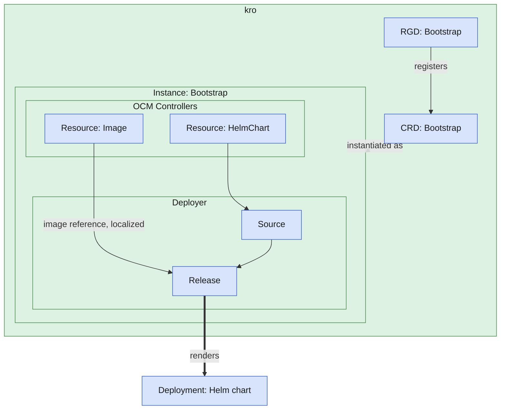

## What You'll Learn

Your application already ships as a Helm chart, and you want its delivery to be just as repeatable: one versioned
OCM component that carries the chart, its container image, and the instructions to deploy it. Promote that component
from a staging registry to production, or hand it to an air-gapped cluster, and the image references should update
themselves. Patching a values file to correct a registry path is exactly what this avoids.

This tutorial builds that pipeline. You package the chart as an OCM component, capture its deployment as a kro
`ResourceGraphDefinition`, and let the OCM controllers deliver and localize it into the cluster. A GitOps deployer
(Flux or Argo CD) renders the chart, so operators install it without touching its internals.
[Podinfo](https://github.com/stefanprodan/podinfo) stands in for your application.

By the end, you'll have:

- An OCM component containing a Helm chart, an image reference, and deployment instructions
- A running Podinfo application deployed via the bootstrap pattern
- Understanding of how localization keeps image references in sync after transfers

## Prerequisites


Before starting, make sure you have set up your environment as described in the [setup guide]().


- [Controller environment]() with OCM Controllers, kro, and a deployer (Flux or Argo CD) installed
- [Custom RBAC]() configured to allow the controller to manage `ResourceGraphDefinitions` (also see [RBAC for CRDs kro creates at runtime]() if you're running a hardened cluster)
- [OCM CLI]() installed
- Access to an OCI registry (e.g., [ghcr.io](https://docs.github.com/en/packages/learn-github-packages/introduction-to-github-packages))
- `envsubst` installed (pre-installed on most Linux/macOS systems; part of `gettext`)


If using a private registry, you'll need to configure credentials for both the OCM CLI and the controller resources. See [Configure Credentials for Controllers]() for details.


## Environment Setup

Set environment variables for your GitHub username and OCM repository:

```bash
export GITHUB_USERNAME=<your-github-username>
export OCM_REPO=ghcr.io/$GITHUB_USERNAME/ocm-tutorial
```

## Concepts

### The Bootstrap Pattern

In the [basic Helm deployment guide](), you manually created a `ResourceGraphDefinition` and applied it to the cluster. The **bootstrap pattern** improves on this by packaging the RGD inside the OCM component itself. The Deployer controller extracts and applies it automatically.

This means:

- Developers define deployment instructions once, alongside their application
- Operators only need to create bootstrap resources pointing to the component
- Deployment instructions travel securely with the software through OCM

### Localization

**Localization** keeps image references in sync when components move between registries:

1. **During transfer**: When you run `ocm transfer cv --copy-resources --upload-as ociArtifact`, OCM uploads artifacts to the new registry as OCI artifacts and updates the descriptor's image references accordingly
2. **During deployment**: The RGD reads the updated image reference from the component and injects it into Helm values

This ensures your deployment always uses images from the current registry, not hardcoded original locations.

## Architecture Overview

The OCM controllers fetch the component and apply the RGD the same way described in
[Concept: Kubernetes Deployer](). The
diagram below picks up from there: it shows what kro does once it has the RGD, and you can
refer back to it as you work through the steps.

<details>
<summary>View Resource Overview Diagram</summary>

(Continues from [Concept: Kubernetes Deployer](), which
shows the `Repository` → `Component` → `Resource` → `Deployer` chain that gets the RGD here.)



</details>

kro creates a CRD from the RGD, and instantiating that CRD deploys the Helm chart with localized image references.

## Create and Publish a Component Version

First, create an OCM component version containing three resources:

- **helm-resource**: The Podinfo Helm chart
- **image-resource**: The Podinfo container image (for localization)
- **resource-graph-definition**: Deployment instructions




### Create a working directory

```shell
mkdir /tmp/bootstrap-deploy && cd /tmp/bootstrap-deploy
```





### Define the component

Create a `component-constructor.yaml` file:

```shell
cat > component-constructor.yaml << 'EOF'
components:
  - name: ocm.software/ocm-k8s-toolkit/bootstrap
    version: "1.0.0"
    provider:
      name: ocm.software
    resources:
      - name: helm-resource
        type: helmChart
        version: "1.0.0"
        access:
          type: OCIImage/v1
          imageReference: "ghcr.io/stefanprodan/charts/podinfo:6.11.1@sha256:a9b2804ec61795a7457b2303bf9efbc5fba51f856c3945f3bb0af68bf3b35afd"
      - name: image-resource
        type: ociArtifact
        version: "1.0.0"
        access:
          type: OCIImage/v1
          imageReference: "ghcr.io/stefanprodan/podinfo:6.11.1@sha256:8fa56908408de98f24aed2a162b1bb42c0b98df7abfcc5a76a14a8be510457c5"
      - name: resource-graph-definition
        type: blob
        version: "1.0.0"
        input:
          type: File/v1
          path: ./resourceGraphDefinition.yaml
EOF
```

As you can see, the resource `resource-graph-definition` is of type `blob` and contains the path to a file
`resourceGraphDefinition.yaml`. Before we can create the OCM component version, we need to create this file, with the
following content:


The `resourceChart` and `resourceImage` resources are identical for both deployers. Both use
`additionalStatusFields`/`toOCI()` to expose the registry, repository, and digest under
`status.additional`; see [Concept: OCM Controllers]()
for how that mechanism works. Choose your deployer tab for the deployer-specific resources:




```shell
cat > resourceGraphDefinition.yaml << 'EOF'
apiVersion: kro.run/v1alpha1
kind: ResourceGraphDefinition
metadata:
  name: bootstrap
spec:
  schema:
    apiVersion: v1alpha1
    kind: Bootstrap
  resources:
    # In this guide, we will not create a "Repository" and "Component" resource in this ResourceGraphDefinition. Those
    # resources will be created to bootstrap the ResourceGraphDefinition itself and will be present in the Kubernetes
    # cluster to be referenced by the following resources (see the bootstrap resource in one of the following sections).

    # This resource refers to the resource "helm-resource" defined in the OCM component version. It will be downloaded,
    # verified, and its location is made available in the status of the resource.
    - id: resourceChart
      readyWhen:
        - ${resourceChart.status.conditions.exists(c, c.type == 'Ready' && c.status == 'True')}
      template:
        apiVersion: delivery.ocm.software/v1alpha1
        kind: Resource
        metadata:
          name: bootstrap-helm-resource
        spec:
          # This component will be part of the bootstrap resources that will be created later.
          componentRef:
            name: bootstrap-component
          resource:
            byReference:
              resource:
                name: helm-resource
          additionalStatusFields:
            # toOCI() converts the resource access to an OCI reference object containing registry, repository, tag, and digest
            oci: resource.access.toOCI()
          # ocmConfig is required, if the OCM repository requires credentials to access it.
          # ocmConfig:
    # This resource refers to the resource "image-resource" defined in the OCM component version. It will be downloaded,
    # verified, and its location is made available in the status of the resource.
    - id: resourceImage
      readyWhen:
        - ${resourceImage.status.conditions.exists(c, c.type == 'Ready' && c.status == 'True')}
      template:
        apiVersion: delivery.ocm.software/v1alpha1
        kind: Resource
        metadata:
          name: bootstrap-image-resource
        spec:
          # This component will be part of the bootstrap resources that will be created later.
          componentRef:
            name: bootstrap-component
          resource:
            byReference:
              resource:
                name: image-resource
          additionalStatusFields:
            oci: resource.access.toOCI()
          # ocmConfig is required, if the OCM repository requires credentials to access it.
          # ocmConfig:
    # OCIRepository watches and downloads the resource from the location provided by the Resource status.
    # The Helm chart location (url) refers to the status of the resource helm-resource.
    - id: ocirepository
      readyWhen:
        - ${ocirepository.status.conditions.exists(c, c.type == 'Ready' && c.status == 'True')}
      template:
        apiVersion: source.toolkit.fluxcd.io/v1
        kind: OCIRepository
        metadata:
          name: bootstrap-ocirepository
        spec:
          interval: 1m0s
          insecure: true
          layerSelector:
            mediaType: "application/vnd.cncf.helm.chart.content.v1.tar+gzip"
            operation: copy
          url: oci://${resourceChart.status.additional.oci.registry}/${resourceChart.status.additional.oci.repository}
          ref:
            digest: ${resourceChart.status.additional.oci.digest}
          # secretRef is required if the OCI repository requires credentials to access it.
          # secretRef:
          #   name: ghcr-secret
    # HelmRelease refers to the OCIRepository, lets you configure the helm chart and deploys the Helm Chart into the
    # Kubernetes cluster.
    - id: helmrelease
      readyWhen:
        - ${helmrelease.status.conditions.exists(c, c.type == 'Ready' && c.status == 'True')}
      template:
        apiVersion: helm.toolkit.fluxcd.io/v2
        kind: HelmRelease
        metadata:
          name: bootstrap-helmrelease
        spec:
          releaseName: bootstrap-release
          interval: 1m
          timeout: 5m
          chartRef:
            kind: OCIRepository
            name: ${ocirepository.metadata.name}
            namespace: default
          values:
            # This is the second step of the localization. We use the image reference from the resource "image-resource"
            # and insert it into the Helm chart values. We use a pseudo-tag with @digest because:
            # 1. Podinfo's Helm chart constructs the image as repository:tag (using :)
            # 2. OCI runtimes ignore the tag portion when a digest is present
            # 3. This creates a valid reference like: registry/repo:pseudo@sha256:...
            image:
              repository: ${resourceImage.status.additional.oci.registry}/${resourceImage.status.additional.oci.repository}
              tag: latest@${resourceImage.status.additional.oci.digest}
EOF
```




```shell
cat > resourceGraphDefinition.yaml << 'EOF'
apiVersion: kro.run/v1alpha1
kind: ResourceGraphDefinition
metadata:
  name: bootstrap
spec:
  schema:
    apiVersion: v1alpha1
    kind: Bootstrap
  resources:
    # In this guide, we will not create a "Repository" and "Component" resource in this ResourceGraphDefinition. Those
    # resources will be created to bootstrap the ResourceGraphDefinition itself and will be present in the Kubernetes
    # cluster to be referenced by the following resources (see the bootstrap resource in one of the following sections).

    # This resource refers to the resource "helm-resource" defined in the OCM component version. It will be downloaded,
    # verified, and its location is made available in the status of the resource.
    - id: resourceChart
      readyWhen:
        - ${resourceChart.status.conditions.exists(c, c.type == 'Ready' && c.status == 'True')}
      template:
        apiVersion: delivery.ocm.software/v1alpha1
        kind: Resource
        metadata:
          name: bootstrap-helm-resource
        spec:
          # This component will be part of the bootstrap resources that will be created later.
          componentRef:
            name: bootstrap-component
          resource:
            byReference:
              resource:
                name: helm-resource
          additionalStatusFields:
            # toOCI() converts the resource access to an OCI reference object containing registry, repository, tag, and digest
            oci: resource.access.toOCI()
          # ocmConfig is required, if the OCM repository requires credentials to access it.
          # ocmConfig:
    # This resource refers to the resource "image-resource" defined in the OCM component version. It will be downloaded,
    # verified, and its location is made available in the status of the resource.
    - id: resourceImage
      readyWhen:
        - ${resourceImage.status.conditions.exists(c, c.type == 'Ready' && c.status == 'True')}
      template:
        apiVersion: delivery.ocm.software/v1alpha1
        kind: Resource
        metadata:
          name: bootstrap-image-resource
        spec:
          # This component will be part of the bootstrap resources that will be created later.
          componentRef:
            name: bootstrap-component
          resource:
            byReference:
              resource:
                name: image-resource
          additionalStatusFields:
            oci: resource.access.toOCI()
          # ocmConfig is required, if the OCM repository requires credentials to access it.
          # ocmConfig:
    # Argo CD Application deploys the Helm chart directly from the OCI registry.
    # Values are injected via valuesObject (structured YAML, avoids escaping issues).
    - id: argocdApplication
      readyWhen:
        - ${argocdApplication.status.health.status == "Healthy"}
        - ${argocdApplication.status.sync.status == "Synced"}
      template:
        apiVersion: argoproj.io/v1alpha1
        kind: Application
        metadata:
          name: bootstrap
          namespace: argocd
          finalizers:
            - resources-finalizer.argocd.argoproj.io
        spec:
          project: default
          source:
            chart: podinfo
            repoURL: oci://${resourceChart.status.additional.oci.registry}/${resourceChart.status.additional.oci.repository}
            targetRevision: ${resourceChart.status.additional.oci.tag}
            helm:
              releaseName: bootstrap-release
              valuesObject:
                image:
                  repository: ${resourceImage.status.additional.oci.registry}/${resourceImage.status.additional.oci.repository}
                  tag: latest@${resourceImage.status.additional.oci.digest}
          destination:
            server: https://kubernetes.default.svc
            namespace: default
          syncPolicy:
            automated:
              prune: true
              selfHeal: true
            syncOptions:
              - CreateNamespace=true
EOF
```





To make your component public in GitHub Container Registry, go to the `packages` tab in your GitHub repository `https://github.com/<your-github-username>?tab=packages`,
select the package `component-descriptors/ocm.software/ocm-k8s-toolkit/bootstrap`, and under "Package settings" change the visibility to `public`.

Alternatively, if you want to keep your package private, configure
credentials for the OCM Controllers and Flux. You need to do the adjustments in
the resourceGraphDefinition.yaml file BEFORE calling `ocm add cv`:


Create a docker-registry secret with your registry credentials. For GitHub Container Registry, you can use a Personal Access Token or a short-lived token from the GitHub CLI:

```shell
kubectl create secret docker-registry ghcr-secret \
  --docker-username=$GITHUB_USERNAME \
  --docker-password="$(gh auth token)" \
  --docker-server=ghcr.io
```

Then update the resources to use credentials:

1. **OCM Controller resources**: Add `ocmConfig` to the Repository in `bootstrap.yaml`. The credentials propagate
   automatically to Component, Resource, and Deployer objects that reference this
   Repository:

   ```yaml
   spec:
     repositorySpec:
       baseUrl: $OCM_REPO
       type: OCIRegistry
     interval: 1m
     ocmConfig:
       - kind: Secret
         name: ghcr-secret
   ```

2. **Flux OCIRepository**: Uncomment `secretRef` in the RGD's ocirepository resource (Flux only):

   ```yaml
   secretRef:
     name: ghcr-secret
   ```

   For Argo CD, credentials are configured at the repository level, not in the Application spec. *See [Argo CD private registry docs](https://argo-cd.readthedocs.io/en/stable/operator-manual/declarative-setup/#repositories)*

3. **Pod imagePullSecrets**: The deployed pods also need credentials to pull
images. Add this to the HelmRelease values (Flux) or `valuesObject` (Argo CD) in the RGD:

   ```yaml
   values:        # use valuesObject: for Argo CD
     image:
       repository: ${resourceImage.status.additional.oci.registry}/${resourceImage.status.additional.oci.repository}
       tag: latest@${resourceImage.status.additional.oci.digest}
       pullSecrets:
       - name: ghcr-secret
   ```

For more details, see [Credentials for OCM Controllers]().





### Build and transfer the component

Build the component version locally:

```bash
ocm add cv
```

Transfer to your registry with `--copy-resources --upload-as ociArtifact` to enable localization. The `--upload-as ociArtifact` flag is required so the Helm chart and image land as OCI artifacts in the target registry, keeping image references the RGD can rewrite:

```bash
ocm transfer cv --copy-resources --upload-as ociArtifact transport-archive//ocm.software/ocm-k8s-toolkit/bootstrap:1.0.0 $OCM_REPO
```





### Verify the transfer

Check that the component was transferred and resources were localized:

```bash
ocm get cv $OCM_REPO//ocm.software/ocm-k8s-toolkit/bootstrap:1.0.0 -o yaml | grep imageReference
```

You should see image references pointing to `$OCM_REPO/...` instead of the original locations. This confirms localization worked.



## Deploy the Helm Chart

Now create the bootstrap resources that will fetch and apply the RGD from the component.




### Create bootstrap resources

The bootstrap resources form a chain: Repository → Component → Resource → Deployer. The Deployer extracts the RGD and applies it to the cluster.

Create `bootstrap.yaml` with the following content:


If you chose to keep your package private, do not forget to add the
secret to the repository's `ocmConfig`, as described above!




```shell
cat > bootstrap.yaml << 'EOF'
apiVersion: delivery.ocm.software/v1alpha1
kind: Repository
metadata:
  name: bootstrap-repository
spec:
  repositorySpec:
    baseUrl: $OCM_REPO
    type: OCIRegistry
  interval: 1m
  # ocmConfig is required, if the OCM repository requires credentials to access it.
  # ocmConfig:
---
apiVersion: delivery.ocm.software/v1alpha1
kind: Component
metadata:
  name: bootstrap-component
spec:
  component: ocm.software/ocm-k8s-toolkit/bootstrap
  repositoryRef:
    name: bootstrap-repository
  semver: 1.0.0
  interval: 1m
  # ocmConfig is required, if the OCM repository requires credentials to access it.
  # ocmConfig:
---
apiVersion: delivery.ocm.software/v1alpha1
kind: Resource
metadata:
  name: bootstrap-rgd
  namespace: default
spec:
  componentRef:
    name: bootstrap-component
  resource:
    byReference:
      resource:
        name: resource-graph-definition
  # ocmConfig is required, if the OCM repository requires credentials to access it.
  # ocmConfig:
---
apiVersion: delivery.ocm.software/v1alpha1
kind: Deployer
metadata:
  name: bootstrap-deployer
spec:
  resourceRef:
    # Reference to the Kubernetes resource OCM resource that contains the ResourceGraphDefinition.
    name: bootstrap-rgd
    # As kro processes resources in cluster-scope*, the deployer must also be cluster-scoped. Accordingly, we have to
    # set the namespace of the resource here (usually, when the namespace is not specified, it is derived from the
    # referencing Kubernetes resource).
    # Check out the kro documentation for more details:
    # https://github.com/kro-run/kro/blob/8f53372bfde232db7ddd6809eebb6a1d69b34f2e/website/docs/docs/concepts/20-access-control.md
    namespace: default
  # ocmConfig is required, if the OCM repository requires credentials to access it.
  # (You also need to specify the namespace of the reference as the 'deployer' is cluster-scoped.)
  # ocmConfig:
EOF
```






### Apply the bootstrap resources


Please make sure that you updated your RBAC permissions before applying this command. Follow our [Configure Custom RBAC for Deployers]() guide to know how to do that.


```bash
envsubst < bootstrap.yaml | kubectl apply -f -
```

Wait for the RGD to become active (this may take 30-60 seconds):

```bash
kubectl get rgd -w
```

<details>
<summary>You should see this output</summary>

```console
NAME        APIVERSION   KIND        STATE    AGE
bootstrap   v1alpha1     Bootstrap   Active   2m56s
```

</details>

When the state shows `Active`, kro has processed the RGD and created a new CRD called `Bootstrap`.




### Create an instance

Now create an instance of the Bootstrap CRD to trigger the actual deployment. Create `instance.yaml`:

```shell
cat > instance.yaml << 'EOF'
apiVersion: kro.run/v1alpha1
kind: Bootstrap
metadata:
  name: bootstrap
EOF
```





### Deploy the application

Apply the instance to the cluster:

```bash
kubectl apply -f instance.yaml
```

<details>
<summary>You should see this output</summary>

```console
bootstrap.kro.run/bootstrap created
```

</details>

Wait for the deployment to complete:

```bash
kubectl get bootstrap -w
```

<details>
<summary>You should see this output</summary>

```console
NAME        STATE    SYNCED   AGE
bootstrap   ACTIVE   True     3m23s
```

</details>

If the instance is in the `ACTIVE` state, the deployment succeeded.




### Verify localization

Check that the deployed pod uses the localized image from your registry (not the original `ghcr.io/stefanprodan/...`):

```bash
kubectl get pods -l app.kubernetes.io/name=bootstrap-release-podinfo -o jsonpath='{.items[0].spec.containers[0].image}'
```

<details>
<summary>You should see this output</summary>

```console
ghcr.io/$GITHUB_USERNAME/component-descriptors/ocm.software/ocm-k8s-toolkit/bootstrap:latest@sha256:262578cde928d5c9eba3bce079976444f624c13ed0afb741d90d5423877496cb
```

</details>

The image reference points to your registry with a digest. Localization worked!




This tutorial uses a dev-friendly kro install with broad permissions (see [Prerequisites](#prerequisites)).
A hardened cluster locks that down; see [RBAC for CRDs kro creates at runtime]()
for why kro needs its own grant, separate from the `resourcegraphdefinitions.kro.run` grant the
OCM controller already needs. For this tutorial, grant kro's service account
`bootstraps.kro.run` (the instance) and `resources.delivery.ocm.software` (the chart and image),
plus `ocirepositories.source.toolkit.fluxcd.io` and `helmreleases.helm.toolkit.fluxcd.io` for
Flux, or `applications.argoproj.io` for Argo CD.


## Troubleshooting

### Authentication Errors (401 Unauthorized)

If you see `401: unauthorized` errors, your GitHub package is private. Either:

- Make the package public in GitHub Package settings
- Configure credentials as described in the collapsible section after "Verify the Transfer"

### RGD Not Becoming Active

Check controller logs:

```bash
kubectl logs -n ocm-k8s-toolkit-system deployment/ocm-k8s-toolkit-controller-manager
```

Common causes: missing component, wrong repository URL, credential issues.

### RBAC Permission Errors

If the controller logs show permission errors like `forbidden` or `cannot create resource`, the controller lacks RBAC permissions to manage `ResourceGraphDefinitions`. Follow the [Custom RBAC guide]() to grant the necessary permissions.

### Instance Not Syncing

If the Bootstrap instance stays in a non-ACTIVE state:

```bash
kubectl describe bootstrap bootstrap
```

Check the Events section for error messages.

### ImagePullBackOff Errors

If pods show `ImagePullBackOff` or `ErrImagePull` errors, the kubelet cannot pull the localized image from your private registry. Add `imagePullSecrets` to the HelmRelease values as described in the "Configure credentials for private registries" section.

## What You Learned

You've successfully:

- Created an OCM component with embedded deployment instructions (RGD)
- Used `--copy-resources --upload-as ociArtifact` to enable localization during transfer
- Deployed the component using the bootstrap pattern
- Verified that localization kept image references in sync

This pattern allows developers to ship deployment instructions alongside their software, while operators only need to create simple bootstrap resources.

## Next Steps

- [Deploy an Application from Chained RGDs with OCM and kro]() covers the same delivery with two RGDs chained together instead of a Helm chart
- [How-to: Air-Gap Transfer]() — Transfer components to disconnected environments
- [How-to: Configure Credentials for Controllers]() — Set up private registry access
- [Concept: OCM Controllers]() — Understand the controller architecture
