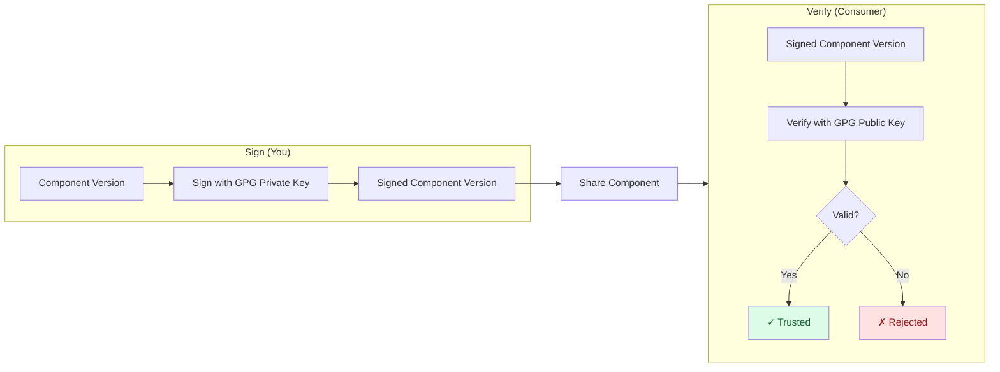

In this tutorial, you'll sign a component version with a GPG private key and verify it with the corresponding public key.
By the end, you'll understand how to use OpenPGP (GPG) signatures with OCM for component authenticity and integrity.

## What You'll Learn

- Create a GPG key pair for signing and verification
- Export ASCII-armored public and private keys
- Configure OCM credentials for GPG signing
- Sign a component version in a CTF archive
- Verify the GPG signature

**Estimated time:** ~15 minutes

## Scenario

You're a software engineer who manages components and uses GPG keys (the same keys used for signing Git commits or releases) to sign OCM component versions.
This lets consumers verify that:

1. **The component is authentic** — it comes from you, not an imposter
2. **The component has integrity** — it hasn't been tampered with since signing

## How It Works



The producer signs the component version with a GPG private key, creating an ASCII-armored OpenPGP detached signature.
Consumers verify using the corresponding public key to confirm authenticity and integrity.

## Prerequisites

- [OCM CLI installed]()
- [GnuPG installed](https://gnupg.org/download/) (`gpg` binary available in `$PATH`)
- A component version to sign (we'll create one if you don't have one)

## Steps





### Create a sample component (if needed)

If you already have a component version in a CTF archive,
e.g. by following our [Create a Component Version]() guide, skip to the next step.

Create a simple helloworld component:

```bash
# Create a directory for the tutorial
mkdir -p /tmp/ocm-gpg-tutorial && cd /tmp/ocm-gpg-tutorial

# Create a basic `component-constructor.yaml` without any resources:
cat > component-constructor.yaml << 'EOF'
components:
- name: github.com/acme.org/helloworld
  version: 1.0.0
  provider:
    name: acme.org
EOF

# Create component version in a CTF archive located at ./transport-archive
ocm add cv
```

You should see that the component version was created successfully.

<details>
<summary>Expected output</summary>

```text
 COMPONENT                      │ VERSION │ PROVIDER
────────────────────────────────┼─────────┼──────────
 github.com/acme.org/helloworld │ 1.0.0   │ acme.org
```

</details>




### Generate a GPG key pair

Create a directory for your keys and generate a GPG key pair:

```bash
# Create a directory for the generated keys
mkdir -p /tmp/ocm-gpg-tutorial/keys

# Non-interactive batch generation (RSA 4096, no expiry, no passphrase protection)
gpg --batch --gen-key << 'EOF'
%no-protection
Key-Type: RSA
Key-Length: 4096
Subkey-Type: RSA
Subkey-Length: 4096
Name-Real: OCM Tutorial Key
Name-Email: ocm-tutorial@example.com
Expire-Date: 0
%commit
EOF
```

Verify the key was created and note the fingerprint:

```bash
gpg --list-secret-keys --keyid-format=long
```

<details>
<summary>Expected output</summary>

```text
sec   rsa4096/ABCDEF1234567890 2026-01-01 [SC]
      AABBCCDDEEFF00112233445566778899AABBCCDD
uid           [ultimate] OCM Tutorial Key <ocm-tutorial@example.com>
ssb   rsa4096/1122334455667788 2026-01-01 [E]
```

The 40-character string (`AABBCCDDEEFF00112233445566778899AABBCCDD`) is your key fingerprint.
You'll need it if you want to pin a specific key when your keyring contains multiple keys.

</details>


Never commit it to version control or share it.


For more details, see [How-to: Generate Signing Keys]().




### Export the keys to files

Export the private and public keys as ASCII-armored files that OCM can load:

```bash
# Export private key — replace FINGERPRINT with the fingerprint from the previous step
gpg --export-secret-keys --armor FINGERPRINT > /tmp/ocm-gpg-tutorial/keys/signing-key.asc

# Export public key
gpg --export --armor FINGERPRINT > /tmp/ocm-gpg-tutorial/keys/verify-key.asc

# Secure the private key file
chmod 600 /tmp/ocm-gpg-tutorial/keys/signing-key.asc
```

Verify both files exist:

```bash
ls -la /tmp/ocm-gpg-tutorial/keys/*.asc
```





### Configure signing credentials

Create a new `.ocmconfig` in the current directory and copy the content below to it, to tell OCM where to find your keys.
If you already have a `$HOME/.ocmconfig` file you can skip creating a new one and just add the credential configuration to your existing file.

Also create a `signer-spec.yaml` file that tells OCM to use the GPG signing handler.
Unlike RSA (which is the default when no signer spec is given), GPG requires an explicit signer spec.

A detailed How-To guide is available here: [How-to: Configure Signing Credentials]().

```bash
touch /tmp/ocm-gpg-tutorial/.ocmconfig

cat > /tmp/ocm-gpg-tutorial/.ocmconfig << 'EOF'
type: generic.config.ocm.software/v1
configurations:
  - type: credentials.config.ocm.software
    consumers:
      - identity:
          type: GPG/v1alpha1
          signature: default
        credentials:
          - type: Credentials/v1
            properties:
              privateKeyPGPFile: /tmp/ocm-gpg-tutorial/keys/signing-key.asc
              publicKeyPGPFile: /tmp/ocm-gpg-tutorial/keys/verify-key.asc
EOF

# Signer spec: selects the GPG signing handler
cat > /tmp/ocm-gpg-tutorial/signer-spec.yaml << 'EOF'
type: GPGSigningConfiguration/v1alpha1
EOF
```

> 👉 The `signature: default` name is used when you don't specify `--signature` on the command line.

To pin a specific key when the keyring contains multiple keys, add `keyFingerprint` to the signer spec:

```yaml
# signer-spec.yaml
type: GPGSigningConfiguration/v1alpha1
keyFingerprint: AABBCCDDEEFF00112233445566778899AABBCCDD
```

For more details, see [How-to: Configure Signing Credentials]().




### Sign the component version

Sign your component with the GPG private key, passing the signer spec to select the GPG handler:

```bash
ocm sign cv ./transport-archive//github.com/acme.org/helloworld:1.0.0 \
  --config /tmp/ocm-gpg-tutorial/.ocmconfig \
  --signer-spec /tmp/ocm-gpg-tutorial/signer-spec.yaml
```

<details>
<summary>Expected output</summary>

```text
digest:
  hashAlgorithm: SHA-256
  normalisationAlgorithm: jsonNormalisation/v4alpha1
  value: 4e376182b3d535143e8e009b1e467df3a5b0c1f912c71ae432200654c355606f
name: default
signature:
  algorithm: GPG
  mediaType: application/vnd.ocm.signature.gpg
  value: |-
    -----BEGIN PGP SIGNATURE-----
    ...
    -----END PGP SIGNATURE-----

time=... level=INFO msg="signed successfully" name=default digest=4e376182b3d535143e8e009b1e467df3a5b0c1f912c71ae432200654c355606f hashAlgorithm=SHA-256 normalisationAlgorithm=jsonNormalisation/v4alpha1
```

</details>

Verify the signature was added:

```bash
ocm get cv ./transport-archive//github.com/acme.org/helloworld:1.0.0 -o yaml | grep -A 10 signatures:
```

You should see a `signatures:` section with algorithm `GPG` and a PGP signature block.





### Verify the signature

Verify the signature using the public key, passing the same signer spec as the verifier spec:

```bash
ocm verify cv ./transport-archive//github.com/acme.org/helloworld:1.0.0 \
  --config /tmp/ocm-gpg-tutorial/.ocmconfig \
  --verifier-spec /tmp/ocm-gpg-tutorial/signer-spec.yaml
```

<details>
<summary>Expected output</summary>

```text
time=... level=INFO msg="verifying signature" name=default
time=... level=INFO msg="signature verification completed" name=default duration=...
time=... level=INFO msg="SIGNATURE VERIFICATION SUCCESSFUL"
```

</details>

> ✅ **Success!** ✅  
> The component version is verified as authentic and unmodified.




## What You've Learned

Congratulations! You've successfully:

- ✅ Generated a GPG key pair for signing and verification
- ✅ Exported the keys to ASCII-armored files
- ✅ Configured OCM to use your keys via `.ocmconfig`
- ✅ Created a GPG signer spec to select the GPG handler
- ✅ Signed a component version with your GPG private key
- ✅ Verified the signature using the public key

## Best Practices for Production

Now that you understand the workflow, here are key practices for production environments:

- **Reuse existing GPG keys** — If you already sign Git tags or release artifacts with a GPG key, the same key works for OCM.
- **Protect private keys** — Use a hardware token (YubiKey, OpenPGP card) or a passphrase-protected key; OCM supports the `passphrase` credential property.
- **Rotate keys periodically** — OCM supports multiple signatures per component version to ease key transitions.
- **Distribute public keys securely** — Publish your public key to a key server (e.g. `keys.openpgp.org`) or share via a trusted channel.
- **Verify before deployment** — Make signature verification a mandatory step in your deployment pipeline.
- **Pin key fingerprints** — Use `keyFingerprint` in a signer spec to prevent accidentally signing or verifying with a different key from a shared keyring.

## Check Your Understanding


The OCM CLI defaults to the RSA handler when no `--signer-spec` is provided.
GPG has a different configuration type (`GPGSigningConfiguration/v1alpha1`) that must be specified explicitly.
A minimal signer spec file with just the type is enough to select the GPG handler.



Both sign the component descriptor digest, but they differ in key format and signature encoding:

- **RSA** uses PEM-encoded keys (PKCS#1 / PKCS#8) and produces a raw hex or PEM-wrapped signature.
- **GPG** uses ASCII-armored OpenPGP keyring files and produces an ASCII-armored OpenPGP detached signature.

GPG is a natural fit if you already manage GPG keys for code signing or release workflows.



Yes. Add the `passphrase` property to your credentials block:

```yaml
credentials:
  - type: Credentials/v1
    properties:
      privateKeyPGPFile: /path/to/signing-key.asc
      publicKeyPGPFile: /path/to/verify-key.asc
      passphrase: my-secret-passphrase
```

OCM decrypts the key in-memory only; the passphrase is never written to disk.



Yes. Each signature has a distinct `name`. Use `--signature <name>` when signing to create named signatures, and OCM will store all of them on the component version.


## Cleanup

Remove the tutorial artifacts:

```bash
rm -rf /tmp/ocm-gpg-tutorial
```

## Next Steps

- [Tutorial: Plain RSA Signatures]() — Sign with raw RSA keys instead of GPG.
- [Tutorial: PEM-encoded Signatures]() — Use X.509 certificate chains with RSA for enterprise PKI trust.
- [How-to: Generate Signing Keys]() — Step-by-step creating key pairs.
- [How-to: Configure Signing Credentials]() — Set up OCM to use your keys for signing and verification.

## Related Documentation

- [Concept: Signing and Verification]() — Understand the theory behind OCM signing
