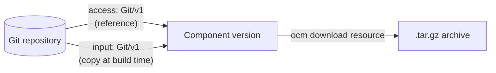

OCM can add the files of a Git commit to a component version. This works with any Git server, such as GitHub, GitLab,
Gitea, Azure DevOps or your own server, over HTTPS or SSH. This tutorial adds one repository as a resource, as a source
and as an embedded snapshot, builds a component version, and downloads the files back.

## What You'll Learn

By the end of this tutorial, you will:

- Reference a repository as a resource and as a source with the `Git/v1` access type
- Embed a repository snapshot in the component version with the `Git/v1` input type
- Understand how OCM pins a branch to a commit and protects it with a digest
- Configure credentials for a private repository

## How It Works



Both types produce the same archive: a gzip-compressed tar of the files at one commit, without the `.git` directory.
The difference is where the archive lives:

- The **access type** stores only the repository URL and the commit. OCM fetches the files when someone downloads the
  resource.
- The **input type** fetches the files when you build the component version, and stores the archive inside it.

**Estimated time:** ~10 minutes

## Prerequisites

- [OCM CLI]() installed
- Network access to `github.com` over HTTPS

The tutorial reads a public repository, so you need no credentials. Step 5 shows how to add them for a private
repository.

## Scenario

- **Component:** `github.com/acme.org/myapp:1.0.0`
- **Repository:** `https://github.com/octocat/Hello-World.git`, a very small public repository
- **Commit:** `7fd1a60b01f91b314f59955a4e4d4e80d8edf11d`, the head of its `master` branch

## Tutorial Steps




### Create the component constructor

Create `component-constructor.yaml` with three entries for the same repository:

```bash
cat > component-constructor.yaml << 'EOF'
components:
  - name: github.com/acme.org/myapp
    version: 1.0.0
    provider:
      name: acme.org
    resources:
      # A reference to a branch. OCM pins it to a commit while it builds the component version.
      - name: hello-world-ref
        type: directoryTree
        version: 1.0.0
        relation: external
        access:
          type: Git/v1
          repository: https://github.com/octocat/Hello-World.git
          ref: refs/heads/master
      # A copy of one commit, stored inside the component version.
      - name: hello-world-snapshot
        type: directoryTree
        version: 1.0.0
        input:
          type: Git/v1
          repository: https://github.com/octocat/Hello-World.git
          commit: 7fd1a60b01f91b314f59955a4e4d4e80d8edf11d
    sources:
      # The source code the component was built from. Sources are never pinned, so set the commit.
      - name: hello-world-source
        type: git
        version: 1.0.0
        access:
          type: Git/v1
          repository: https://github.com/octocat/Hello-World.git
          ref: refs/heads/master
          commit: 7fd1a60b01f91b314f59955a4e4d4e80d8edf11d
EOF
```

`ref` accepts a branch or tag name (`master`, `v1.0.0`) or a full ref (`refs/heads/master`, `refs/tags/v1.0.0`).
`commit` must be the full 40-character SHA. When both are set, the commit wins, and the ref is only information for
the reader.





### Build the component version

```bash
ocm add cv
```



```text
level=WARN msg="source content is recorded without a digest and is not verifiable; declare the artifact as a resource if content validation is needed"
 COMPONENT                 │ VERSION │ PROVIDER
───────────────────────────┼─────────┼──────────
 github.com/acme.org/myapp │ 1.0.0   │ acme.org
```



The warning is expected. A source carries no digest, so OCM cannot check later that its content is unchanged. Use a
resource when you need that check.





### Look at what OCM stored

```bash
ocm get cv ./transport-archive//github.com/acme.org/myapp:1.0.0 -o yaml
```



```yaml
resources:
- access:
    commit: 7fd1a60b01f91b314f59955a4e4d4e80d8edf11d
    ref: refs/heads/master
    repository: https://github.com/octocat/Hello-World.git
    type: Git/v1
  digest:
    hashAlgorithm: SHA-256
    normalisationAlgorithm: genericBlobDigest/v1
    value: 6263b5215ca43f8740a453680d3e6009efa5b3e972e224baac7e06809a24e942
  name: hello-world-ref
  relation: external
  type: directoryTree
  version: 1.0.0
- access:
    localReference: sha256:6263b5215ca43f8740a453680d3e6009efa5b3e972e224baac7e06809a24e942
    mediaType: application/x-tgz
    type: LocalBlob/v1
  digest:
    hashAlgorithm: SHA-256
    normalisationAlgorithm: genericBlobDigest/v1
    value: 6263b5215ca43f8740a453680d3e6009efa5b3e972e224baac7e06809a24e942
  name: hello-world-snapshot
  relation: local
  type: directoryTree
  version: 1.0.0
sources:
- access:
    commit: 7fd1a60b01f91b314f59955a4e4d4e80d8edf11d
    ref: refs/heads/master
    repository: https://github.com/octocat/Hello-World.git
    type: Git/v1
  name: hello-world-source
  type: git
  version: 1.0.0
```



Three things to note:

- **`hello-world-ref` got a `commit`.** You wrote only a branch. OCM resolved it to the current commit and wrote that
  commit into the access. The component version now points to fixed content, even when the branch moves on.
- **`hello-world-snapshot` is a `LocalBlob/v1`.** The input type fetched the files and stored the archive in the
  transport archive. The repository URL is not kept.
- **Both resources have the same digest.** The access and the input build the same archive for the same commit.





### Download the files

Download the referenced resource. OCM fetches the pinned commit from GitHub and checks the digest:

```bash
ocm download resource ./transport-archive//github.com/acme.org/myapp:1.0.0 \
  --identity name=hello-world-ref \
  --output hello-world.tar.gz
tar -tzvf hello-world.tar.gz
```



```text
level=INFO msg="resource downloaded successfully" output=hello-world.tar.gz
-rw-r--r--  0 0      0          13 Jan  1  1970 README
```



The owner, group and timestamp are fixed values. OCM writes them this way so that the same commit always gives the
same archive, and therefore the same digest.





### Add credentials for a private repository

*Optional. Skip this step for public repositories.*

OCM finds credentials through a consumer identity of type `Git`, derived from the repository URL. Create a
`.ocmconfig` file. Pick the tab that matches your repository URL:




```bash
cat > .ocmconfig << 'EOF'
type: generic.config.ocm.software/v1
configurations:
  - type: credentials.config.ocm.software
    consumers:
      - identity:
          type: Git
          hostname: gitlab.com
          scheme: https
          path: example-group/*
        credentials:
          - type: GitCredentials/v1
            username: oauth2
            password: glpat-your-token
EOF
```

Most Git servers take an access token as the password. You can also set `token` instead, which OCM sends as a bearer
token.




```bash
cat > .ocmconfig << 'EOF'
type: generic.config.ocm.software/v1
configurations:
  - type: credentials.config.ocm.software
    consumers:
      - identity:
          type: Git
          hostname: git.example.com
          scheme: ssh
          port: "22"
        credentials:
          - type: GitCredentials/v1
            privateKey: /home/user/.ssh/id_ed25519
EOF
```

Use an SSH URL in the constructor, such as `git@git.example.com:org/repo.git`. Without a configured key, OCM uses your
SSH agent. The server must be in your `~/.ssh/known_hosts`. Keep `port: "22"`: an SSH entry without a port does not
match.




Pass the file with `--config .ocmconfig`, or put it in one of the
[well-known locations](). The same entry covers the access type and the
input type. The derived `path` includes the `.git` suffix of the URL, so the glob `example-group/*` is the easy choice.
See [Credential Consumer Identities: Git]() for
all attributes.




## What you've learned

- The `Git/v1` access type references a commit; the `Git/v1` input type embeds it.
- A resource with only a `ref` is pinned to a commit and gets a digest when you build the component version.
- A source is never pinned and has no digest, so give it a `commit`.
- The archive is deterministic, so access and input give the same digest for the same commit.
- Credentials match a `Git` consumer identity derived from the repository URL.

## Check your understanding

- [ ] A teammate pushes to `master` after you built the component version. What does `hello-world-ref` download?
- [ ] When should you use the input type instead of the access type?
- [ ] Why does a consumer entry with `path: org/repo` not match `https://example.com/org/repo.git`?



- **Question 1:** The old commit. The access carries the pinned `commit`, and the commit wins over the ref.
- **Question 2:** When the component version must work without access to the Git server, for example in an air-gapped
  environment.
- **Question 3:** The derived `path` is `org/repo.git`. Use `org/repo.git` or `org/*`.



## Troubleshooting

### `repository not found` for a public repository

**Cause:** The URL has no scheme, for example `github.com/org/repo`. OCM reads such a string as a local directory.

**Fix:** Write the full URL, such as `https://github.com/org/repo.git`.

### `ssh: unable to authenticate, attempted methods [none publickey]`

**Cause:** OCM found no SSH key. No consumer entry matched, and the SSH agent has no key for this server. A common
reason is an SSH entry without `port: "22"`.

**Fix:** Add a key to your SSH agent, or add a consumer entry with `scheme: ssh`, `port: "22"` and `privateKey` as in
step 5.

### `SSH agent requested but SSH_AUTH_SOCK not-specified`

**Cause:** OCM found no SSH key in a consumer entry, and no SSH agent runs.

**Fix:** Start an SSH agent with your key, or add a consumer entry as in step 5.

### `tokens require an HTTPS repository`

**Cause:** A consumer entry with a `token` matched an SSH or HTTP URL.

**Fix:** Set `scheme` in the consumer identity, so the token applies to HTTPS URLs only. OCM never sends credentials
over plain HTTP.

### `git archive digest mismatch`

**Cause:** The archive of the commit does not match the digest in the component version. The digest covers the
compressed archive, so an OCM release built with a different Go version can also produce different bytes.

**Fix:** Check that `commit` is the commit you expect. If it is, compare the OCM versions that built and that downloaded
the component version.

## Cleanup

```bash
rm -rf transport-archive hello-world.tar.gz component-constructor.yaml .ocmconfig
```

## Next steps

- [How-to: Add Resources from GitHub](): the `GitHub/v1`
  access type, which downloads the archive through the GitHub REST API

## Related documentation

- [Reference: `Git/v1` access type](), including
  when to choose `Git/v1` or `GitHub/v1`, and migration from OCM v1
- [Reference: `Git/v1` input type]()
- [Reference: Git Resource Repository]()
- [Reference: `GitCredentials/v1`]()
