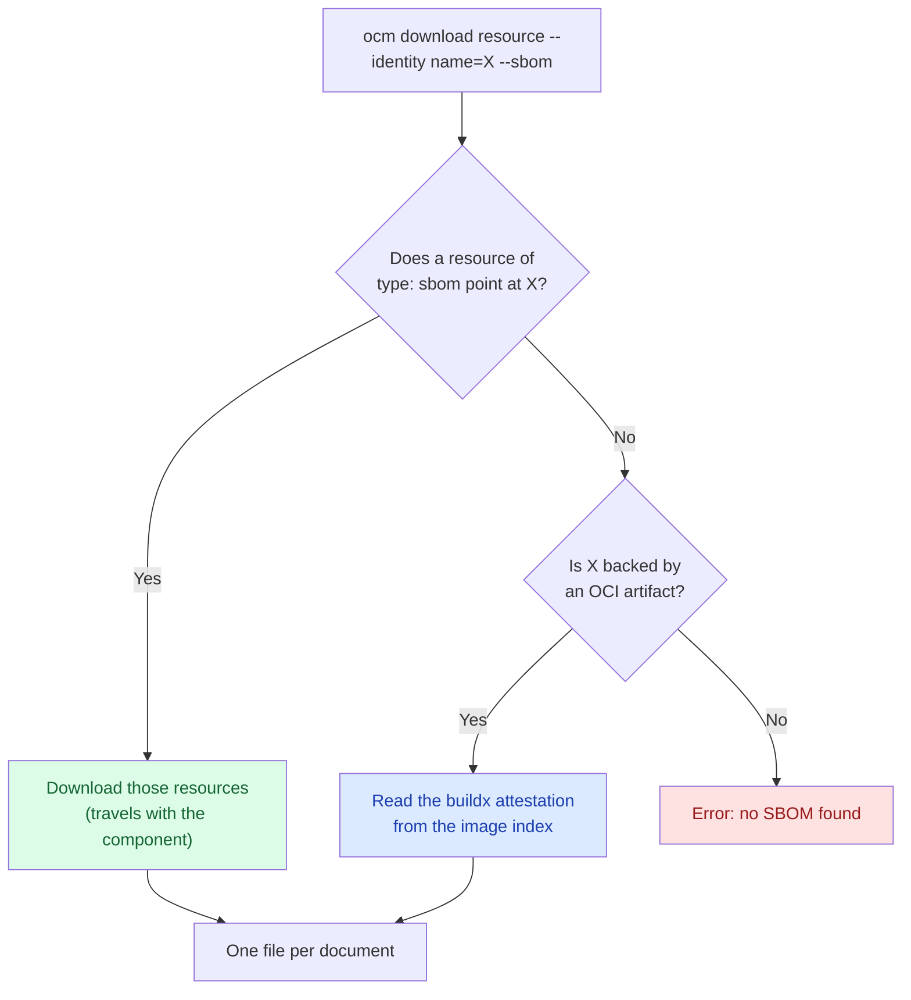

A component version tells you *which artifacts* you deliver. It does not tell you *what is inside* them. That answer
lives in a Software Bill of Materials. Today, SBOMs might be located in various places, and we need a way to unify them
and get all of them together to one location. For the why, see [Software Bills of Materials]().

In this tutorial you build a component version that ships a binary and a third-party image, and you'll retrieve the SBOM
for both with the same command, even though the two SBOMs got there in completely different ways.


`ocm download resource --sbom` is experimental. What is discovered, how it is written out, and the flag itself may
change in a future release depending on user feedback to offer a better UX.


## What You'll Learn

- Link an SBOM you produced yourself to the resource it describes, using the `ocm.software/artifact-references` label
- Discover the SBOM that `docker buildx build --sbom=true` already attached to an OCI image
- Retrieve both with one command, `ocm download resource --sbom`
- Collect the SBOMs of an entire component version with a small script
- Scan the result with Trivy
- Understand which of the two approaches survives a by-value transfer, and why that decides which one you should use

**Estimated time:** ~25 minutes

## Scenario

We'll create a component version consisting of two things: a CLI binary, and the
[podinfo](https://github.com/stefanprodan/podinfo) image, which you consume as-is from a third party.

Let's try to identify if *CVE-2026-56854* is out, and we are affected by it. SBOMs live in many locations, and OCM helps
in identifying them and bringing them in to one place.

- Nothing is attached to your binary. You generate its SBOM yourself and have to say, somewhere durable, which resource
  it describes.
- `podinfo` already has an SBOM, attached by BuildKit when it was built. Nobody has to generate anything, but you do
  have to know where to look.

OCM has you covered.

## How It Works

`ocm download resource --sbom` tries two strategies currently, in order, and the first one that finds anything, wins.



**Strategy 1, the artifact-references label.** A resource of `type: sbom` has a label naming the resource it
describes. Because the link is an ordinary label on an ordinary resource, it is part of the component descriptor. It
gets signed, and it goes wherever the component version is transferred to. This ensures that the SBOM and the reference
are both part of the signature therefore, are immutable without a signature change.

**Strategy 2, the buildx attestation.** For a resource backed by an OCI artifact, OCM reads the image index and looks
for the attestation manifests BuildKit creates next to each platform's image. Nothing has to be added to the component
version at all, but the SBOM stays in the registry the image came from.


Only the BuildKit layout is understood right now. SBOMs attached by cosign, or published through the OCI referrers API, are not
discovered at this time. You can read more about BuildKit attestation at [SBOM attestations](https://docs.docker.com/build/metadata/attestations/sbom/).


## Prerequisites

- [OCM CLI installed]() at a version that has
  `ocm download resource --sbom`
- [`syft`](https://github.com/anchore/syft) to generate an SBOM for the binary
- [`trivy`](https://github.com/aquasecurity/trivy) to scan the result
- `jq`, for the collection script
- Network access to `ghcr.io`

## Steps

### Set up the workspace

```bash
mkdir -p /tmp/ocm-sbom-tutorial && cd /tmp/ocm-sbom-tutorial
```

We'll be using the ocm CLI itself as the binary. Point at wherever it is installed, and remember the workspace:

```bash
export OCM_CLI_LOCATION="$(command -v ocm)"
export WORKSPACE="$PWD"
```

Both are read by the component constructor further down.

### Generate an SBOM for the binary

Let's create an SBOM for the above binary.

```bash
syft scan "file:$OCM_CLI_LOCATION" -o spdx-json > ocm-cli.spdx.json
```

Check that you got a document with packages in it:

```bash
jq '{spdxVersion, name, packages: (.packages | length)}' ocm-cli.spdx.json
```

```json5
{
  "spdxVersion": "SPDX-2.3",
  "name": "ocm",
  "packages": 108 // this may vary
}
```

### Describe the component version

Create `component-constructor.yaml` with three resources: the binary, the SBOM that describes it, and the image.

```yaml
components:
  - name: ocm.software/examples/sbom-demo
    version: 1.0.0
    provider:
      name: ocm.software

    resources:
      - name: ocm-cli
        type: blob
        version: 1.0.0
        input:
          type: File/v1
          path: ${OCM_CLI_LOCATION}
          mediaType: application/octet-stream

      # Using artifact-references, link back to the binary by label.
      - name: ocm-cli-sbom
        type: sbom
        version: 1.0.0
        labels:
          - name: ocm.software/artifact-references
            signing: true
            value:
              - identity:
                  name: ocm-cli
        input:
          type: File/v1
          path: ${WORKSPACE}/ocm-cli.spdx.json
          mediaType: application/spdx+json

      # This is the reference to podinfo that has been built using buildx.
      - name: podinfo
        type: ociImage
        version: 6.9.2
        relation: external
        access:
          type: OCIImage/v1
          imageReference: ghcr.io/stefanprodan/podinfo:6.9.2
```

Explanation on how the `ocm-cli-sbom` is structured:

- **`type: sbom`**: a resource pointing at the binary with any other type is skipped.
- **`ocm.software/artifact-references`**: This label's value is a *list*, so one SBOM can describe
  several resources.
- **`identity.name`**: `name` is required and must match. `version` is optional: leave it out, as above, and any
  version of `ocm-cli` matches, which means you do not have to touch the label on every release. Any other key you add
  is treated as an extra identity attribute and MUST match the target's extra identity `exactly`.

Build it into a CTF archive:

```bash
ocm add cv --working-directory /
```

```text
 COMPONENT                       │ VERSION │ PROVIDER
─────────────────────────────────┼─────────┼──────────────
 ocm.software/examples/sbom-demo │ 1.0.0   │ ocm.software
```

Without `--repository`, this writes a CTF into `./transport-archive`, which is what the rest of the tutorial reads
from. `File/v1` only reads files inside the working directory, that defaults to the constructor file's directory. Using
`--working-directory /` allows reading the ocm binary on your `PATH`.

Let's verify that the label is now part of the component descriptor:

```bash
ocm get cv ./transport-archive/ -o yaml | grep -A6 artifact-references
```

```yaml
      - name: ocm.software/artifact-references
        signing: true
        value:
        - identity:
            name: ocm-cli
```

This means, that the label's value is now immutable as it is part of the signature.

### Retrieve the linked SBOM

Ask for the SBOM of the *binary*, not of the SBOM resource:

```bash
ocm download resource ./transport-archive//ocm.software/examples/sbom-demo:1.0.0 \
  --identity name=ocm-cli \
  --sbom \
  --output ./sboms/ocm-cli
```

```text
level=INFO msg="found an sbom resource referencing the requested resource" sbom="name=ocm-cli-sbom,version=1.0.0" resource="name=ocm-cli,version=1.0.0"
level=INFO msg="wrote discovered sboms" resource="name=ocm-cli,version=1.0.0" directory=./sboms/ocm-cli documents=1
sboms/ocm-cli/ocm-cli-sbom.spdx.json
```

The path written is printed on standard output, one per line, while the log goes to standard error. That split is
deliberate: it lets you pipe the paths straight into a scanner.


Always pass `--output`. Without it the directory is named after the resource identity, so `--identity name=ocm-cli`
writes into `./ocm-cli`, which fails if a file by that name already exists in the working directory.


### Retrieve the attached SBOM

Now the image. Nothing in the component version references it, so OCM falls through to the second strategy and reads
the attestation out of the registry:

```bash
ocm download resource ./transport-archive//ocm.software/examples/sbom-demo:1.0.0 \
  --identity name=podinfo \
  --sbom \
  --output ./sboms/podinfo
```

```text
level=INFO msg="found sboms attached to the artifact of the requested resource" resource="name=podinfo,version=6.9.2" discovered=3
level=INFO msg="wrote discovered sboms" resource="name=podinfo,version=6.9.2" directory=./sboms/podinfo documents=3
sboms/podinfo/sbom_linux_amd64.spdx.json
sboms/podinfo/sbom_linux_arm_v7.spdx.json
sboms/podinfo/sbom_linux_arm64.spdx.json
```

Same command, same flags, completely different mechanism underneath, and the caller never had to know which one applied.

Three documents come back because `podinfo` is a multi-platform image and each platform contains its own SBOM. Every platform
in the index is downloaded, regardless of the architecture in your resource identity, and the platform is put into the
file name. SBOMs are output **exactly as published**.

### Collect the SBOMs of the whole component version

There is no single command that produces one SBOM for a whole component version at this moment. This may change in the
future. For now, we can use a little script to do it in a loop.

Consider the following tiny example of a script that can do it.

```bash
#!/usr/bin/env bash
# Collect the SBOMs of every resource of a component version into one directory.
# NOTE: This scripts ignores extra identity for the sake of simplicity.
set -euo pipefail

REF="${1:?usage: collect-sboms.sh <component-version-ref> [output-dir]}"
OUT="${2:-./sboms}"

mkdir -p "$OUT"

ocm get cv "$REF" -o json |
  jq -r '.[].component.resources[] | select(.type != "sbom") | .name' |
while read -r resource; do
  if ocm download resource "$REF" \
       --identity "name=$resource" \
       --sbom \
       --output "$OUT/$resource" >/dev/null 2>&1; then
    echo "ok      $resource"
  else
    echo "no sbom $resource" >&2
  fi
done

find "$OUT" -name '*.json' | sort
```

Resources of `type: sbom` are skipped: they *are* the SBOMs, they do not have one. Resources with no SBOM at all are
expected, so a failure for one of them is reported and the loop continues.

```bash
chmod +x collect-sboms.sh
./collect-sboms.sh ./transport-archive//ocm.software/examples/sbom-demo:1.0.0
```

```text
ok      ocm-cli
ok      podinfo
./sboms/ocm-cli/ocm-cli-sbom.spdx.json
./sboms/podinfo/sbom_linux_amd64.spdx.json
./sboms/podinfo/sbom_linux_arm_v7.spdx.json
./sboms/podinfo/sbom_linux_arm64.spdx.json
```

### Scan the result

Every file is a normal SPDX document so you can pipe it directly to trivy:

```bash
find ./sboms -name '*.json' | sort | while read -r f; do
  echo "== $f"
  trivy sbom --quiet --scanners vuln "$f"
done
```

```text
== ./sboms/ocm-cli/ocm-cli-sbom.spdx.json
┌────────┬──────────┬─────────────────┐
│ Target │   Type   │ Vulnerabilities │
├────────┼──────────┼─────────────────┤
│        │ gobinary │       10        │
└────────┴──────────┴─────────────────┘

== ./sboms/podinfo/sbom_linux_amd64.spdx.json
┌────────┬──────────┬─────────────────┐
│ Target │   Type   │ Vulnerabilities │
├────────┼──────────┼─────────────────┤
│        │ gobinary │       62        │
└────────┴──────────┴─────────────────┘
```

Your numbers will differ, because the vulnerability database moves.

## The difference between strategies {#strategy-differences}

The two strategies look identical from the command line, but they behave differently once the component version
is transferred.

Transfer the component version by value, which is what an air-gapped delivery does:

```bash
ocm transfer cv ./transport-archive//ocm.software/examples/sbom-demo:1.0.0 ./transport-archive-transferred --copy-resources
```

The linked SBOM is still there. It was a resource, so it was copied along with everything else:

```bash
ocm download resource ./transport-archive-transferred//ocm.software/examples/sbom-demo:1.0.0 \
  --identity name=ocm-cli --sbom --output ./t-sboms/ocm-cli
```

```text
level=INFO msg="found an sbom resource referencing the requested resource" sbom="name=ocm-cli-sbom,version=1.0.0" resource="name=ocm-cli,version=1.0.0"
t-sboms/ocm-cli/ocm-cli-sbom.spdx.json
```

The attached one is gone:

```bash
ocm download resource ./transport-archive-transferred//ocm.software/examples/sbom-demo:1.0.0 \
  --identity name=podinfo --sbom --output ./t-sboms/podinfo
```

```text
Error: no sbom found for resource "name=podinfo,version=6.9.2": nothing in the component version
references it, and its access type "LocalBlob/v1" cannot be inspected for an attached sbom
(failed to get plugin for typ "LocalBlob/v1")
```

`--copy-resources` turns the image's `OCIImage/v1` access into a `LocalBlob/v1`, and the attestation manifests that
contained the SBOM are **NOT** part of what gets copied. There is no longer an image index to read, so the second strategy
will no longer work. Transferring *by reference* (without `--copy-resources`) leaves the access untouched and the
attestation keeps working, but then you are still depending on `ghcr.io` being reachable.

|                                      | Artifact-references label           | buildx attestation   |
|--------------------------------------|-------------------------------------|----------------------|
| Who produces the SBOM                | You                                 | The image build      |
| Where it lives                       | A resource of the component version | The image's registry |
| Covered by the component signature   | Yes                                 | No                   |
| Survives `transfer --copy-resources` | Yes                                 | **No**               |
| Works air-gapped                     | Yes                                 | No                   |

This creates the following practical rule: **the attestation strategy is a convenience for images you consume in place.
If you plan on shipping your component version, use the label reference strategy instead.** If a third-party image needs
to stay scannable after an air-gapped transfer, download its SBOM once with `--sbom` and add it back as a linked `type: sbom`
resource.

## Troubleshooting {#troubleshooting}

### `no sbom found ... its access type "LocalBlob/v1" cannot be inspected`

**Why:** Nothing in the component version references the resource, and its content is inside the component version, so
there is no image index to inspect. This is the normal state for any local blob, and for an OCI image after a by-value
transfer.

**Fix:** Add an SBOM as a resource of `type: sbom` with an `ocm.software/artifact-references` label pointing at it. See
[The difference between strategies](#strategy-differences).

### `no buildx SBOM attestation found`

**Why:** The image index has no attestation manifest for the platform, or it has one but no SPDX document in it. Images
built without `--sbom=true`, or attested only with SLSA provenance, get you here. So does a CycloneDX-only attestation,
because SPDX is the only predicate type done by buildx by default.

**Fix:** Confirm what is actually attached with `docker buildx imagetools inspect <image> --raw` and look for manifests
annotated `vnd.docker.reference.type: attestation-manifest`. If there is none, generate the SBOM yourself and link it.

### `reference does not resolve to an image index`

**Why:** The image is a plain single manifest. BuildKit publishes attestations as sibling manifests inside an index, so
a single-manifest image will have none.

**Fix:** Rebuild the image with a `buildx` driver that emits an index, or link the SBOM as a resource.

### `creating sbom output directory "..." failed: not a directory`

**Why:** `--output` was omitted, so the directory was named after the resource identity, and a file by that name already
exists in the working directory.

**Fix:** Pass `--output` explicitly.

### The label is in the descriptor but nothing is discovered

**Why:** Almost always one of three things: the referencing resource is not `type: sbom`, the label name is misspelled,
or the identity in the label has an extra value the target does not have. Extra identity attributes MUST MATCH
`exactly` in both directions, so an unexpected key on either side will break this match.

**Fix:** Compare `ocm get cv ... -o yaml` against the target's identity. Run with `--loglevel debug` to see which
candidates were considered and why they were dropped.

## What You've Learned

- ✅ Linked an SBOM to the resource it describes with the `ocm.software/artifact-references` label
- ✅ Discovered an SBOM that BuildKit attached to a third-party image, without adding anything to the component version
- ✅ Retrieved both through one command, `ocm download resource --sbom`
- ✅ Collected the SBOMs of a whole component version and scanned them with Trivy
- ✅ Saw why only the linked SBOM survives a by-value transfer

## Cleanup

```bash
rm -rf /tmp/ocm-sbom-tutorial
```

## Related Documentation

- [How-to: Download Resources from Component Versions]() - The download command this tutorial builds on
- [How-to: Air-Gap Transfer]() - Moving a component version by value, the case that decides which SBOM strategy works
- [Reference: Input and Access Types]() - `File/v1`, `OCIImage/v1`, and what `--copy-resources` turns them into
- [Tutorial: Plain Signatures]() - Signing the component version, which is what makes a linked SBOM trustworthy
- [Concept: Software Bills of Materials]() - What an SBOM is and why OCM binds it to the component version
- [Blog: Shipping SBOMs with Your Components](/blog/2026-07-28-shipping-sboms-with-your-components/) - The proof of concept this feature grew out of
- [Signing and Verification]() - Sign and verify component versions with cryptographic keys
